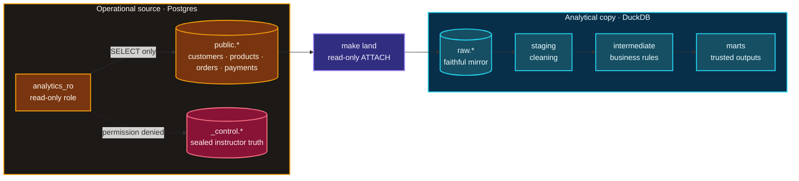
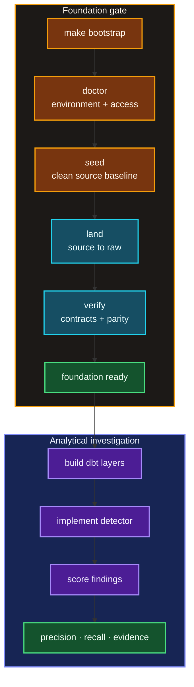
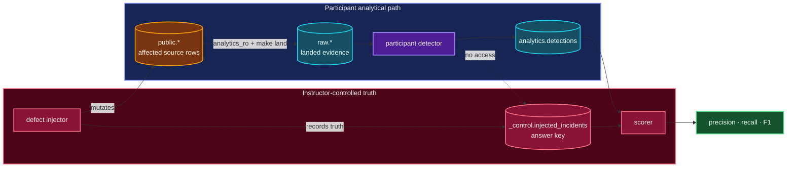

<div align="center">

[](https://github.com/luanmorenommaciel/uc-transact-co)

# TransactCo

**A brownfield analytics system built to be investigated.**

*Postgres runs the store. DuckDB carries the analytical copy. A sealed oracle
knows what broke. You build the system that proves the numbers deserve trust.*

[](https://www.python.org/)
[](https://docs.docker.com/compose/)
[](https://docs.astral.sh/uv/)
[](#-architecture)

Postgres source · DuckDB warehouse · 14 injectable failure modes · isolated
answer key · unresolved Revenue ontology · executable verification

[Quickstart](#-quickstart) ·
[Guided modules](#-guided-modules) ·
[Architecture](#-architecture) ·
[System model](#-system-model) ·
[Failure lab](#-failure-lab) ·
[Command surface](#-command-surface) ·
[Documentation](#-documentation)

</div>

---

## What is TransactCo?

TransactCo is a deliberately realistic e-commerce brownfield. Customers,
products, orders, and payments live in one operational Postgres database. The
store writes transactions while analytical queries compete for the same
resources. The CFO's question sounds simple:

> How much revenue did we make yesterday, and why should I trust that number?

The first half asks for SQL. The second asks for semantics, evidence, system
boundaries, and operational safety.

This repository supplies the runnable source system, the controlled failure
environment, and five guided modules of Semana Engenharia Agêntica. Nights 1
through 4 have been executed; the Night 5 module is built and scheduled for
17 Aug 2026. It is a teaching foundation, not a finished analytical product.

| Ships ready | You construct |
| --- | --- |
| Postgres with the source schema applied at boot | Baseline-specific context, evidence, and technical brief |
| Correlated, time-aware business data | The remaining dbt `staging` → `intermediate` → `marts` work |
| Postgres → DuckDB read-only landing | Agents that inspect, move, and transform |
| Fourteen injectable failure modes | The incident detector |
| Instructor truth isolated in `_control` | The controlled execution and verification loop |
| A versioned ontology with `Revenue` explicitly unresolved | The Finance decisions that make Revenue meaningful |
| Foundation, harness, and specification runbooks | Baseline-specific evidence, task packets, models, and learning artifacts |
| Reusable investigation and harness-scaffold skills | The project-specific content and authority inside those structures |

## ⚡ Quickstart

Requirements: Docker, [`uv`](https://docs.astral.sh/uv/), and `make`. The live
runbook also uses Git and [`rg`](https://github.com/BurntSushi/ripgrep).

```bash
make bootstrap
make status
```

`make bootstrap` creates the environment, installs the dbt adapter, starts and
checks Postgres, generates a clean source dataset, rebuilds the generated DuckDB
warehouse, lands the raw tables, runs unit contracts, verifies isolation and row
parity, and validates the current dbt project and DuckDB profile.

> **Reset boundary:** bootstrap replaces `warehouse.duckdb`. Preserve that file
> before rerunning bootstrap if it contains detector or transformation work you
> care about. It also makes the baseline-specific evidence under
> `storage/specs/` stale. Those five files are now tracked, frozen inputs and
> read-only under `AGENTS.md`; do not overwrite them in this checkout. A full
> replay needs a deliberately prepared rehearsal copy and explicit authority to
> recapture the evidence.

Run `make setup` while network access is reliable. DuckDB downloads its Postgres
extension during setup.

For the guided experience, start at [`sessions/README.md`](sessions/README.md). The
prompts deliberately stop before Finance-owned meaning is invented or an agent
receives authority that was not written down.

## ⟲ Guided modules

The modules form one cumulative artifact chain. The harness module inherits the
foundation evidence; it is not a second, independent quickstart.

| Module | Canonical question | Runbook | Deck | Session result | Repository state |
| --- | --- | --- | --- | --- | --- |
| Foundation investigation | What is true, what is inferred, and what remains a human decision? | [`sessions/d1/`](sessions/d1/) | [`presentation/d1.html`](presentation/d1.html) | Context inventory, ontology note, technical brief, investigation skill | Executed |
| Harness and authority | What may the agent do, through which tools, paths, and gates? | [`sessions/d2/`](sessions/d2/) | [`presentation/d2.html`](presentation/d2.html) | Harness contract, bounded roles, sketch plans, one controlled dbt build, scaffold skill | Executed |
| The Task — specification and decomposition | What does done mean in a form a machine can answer? | [`sessions/d3/`](sessions/d3/) | [`presentation/d3.html`](presentation/d3.html) | Task-Spec, runnable evals, task graph, one bounded packet compared across 2–3 available engines | Executed |
| The Loop — dispatch, proof, receipt, measurement | What happens when no one is watching — and how do I know the green means anything? | [`sessions/d4/`](sessions/d4/) | [`presentation/d4.html`](presentation/d4.html) | Signing key, sealed holdout, authorization chain, the crank driving every ready spec through five acceptance gates | Executed; five specs accepted at Tier 1 |
| The Factory — close, rails, table | Can the CFO question finally be answered, and what stays a human decision? | [`sessions/d5/`](sessions/d5/) | [`presentation/d5.html`](presentation/d5.html) | Read-only CFO MCP surface over the accepted measurements; the grain decision deliberately left open | Built; scheduled 17 Aug 2026 |

The first two modules produced five baseline-specific artifacts under
`storage/specs/` and the Day 2 `stg_orders` model. Those artifacts are
tracked, frozen inputs. The specification module read them, kept `Revenue`
blocked, and authored the six-spec task graph under `tasks/`. The loop module
then drove every ready spec through the authorization chain: five specs are
accepted at Tier 1 and moved to `tasks/done/`, and five staging models now
live under `dbt/models/staging/`. The one remaining spec,
`T-20260812-daily-grain-decision`, declares no write surface — it is a
Finance-owned decision, so the crank cannot execute it, by design. Each
numbered checkpoint states whether to continue the current agent session, open
a new one, or use no agent at all.

The semantic boundary is executable:

```bash
uv run transactco ontology validate
uv run transactco ontology list
uv run transactco ontology explain Revenue
```

Structural validity does not approve business meaning. `Revenue` remains
`unresolved` until Finance owns the contributing statuses, recognition event,
adjustments, currency, and business-day decisions.

## ◇ Architecture

One direction only: analytical work leaves the operational source; instructor
truth does not.



The raw layer is a faithful mirror. If a source defect renames a column, the
renamed column lands. Repairing it silently during extraction would erase the
evidence the investigation is meant to find.

The analytical connection uses `analytics_ro`, which can read `public.*`, cannot
write to the source, and has no access to `_control`.

### Build and proof lifecycle

The foundation is not considered ready because it starts. It is ready only after
its contracts, isolation, and analytical path have been proved.



## ▦ System model

| Entity | Role | Important time |
| --- | --- | --- |
| `customers` | Commercial identity and segment | signup, source lifecycle, ingestion |
| `products` | Catalog, price, cost, availability | source lifecycle, ingestion |
| `orders` | Quantity, captured unit price, discount, status, channel | order time, update time, ingestion |
| `payments` | Payment attempts, amount, method, status | payment time, ingestion |

There are no foreign keys or check constraints. That is intentional: the fixture
must admit orphan references, invalid values, and schema drift. Participants
infer candidate relationships from names and then prove or reject them with
data.

Two clocks matter throughout the system:

- **Business time** describes when something happened in the domain.
- **Ingestion time** describes when the row reached the inspected database.

Substituting one for the other changes the meaning of freshness, late arrival,
and revenue.

## ⚠ Failure lab

The generator can introduce fourteen named conditions without leaking their
mechanics into the analytical path.

**Data quality**

`negative_price` · `missing_customer` · `invalid_quantity` ·
`duplicate_order` · `orphan_payment` · `malformed_data`

**Schema and behavior**

`schema_drift` · `late_arrival` · `volume_spike` ·
`recurring_incident` · `ambiguous_anomaly` · `destructive_fix` ·
`slow_source` · `multi_failure_cascade`

```bash
make inject                       # default scenario, announced
make inject-quiet                 # same operation without revealing what landed
make inject SCENARIO=deep         # a broader scenario
make inject SCENARIO=all          # all registered conditions
make inject DEFECT=schema_drift   # one condition by name
```

Injection is atomic. If the operation fails, or the answer key no longer points
to real affected rows, the transaction rolls back.

One of the fourteen conditions is deliberately ambiguous. Detection quality
therefore depends on meaning and evidence—not only pattern matching.

## ◎ Detector and scoring contract

The detector writes one row per finding into `analytics.detections` inside
DuckDB:

| Column | Meaning |
| --- | --- |
| `detection_id` | Free-form finding or group identifier |
| `defect_type` | Normalized registered condition name |
| `target_table` | `customers`, `products`, `orders`, or `payments` |
| `row_key` | Affected primary key as text, or `NULL` for rowless conditions |
| `evidence` | Human-readable reasoning; retained but not scored |
| `detected_at` | Detection timestamp |

```bash
make score
```

Scoring keeps two questions separate:

- Did the detector identify the right incident family?
- Did it identify the right affected rows?

`make reveal` opens the instructor answer key. Score first.

## ⛨ Oracle boundary

The answer key lives in Postgres under `_control` and is excluded from DuckDB.
Every landing run attempts to read it as `analytics_ro` and proves that access is
denied before copying the four allowlisted source tables.

This is a workflow and analytical-path seal—not an adversarial security boundary
against the owner of the laptop. A genuinely private holdout requires an
instructor-controlled environment or an equivalent context boundary.



## ⌘ Command surface

| Command | Purpose |
| --- | --- |
| `make help` | Show the complete operator surface |
| `make setup` | Create `.env`, install dependencies, pre-warm DuckDB |
| `make bootstrap` | Rebuild and prove a clean foundation fixture |
| `make doctor` | Check Postgres, schema, oracle seal, and extension |
| `make status` | Show source/raw counts and UTC freshness without oracle details |
| `make test` | Run fast executable contracts |
| `make skill-check` | Validate the reusable investigation skill and its package contract |
| `make verify` | Prove clean baseline, read-only source access, parity, manifest, and oracle isolation |
| `make dbt-check` | Validate the DuckDB profile and parse the current dbt project |
| `make defects` | List the fourteen registered failure modes and their scenarios |
| `make up` / `make down` | Start Postgres and apply the schema / stop it, keeping data |
| `make seed` | Regenerate the clean operational dataset |
| `make land` | Carry `public.*` into `raw.*` through read-only ATTACH |
| `make psql` / `make psql-ro` | Open Postgres as root / with the analytical read-only role |
| `make query Q="..."` / `make query-ro Q="..."` | Query DuckDB read-write / read-only |
| `make inject` / `make inject-quiet` | Introduce controlled conditions |
| `make score` / `make reveal` | Evaluate findings / open instructor truth |
| `make clean` | Remove the local DuckDB warehouse file |
| `make reset` | Destroy and rebuild the disposable Postgres fixture |

`make reset` destroys the local Docker volume. Never point this teaching fixture
at a non-disposable database.

## ≡ Documentation

| Surface | Audience | Purpose |
| --- | --- | --- |
| [`infra/postgres/init/`](infra/postgres/init/) | Builders | Executable schema, control plane, and role boundaries |
| [`src/transactco/domain/`](src/transactco/domain/) | Builders | Package boundary for entities, relationships, and invariants |
| [`src/transactco/operational/`](src/transactco/operational/) | Builders | Postgres access and deterministic source generation |
| [`src/transactco/analytical/`](src/transactco/analytical/) | Builders | Read-only source crossing and DuckDB landing |
| [`src/transactco/control/`](src/transactco/control/) | Builders | Verification, controlled evaluation, and scoring |
| [`AGENTS.md`](AGENTS.md) · [`CLAUDE.md`](CLAUDE.md) | Agents | Cross-engine ground rules and the Day 2 role-definition surface |
| [`plan/semana.md`](plan/semana.md) | Facilitators | Storytelling, session design, delivery gates, context pack, and runbook |
| [`presentation/d1.html`](presentation/d1.html) · [`presentation/d2.html`](presentation/d2.html) · [`presentation/d3.html`](presentation/d3.html) · [`presentation/d4.html`](presentation/d4.html) · [`presentation/d5.html`](presentation/d5.html) | Facilitators | Foundation, harness, specification, loop, and factory decks — open in a browser, navigate with arrow keys or space |
| [`presentation/about-me.html`](presentation/about-me.html) | Facilitators | Optional presenter introduction deck |
| [`scripts/cfo_mcp.py`](scripts/cfo_mcp.py) · [`.mcp.json`](.mcp.json) | Facilitators | Read-only `transactco-cfo` MCP server over the Tier-1-accepted measurements; refuses to define `Revenue` |
| [`scripts/crank.sh`](scripts/crank.sh) | Facilitators | The Day 4 loop driver — handoff, gated acceptance, transition, commit for every ready spec |
| [`sessions/`](sessions/) | Facilitators | Executable teaching surface — one numbered file per demo checkpoint |
| [`skills/interview-the-system/`](skills/interview-the-system/) | Participants | Reusable skill, references, validator, and agent metadata |
| [`skills/harness-scaffold/`](skills/harness-scaffold/) | Participants | Regenerable harness structure; scaffolding only, never authority or completed content |
| [`skills/spec-before-build/`](skills/spec-before-build/) | Participants | Turn one ambiguous plan item into an atomic Task-Spec whose exit check answers for itself |
| [`storage/specs/`](storage/specs/) | Session evidence | Five tracked, baseline-specific artifacts from Nights 1–2; frozen and read-only for Nights 3–4 |
| [`tasks/`](tasks/) | Session evidence | The Task-Spec graph — five specs accepted at Tier 1 in `tasks/done/`, one open Finance decision |
| [`docs/semana-agentic-uc-transact-co-v2.pdf`](docs/semana-agentic-uc-transact-co-v2.pdf) | Maintainers | Historical source brief; preserved, not the operational runbook |
| [`docs/codebase-review-2026-08-14.md`](docs/codebase-review-2026-08-14.md) | Maintainers | Per-folder review and sign-off after the Day 4 execution and Day 5 build |

The guided experience runs from the decks, numbered live checkpoints, approved
artifacts, and reusable skills. Nights 1–2 produced the five tracked review
artifacts under `storage/specs/`; temporary traces and scaffolds remain under
ignored `tmp/`. The specs are preserved session evidence, not universal or
Finance-approved truth.

The root README spans the complete project and names the failure/scoring
surfaces. For a spoiler-safe foundation investigation, give the agent only the
allowlisted context described in `plan/semana.md`.

## Truth boundaries

- The same seed reproduces generation logic and historical relationships for a
  given seed-time anchor. The partial current date remains time-relative, so
  exact final counts can differ across machines.
- `.env.example` contains local teaching credentials. Nothing in it is suitable
  for production.
- Structural checks prove the encoded fixture contracts. They do not decide the
  business meaning of revenue, refunds, timezone, or late-arrival treatment.
- Baseline-specific specs and traces are valid only for the fixture they
  inspected. Rebuilding the fixture makes the tracked specs historical; do not
  overwrite them in this checkout.
- Five staging models and their source declarations are committed: the Day 2
  `stg_orders` and the four Day 4 crank-accepted models. Intermediate models,
  marts, completed role content, and the detector remain participant work —
  not missing implementation. The open `daily-grain-decision` spec is a
  Finance-owned semantic decision, not an unfinished task.
- A scaffold proves that required files and directories exist. It does not grant
  tool authority, fill the knowledge base, verify behavior, or approve a
  semantic decision.

## Troubleshooting

**Postgres extension unavailable**

Run `make setup` with network access before the live investigation.

**Port 5432 already in use**

Change `POSTGRES_PORT` in `.env`, then run `make up` again.

**Initialization changes are not visible**

Postgres init scripts run only when the Docker volume is created. Use
`make reset` only when the local fixture is disposable.

**The analytical copy is behind Postgres**

If the source is current but Postgres/DuckDB counts or landing metadata differ,
run `make land && make verify`. Ordinary re-landing preserves
`analytics.detections`; bootstrap intentionally does not.

**The source fixture is no longer fresh**

`make verify` rejects a clean fixture when no order or payment has arrived in
the last six hours. For a fresh start, run `make bootstrap`. If a later guided
module already depends on `storage/specs/`, stop: bootstrap makes those frozen
artifacts stale, and current agent instructions prohibit overwriting them. Use
a separately authorized rehearsal copy for a full recapture. Re-landing alone
cannot make an aged source current.
