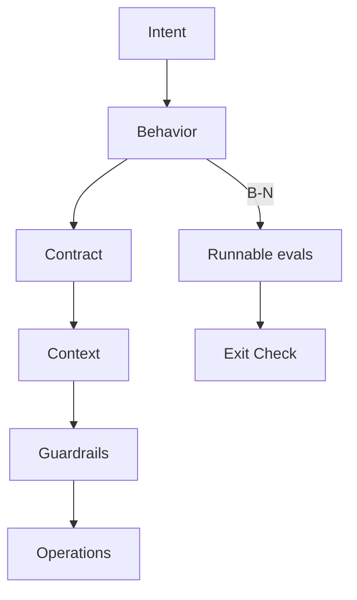
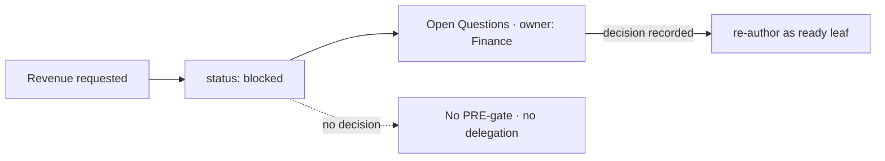
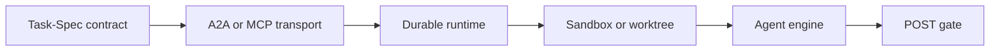

# Day 3 agenda — from plan to executable atomic work

This agenda contains no fixed times or slide locks. The presentation introduces
one idea, then the repository demonstrates it.

## Opening — the third trust problem

Carry the story forward:

- Day 1: What is true?
- Day 2: What may the agent do?
- Day 3: What exactly can another agent finish and prove?

Opening question:

> The plan says `stg_customers`. Could a fresh agent build the same thing we
> intended—and could a different process decide whether it is done?

## Act 1 — reveal the experiment

Show nine cards face down. Explain that every model received the same pinned
repository, questions, truth boundaries, and output budget.

Reveal DeepSeek Flash first: `SOURCE_ACCESS=FAILED`.

Teaching point: an agent without approved context should stop rather than fill
the gap with prior knowledge.

Then reveal the eight usable cards quickly, one sentence each. Do not read the
full outputs. Finish with the confidence range and the consensus sentence.

## Act 2 — the plan is necessary but not executable

Open `storage/specs/4-plan-transform.md` and point to item 1:

> `stg_customers` — types, key `customer_id`, no business rule.

It is a legitimate plan item, but it does not yet carry all of the following:

- exact write surface;
- observable behavior;
- executable checks;
- effort and retry limits;
- explicit exclusions;
- authorization and acceptance lifecycle.

Teaching point: a plan helps humans agree; it is not automatically a portable
execution contract.

## Act 3 — anatomy of the atomic leaf

Introduce the canonical Task-Spec 3.6 flow rather than a parallel “Tasks Pack”:

Explain atomicity as one coherent done-condition, bounded writes, and enough
context to finish in one fresh executor session. “One PR” is a heuristic, not
the definition.

## Act 4 — build the ready atom

Convert plan item 1 into an S leaf for `stg_customers`.

The initial bounded surface should be limited to:

- `dbt/models/staging/stg_customers.sql`;
- `dbt/models/staging/_raw_sources.yml`.

The leaf preserves physical columns and types. It must not define Revenue,
segment semantics, or customer business rules. Its behaviors map to runnable
dbt checks, and the repository gates remain `make dbt-check` and `make test`.

Teaching point: atomicity is not smallness alone; it is bounded authority plus
observable completion.

## Act 5 — show the blocked atom

Return to item 10: a model or metric named `revenue`.

Represent it as structurally blocked with Finance as owner. Do not create an
eval that silently chooses statuses, timestamps, gross/net treatment, currency,
or recognition policy.

Teaching point: a good task system represents missing authority instead of
turning uncertainty into code.

## Act 6 — authorize and hand off

Run the PRE gate, inspect the HMAC-backed authorization envelope, and emit a
credential-free `TaskHandoff/v1` for a fresh executor session.

Explain precisely:

- the seal is tamper-evident, not identity;
- the handoff transports the contract, not credentials;
- Task-Spec does not select or host the model;
- sandbox enforcement belongs to the execution environment.

## Act 7 — execute, then settle separately

Let the fresh executor build only the authorized leaf. After it reports
completion, run the POST gate outside its implementation loop.

Show both possible outcomes:

- accepted locally because evals, scope, and seal passed;
- rejected or parked because evidence or scope failed.

Then state the boundary: `accepted: true` is not deployment, production health,
or Finance approval.

## Act 8 — place Task-Spec in the ecosystem

- A2A/MCP transport task state and artifacts.
- Temporal/Inngest/Trigger/LangGraph manage durable execution.
- E2B/Daytona/worktrees isolate execution.
- Codex/Claude/Gemini/Kimi and others perform the work.
- Task-Spec carries the bounded contract and configured proof.

## Close — the honest breakthrough

Use GLM's balanced conclusion:

> The breakthrough is real; the proof is incomplete.

Close with the two commitments:

1. A prompt asks one model to try. A Task-Spec lets a fresh executor act within
   bounded authority and lets a later gate recheck the configured evidence.
2. The next proof is not another diagram. It is the same sealed task executed
   by multiple real engines, followed by adversarial and production evidence.

## Giveaways

- the immutable raw multi-LLM responses;
- the nine Reveal cards;
- the consensus and disagreement ledger;
- the canonical Task-Spec prompt and repository;
- the completed TransactCo atomic leaf after the live run.
