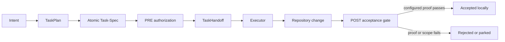

# Consensus — what eight usable models independently found

## Collection result

- 9 submissions arrived.
- 8 produced complete analyses.
- 1 failed closed because it could not access the canonical source.
- Confidence ranged from 62 to 85, with a mean of 73.9 and median of 75.
- 1 response exceeded the output budget; the raw response remains unchanged.

## The central consensus

All eight usable analyses converged on the same thesis:

> Task-Spec is most valuable as a portable contract for one bounded unit of
> work—not as a model, sandbox, scheduler, tracker, or autonomous factory.

They also converged on the mechanism:

## Eight-of-eight agreement

Every usable response identified these as the important mechanisms:

1. Completion is represented by runnable evaluations and an Exit Check rather
   than an agent's narrative.
2. Behavior and evaluation are linked through `B-N` and `verifies:`.
3. Write authority and other covered fields are sealed before delegation.
4. Authorization, execution, and acceptance are separate lifecycle moments.
5. A credential-free handoff and conformance suite make portability testable.
6. Task-Spec owns the contract boundary, not fleet scheduling, model execution,
   sandbox enforcement, or production operation.
7. Eval quality is the ceiling: a structurally valid weak oracle is still weak.
8. Real multi-engine CI and stronger anti-gaming evidence remain missing.

## The best shared formulation

The models used different language—ABI, payload, protocol, contract, substrate,
or noun beneath the verbs—but the common idea is simpler:

> A prompt asks one model to try. An atomic Task-Spec lets a fresh executor know
> what it may change and lets a later gate determine whether the configured
> evidence passed.

## What the consensus does not prove

Eight similar answers are not eight independent production experiments. The
models inspected the same canonical repository and therefore should converge
on its implemented claims. Their agreement is valuable for identifying the
clearest explanation and the recurring criticism; it is not adoption evidence.
