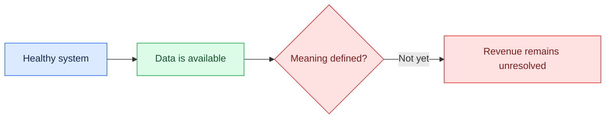

# 00 — Establish the Baseline

## Session

**No agent.** Use the terminal only.

## Why this step

Before asking the system a business question, prove that the environment is
available and record the revision being investigated. Health is necessary, but
health does not define Revenue.

## Structure



Explain briefly:

- `doctor` proves connectivity and safety checks.
- `status` proves that the four operational entities contain data.
- Neither command supplies a Finance-owned definition.

## Backstage preflight

This is the original Day 1 preflight. Run it only in a separately authorized,
disposable rehearsal copy: `make bootstrap` rebuilds generated data, while the
tracked specs in the current checkout are frozen inputs.

```bash
git status --short
git rev-parse --short HEAD
make bootstrap
uv run transactco ontology validate
make skill-check
mkdir -p storage/specs
mkdir -p tmp/foundation-investigation/manual
mkdir -p tmp/foundation-investigation/skill
```

## Do live

```bash
git rev-parse --short HEAD
make doctor
make status
```

Show only:

1. the recorded revision;
2. `ready` from the environment;
3. Customers, Products, Orders, and Payments;
4. the fact that row counts are evidence of availability, not meaning.

Say:

> The system is healthy. The business answer is still undefined.

## Gate

- Environment is ready.
- The four entities are visible.
- No defect was injected or instructor surface inspected.
- The room can explain why health is not semantic trust.

## Recovery

```bash
make up
make doctor
```

Use `make reset` only for a disposable local volume; it destroys the database.

Next: [`01-weak-prompt.md`](01-weak-prompt.md).
