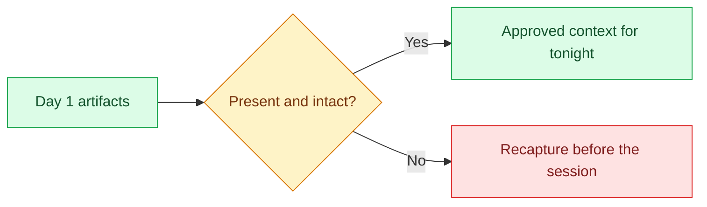

# 00 — Verify the Inheritance

## Session

**No agent.** Use the terminal only.

## Why this step

Day 1 claimed that evidence survives the chat session. Tonight that claim is
either true on screen or the night cannot start: three spec files, four healthy
tables, and a deliberately empty dbt shell that parses.

## Structure



Explain briefly:

- The specs are yesterday's outputs entering as tonight's inputs.
- The dbt shell is empty on purpose — construction lands there tonight.
- `Revenue` is still `unresolved`; nothing tonight changes that.

## Backstage preflight

This is the original Day 2 preflight and belongs in a separately authorized
rehearsal copy. The specs are baseline-specific evidence; if `make bootstrap`
was re-run since capture, restart from Day 1 checkpoints 03–06 in that rehearsal
copy. Numbers from an older baseline must not be shown, and the tracked specs in
the current checkout must not be overwritten.

```bash
git status --short
git rev-parse --short HEAD
make doctor
ls -la storage/specs/
test ! -d dbt/models/staging && echo "staging absent — correct"
test ! -e storage/specs/4-plan-transform.md && echo "plans absent — correct"
test ! -d tmp/harness-scaffold && echo "scaffold absent — correct"
git ls-files --error-unmatch AGENTS.md && echo "AGENTS.md tracked — 03 diff will render"
uv run transactco ontology validate
```

The working tree must be clean and `AGENTS.md` must be **committed** before the
session: checkpoint 03's evidence is `git diff AGENTS.md`, which prints nothing
for an untracked file, and any unrelated pending change shows up in the diffs at
03 and 05.

## Do live

```bash
make status
ls -la storage/specs/
make dbt-check
```

Show only:

1. the four entities and their freshness;
2. the three numbered specs and their timestamps;
3. `dbt parse` succeeding against an empty `models/` directory.

Say:

> The session that produced these files is gone. The files are not. That is the
> whole argument for documentation — now we build on top of it.

## Gate

- Environment healthy; four entities visible.
- `1-context.md`, `2-ontology.md`, `3-technical-brief.md` present and readable.
- The dbt shell parses and `dbt/models/staging/` does not exist yet.
- No instructor surface inspected.

## Bridge from Day 1 — the method as a file

**Optional, about three minutes. Cut this first if the night is running late;
no later checkpoint depends on it.**

**NEW — warm-up session, discarded.** Do not reuse it for checkpoint 01;
Session A has to start unprimed.

Day 1 ended by packaging the investigation method as a skill, and the room never
saw it run. Running it now buys two things: yesterday's claim stops being a
claim, and tonight's premise arrives in the agent's own words — the number is
still waiting for Finance.

Show the seven steps first:

```bash
rg -n '^### ' skills/interview-the-system/SKILL.md
```

Then start the warm-up session:

```text
Leia `skills/interview-the-system/SKILL.md` e aplique a skill à pergunta:
"Qual foi a Receita da TransactCo ontem e por que o CFO deveria confiar nesse
número?"

Use `storage/specs/1-context.md`, `storage/specs/2-ontology.md` e
`storage/specs/3-technical-brief.md` como contexto aprovado. Pare no contrato
de investigação: apresente o contrato proposto e as decisões abertas em uma
única tabela de no máximo 6 linhas e 150 palavras.

Você pode ler esses arquivos. Não escreva nem edite nenhum arquivo, não
consulte o banco e não gere o pacote de investigação. Responda em português do
Brasil.
```

Show only:

1. the contract row that puts `Revenue` out of scope;
2. the open decision whose owner is Finance.

Say:

> Yesterday this was a method in our heads. Today it is a file that reaches the
> same stop without me. Tonight we write the other half — what the agent may
> build while that stop holds.

Bridge gate:

- The skill ran from files alone — no Day 1 chat memory in the session.
- The proposed contract stopped at `Revenue` and named Finance as its owner.
- Nothing was written; `git status --short` is still clean.

If the session writes a file, queries the database, or runs past the contract,
interrupt it, name the boundary out loud, and go to `01`. The overreach lesson
belongs to checkpoint 01, not here.

## Recovery

```bash
make up
make land
```

If the specs are missing or stale, stop. Restart from Day 1 in the separately
authorized rehearsal copy; do not overwrite the tracked current artifacts or
substitute prepared copies without labeling them **prepared**.

Next: [`01-unbounded.md`](01-unbounded.md).
