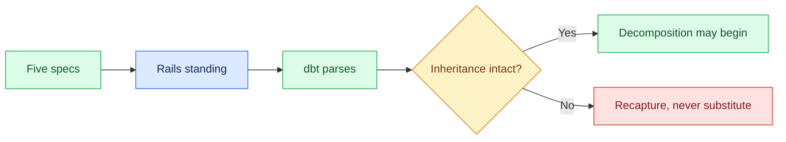

# 00 — Verify the Inheritance

## Session

**No agent.** Terminal only. The first agent session opens at checkpoint 01.

## Why this step

Two nights of evidence are on disk. Tonight consumes the newest of it — the
transform plan — as raw material. Before anything is decomposed, the room sees
that the plan is real, that the rails from Day 2 still stand, and that the
construction site is where Day 2 left it.

## Structure



Explain briefly:

- Five specs, two of them written by an agent last night under a contract.
- The rails did not evaporate: the agent pair and one passing model are committed.
- Nothing here says what "done" means — that is tonight's whole programme.

## Do live

First, the reset — run this **before the room is watching**. The repository ships
one Task-Spec from an earlier rehearsal (`tasks/T-20260812-daily-gross-ordered.md`,
committed in `0bd3e09`), and checkpoint 02's whole teaching beat is the room
watching that file get typed. Archive it rather than delete it: `tmp/` is
gitignored, so it survives as the **prepared** fallback, and `git checkout --
tasks/` restores the committed copy afterwards.

```bash
mkdir -p tmp/prepared
[ -e tasks ]     && mv tasks     tmp/prepared/tasks-prerehearsal
[ -e .taskspec ] && mv .taskspec tmp/prepared/taskspec-prerehearsal
rm -f dbt/models/staging/stg_daily_gross_ordered.sql
git status --short          # expect: deleted tasks/… — that is the reset, not a mistake
```

Then, with the room watching:

```bash
git rev-parse --short HEAD
make status
ls -la storage/specs/
make dbt-check
taskspec version
test ! -e tasks && echo "tasks absent — correct"
test ! -e dbt/models/staging/stg_daily_gross_ordered.sql && echo "tonight's model absent — correct"
```

Then open the raw material and scroll to its blocked rows:

```bash
sed -n '10,22p' storage/specs/4-plan-transform.md
```

## Show the evidence

Four healthy entities from `make status`. Five specs with their timestamps. The
dbt project parsing with the Day 2 model in place. Then the plan's table, and
specifically rows 7, 9 and 10 — the ones marked BLOCKED with Finance named.

Say:

> Ten items. Every one names its evidence. Three of them are blocked where
> meaning is missing. This is a good plan — and not one line of it tells an
> agent when it is done.

## Gate

- Environment healthy; four entities visible.
- Five specs present and readable, including both Day 2 plans.
- `make dbt-check` passes with the Day 2 staging model.
- `tasks/` and `.taskspec/` are absent, and `dbt/models/staging/` holds only
  `_raw_sources.yml` and `stg_orders.sql`. The reset block above is what makes
  this true — the repository ships a rehearsal Task-Spec, so this gate cannot
  pass on a fresh checkout without it.
- `taskspec version` prints **3.7.0**. Checkpoint 04 depends on it; a missing CLI
  must surface here at 20:00, not at 21:30 in front of the room.
- The plan's BLOCKED rows were read aloud.

## Recovery

```bash
make up
make land
```

If the two Day 2 plans are missing, stop and restore them before continuing —
they are the only input to tonight's decomposition. Do not substitute an
unlabeled copy; a prepared fallback must be announced as **prepared**.

Next: [`01-plausible-plan.md`](01-plausible-plan.md).
