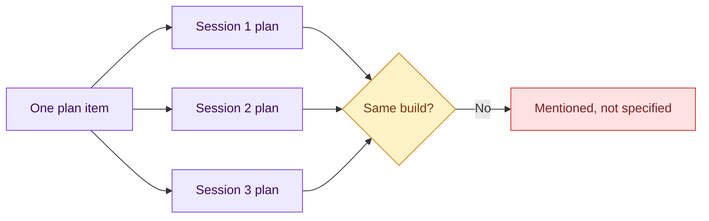

# 01 — The Plan Is Not the Work

## Session

**NEW — Session A, disposable.** Discard it the moment this checkpoint ends.
Nothing it produces enters tonight's work. If you reuse one context, reset it
fully between each of the three runs.

## Why this step

Day 2's villain was loud: an agent claiming authority nobody gave it. Tonight's
is quiet. Item 7 of the transform plan names its evidence, cites a measured
number, and marks its blocked grain. Nobody in the room would reject it in
review — and it still permits three different builds, each of which would claim
done. The room must watch that happen before the spec has a reason to exist.

## Structure



Explain briefly:

- The item is quoted verbatim. Nothing is added, nothing is removed.
- We stop at the plan. Nothing executes, nothing is written.
- Three defensible answers to the same line is not a model problem.

## Do live

Paste this three times, into three fresh contexts. Say nothing else between
runs.

```text
Implemente o item 7 do plano de transformação em storage/specs/4-plan-transform.md:

"mart_daily_gross_ordered — sum by ordered_at, non-cancelled orders;
grain = UTC calendar day, labeled as a technical window"

Apresente apenas o seu plano de implementação em no máximo 6 linhas
numeradas. Não execute nada e não escreva nenhum arquivo.
```

The quoted line is item 7 verbatim from the spec — leave it in English exactly
as the file has it, so the room can compare the prompt to the file on screen.

## Show the evidence

The three plans side by side. Walk them with one question:

> Which one of these is wrong?

None is. Then circle the three divergences the room can see for itself:

1. **Which statuses count as non-cancelled** — all five non-cancelled, or only
   `delivered`, or only those with a captured payment.
2. **Which upstream model it reads** — `stg_orders` directly, or
   `int_orders_payments_reconciled`.
3. **Where the technical-window label lives** — a column, the model name, a
   schema description, or a comment nobody will read.

Say:

> Every one of these is defensible. That is the problem. A plan item that
> permits three builds has not been specified — it has been mentioned.

## Gate

- Three plans exist on screen; nothing executed and no file was written.
- At least three concrete divergences were named out loud.
- Nobody in the room could call any of the three plans wrong.
- Session A is discarded.

## Recovery

If the three plans come back suspiciously similar, ask each one the follow-up
question: *"Quais pedidos exatamente entram na soma, e por quê?"* The divergence
surfaces immediately. If a session tries to execute, interrupt it and name the
boundary — the overreach lesson belongs to Day 2, not here.

Next: [`02-tasks-pack.md`](02-tasks-pack.md).
