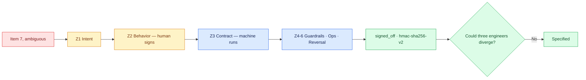

# 02 — Write the Task-Spec by Hand

## Session

**NEW — Session B.** It carries specification work through checkpoint 05.
**The human types.** Terminal and editor visible. No generator, no paste. The
tedium is the lesson: the giveaway at checkpoint 04 prices it.

## Why this step

Checkpoint 01 proved the plan item permits three builds. A Task-Spec closes that
gap by binding, for exactly one atomic change, what may be touched, what
behavior counts as success, what proves it, and who authorized it. Six zones.
Written once, by hand, so the room knows what the generator would be generating.

## Structure



Explain briefly:

- Zones 1–2 are written or signed by a human; zone 3 lets the agent answer
  "am I done?" without asking; zones 4–6 hold the boundary, the open questions,
  and the way back.
- `effort` is the sizing rule, not a label: `XS`/`S`/`M`/`L` are runnable
  leaves; `XL`/`XXL` cannot be executed at all and must carry `children`.
- The seal is the Day 2 sequel: `signed_off` is bound by HMAC to the exact body,
  so changing one character after approval breaks it. Authority stops being a
  memory.
- The spec is files, so it survives the engine swap exactly like `AGENTS.md`.

## Do live

Create the directory and the spec in the editor, typing every zone:

```bash
mkdir -p tasks
```

Then write `tasks/T-20260812-daily-gross-ordered.md`. The narrowest honest scope for item 7 is
the aggregate itself — the label decision from checkpoint 01 becomes explicit:

```markdown
---
id: T-20260812-daily-gross-ordered
title: Aggregate non-cancelled order totals by ordered_at
status: ready
effort: S
budget_iterations: 15
agent: any
depends_on: []
touches_paths: []
creates_paths: [dbt/models/staging/stg_daily_gross_ordered.sql]
source_note: storage/specs/4-plan-transform.md
created: 2026-08-12
tags: [dbt, staging, transactco]
---

## Goal
Produce one daily aggregate of non-cancelled order totals, labeled by its
physical basis and never as Revenue.

## Context
Reads `stg_orders` (Day 2, committed). Sums `total_amount` grouped by the UTC
calendar day of `ordered_at`. Excludes `cancelled`.
Lands in `dbt/models/staging/`: item 7 names a *mart*, but the Day 2 contract
authorizes `dbt/models/staging/` only, and `4-plan-transform.md` states the
marts layer needs a scope extension at its own checkpoint. This spec scopes
down rather than widening the contract.
Evidence: `4-plan-transform.md` item 7 · brief candidate 1
(R$ 1,403,044.31 / 868 orders).

## Behaviors
(zone 2 — written at checkpoint 03)

## Success Criteria
(zone 3 — written at checkpoint 03)

## Validation Card
(zone 3 — written at checkpoint 03)

## Exit Check
(zone 3 — written at checkpoint 03)

## Anti-Patterns
- **Don't name it revenue** — Revenue is unresolved and owned by Finance.
  Label the aggregate by its physical basis instead.
- **Don't net returns into the total** — refunds are counted, never subtracted.

## Do-Not-Touch
- `storage/specs/` — Day 1 and Day 2 evidence, read-only tonight
- `src/transactco/control/` — instructor surface

## Open Questions
(none — this task is fully specified)
```

Zones 4 and 5 are written now because they are boundaries, not proofs. Zone 6
(Rollback, Observability) is `full`-profile only and this task is `standard`.

Four sections stay empty on purpose, and it is worth naming them so the room sees
the shape of the gap rather than an unfinished file: **`## Behaviors`** (zone 2)
and **`## Success Criteria`**, **`## Validation Card`**, **`## Exit Check`**
(zone 3). Those are the two halves of done, and checkpoint 03 fills all four in
that order. Say it plainly: *the boundary is written, the proof is not — so right
now this file still cannot tell anyone when it is finished.*

Then show what changed:

```bash
git status --short tasks/
```

## Show the evidence

The spec on screen, and the three divergences from checkpoint 01 resolved in
it, one by one: the statuses are named, the upstream model is named, the label's
home is named. Hold one beat and say:

> Remember how this felt. In two checkpoints a template does the skeleton in
> seconds — and you will know exactly what it generated, because you typed it
> once.

## Gate

- `tasks/T-20260812-daily-gross-ordered.md` exists, typed in front of the room.
- Zones 1, 4 and 5 are complete; zones 2 and 3 are deliberately deferred to checkpoint 03.
- Each of checkpoint 01's three divergences is now answered in writing.
- Nothing else in the repository changed.
- The room felt the manual cost.

## Recovery

If typing live stalls, keep going — slow typing teaches better than fast
pasting. Only if the editor session breaks entirely, move the incomplete spec
under ignored `tmp/` as a clearly labeled recovery artifact, then retype Goal
and Context first; Behaviors and Success Criteria belong to checkpoint 03
anyway.

Next: [`03-bdd-and-evals.md`](03-bdd-and-evals.md).
