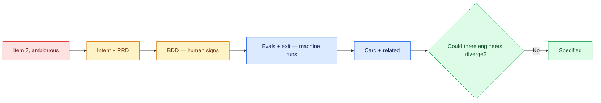

# 02 — Write the Tasks Pack by Hand

## Session

**NEW — Session B.** It carries specification work through checkpoint 05.
**The human types.** Terminal and editor visible. No generator, no paste. The
tedium is the lesson: the giveaway at checkpoint 04 prices it.

## Why this step

Checkpoint 01 proved the plan item permits three builds. The pack closes that
gap by naming, for exactly one objective, what a human signs and what a machine
runs. Seven fields. Written once, by hand, so the room knows what a generator
would be generating.

## Structure



Explain briefly:

- Fields 1–3 are written or signed by a human; 4–6 let the agent answer "am I
  done?" without asking; field 7 lets a hundred packets order themselves.
- One objective, no "and". If the title needs "and" to be honest, it is two.
- The pack is files, so it survives the engine swap exactly like `AGENTS.md`.

## Do live

Create the directory and the pack in the editor, typing every field:

```bash
mkdir -p storage/tasks
```

Then write `storage/tasks/T-001.md`. The narrowest honest scope for item 7 is
the aggregate itself — the label decision from checkpoint 01 becomes explicit:

```markdown
---
id: T-001
title: mart_daily_gross_ordered aggregates non-cancelled orders by ordered_at
status: ready
depends_on: []
touches_paths: [dbt/models/staging/]
do_not_touch: [storage/specs/, src/transactco/control/]
---

## Intent
Produce one daily aggregate of non-cancelled order totals, labeled by its
physical basis and never as Revenue.

## PRD
Reads `stg_orders` (Day 2, committed). Sums `total_amount` grouped by the UTC
calendar day of `ordered_at`. Excludes `cancelled`. The technical-window label
lives in the model name and its schema description — not in a comment.
Evidence: `4-plan-transform.md` item 7 · brief candidate 1
(R$ 1,403,044.31 / 868 orders).

## BDD
(written at checkpoint 03)

## Evals
(written at checkpoint 03)

## Exit check
(written at checkpoint 03)

## Validation card
retry: max 3 iterations · circuit breaker after 2 passes with no progress
agent contract: read the pack, build, verify, emit pass | fail | blocked

## Related
depends_on: none — stg_orders already exists and passes its gate
blocks: T-002 (captured payments mart shares the grain decision)
```

Then show what changed:

```bash
git status --short storage/tasks/
```

## Show the evidence

The pack on screen, and the three divergences from checkpoint 01 resolved in
it, one by one: the statuses are named, the upstream model is named, the label's
home is named. Hold one beat and say:

> Remember how this felt. In two checkpoints a template does the skeleton in
> seconds — and you will know exactly what it generated, because you typed it
> once.

## Gate

- `storage/tasks/T-001.md` exists, typed in front of the room.
- All seven fields are present; three are deliberately marked for checkpoint 03.
- Each of checkpoint 01's three divergences is now answered in writing.
- Nothing else in the repository changed.
- The room felt the manual cost.

## Recovery

If typing live stalls, keep going — slow typing teaches better than fast
pasting. Only if the editor session breaks entirely, restore with
`git checkout -- storage/tasks/` and retype Intent and PRD first; the BDD and
evals belong to checkpoint 03 anyway.

Next: [`03-bdd-and-evals.md`](03-bdd-and-evals.md).
