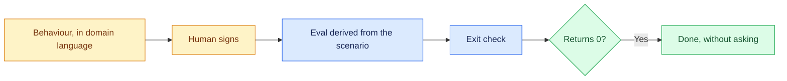

# 03 — Two Halves of Done

## Session

**Continue Session B.** Still the human typing for the scenario; the agent may
draft the bash once the scenario is signed.

## Why this step

"Done" has two readers. Finance cannot review a bash assertion, and a machine
cannot run a sentence. Write the behaviour first in language the decision owner
can approve, then derive the eval from it — so the eval stops being an assertion
somebody invented.

## Structure



Explain briefly:

- Write the scenario before the assertion; the assertion inherits its meaning.
- An eval must be terminal: deterministic, idempotent, and answerable by a
  machine without your opinion.
- The exit check is one command. It returns 0 or the work is not done.

## Do live

Fill the four deferred sections of `tasks/T-20260812-daily-gross-ordered.md`. Type the scenario;
it is the half a human signs:

```gherkin
Scenario: gross ordered excludes cancelled orders
  Given raw orders carrying six distinct statuses
  When stg_daily_gross_ordered aggregates total_amount by ordered_at
  Then orders with status 'cancelled' are excluded
  And the result is labeled a technical window, never "Revenue"
```

Then the evals it implies:

```bash
# eval-1: the model exists and the project parses
eval_1() { make dbt-check >/dev/null 2>&1; }

# eval-2: the scenario's exclusion is expressed in the model
eval_2() { grep -q "cancelled" dbt/models/staging/stg_daily_gross_ordered.sql; }

# eval-3: the boundary holds — nothing here is named revenue
eval_3() { ! grep -ril "revenue" dbt/models/ | grep -q . ; }
```

And the exit check:

```bash
eval_1 && eval_2 && eval_3
```

Run it once, now, and let it fail:

```bash
bash -c 'source /dev/stdin <<< "$(sed -n "/^eval_1()/,/^}/p;/^eval_2()/,/^}/p;/^eval_3()/,/^}/p" tasks/T-20260812-daily-gross-ordered.md)"; eval_1 && eval_2 && eval_3'; echo "exit=$?"
```

## Show the evidence

Two things, in this order. First the scenario — ask the room who in their
company would sign it; the answer is Finance, and they can read it. Then the
exit check returning non-zero, and say:

> Nothing is built yet, so it fails. That is correct. This number is the only
> thing that will tell us we are finished — and it already works.

## Gate

- A Gherkin scenario exists inside `T-20260812-daily-gross-ordered.md`, readable by a non-engineer.
- Three bash evals exist, each terminal and each traceable to the scenario.
- The exit check ran on screen and returned non-zero — a failing gate before
  the build is the proof that the gate is real.
- `Revenue` appears in eval-3 only as a prohibition.

## Recovery

If the eval extraction one-liner is awkward on the night, keep a copy of the
three functions in a scratch file and source it directly — the teaching point
is the returned number, not the shell plumbing. Announce the scratch file as
**prepared** if you use it.

**BREAK comes after 03** — leave the Task-Spec on the projector.

Next: [`04-decompose.md`](04-decompose.md).
