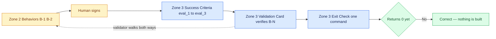

# 03 — Two Halves of Done

## Session

**Continue Session B.** Still the human typing for the scenario; the agent may
draft the bash once the scenario is signed.

## Why this step

"Done" has two readers. Finance cannot review a bash assertion, and a machine
cannot run a sentence. Write the behaviour first in language the decision owner
can approve, then derive the eval from it — so the eval stops being an assertion
somebody invented.

## Structure



Explain briefly:

- Write the behavior before the assertion; the assertion inherits its meaning.
- An eval must be terminal: deterministic, idempotent, and answerable by a
  machine without your opinion.
- **Neither side may dangle.** Every `B-N` needs at least one eval that names it,
  and every eval must name at least one `B-N`. The validation card is where that
  mapping is written down, and `taskspec validate` walks it in both
  directions and fails the file on any unmatched node.
- The exit check is one command. It returns 0 or the work is not done.

## Do live

Checkpoint 02 left exactly four sections of
`tasks/T-20260812-daily-gross-ordered.md` marked `(written at checkpoint 03)`.
Fill them in this order — the order matters, because each one is derived from the
one above it:

| # | Section | Zone | Who writes it | What it holds |
| ---: | --- | --- | --- | --- |
| 1 | `## Behaviors` | 2 | **the human types** | `B-1`, `B-2` — Given / When / Then, in language Finance can approve |
| 2 | `## Success Criteria` | 3 | agent drafts, human checks | one bash function per eval, each naming the `B-N` it proves |
| 3 | `## Validation Card` | 3 | agent drafts, human checks | the `verifies: [B-N]` mapping, retry policy, agent contract |
| 4 | `## Exit Check` | 3 | **the human types** | one command that returns 0 only when every eval passes |

**Section 1 of 4 — `## Behaviors`.** The half a human signs. Two behaviors, not
one, because the plan item made two separate promises:

```markdown
## Behaviors

- **B-1** — GIVEN raw orders carrying six distinct statuses
  WHEN `stg_daily_gross_ordered` aggregates `total_amount` by `ordered_at`
  THEN orders with status `cancelled` are excluded from the total.
- **B-2** — GIVEN the aggregate is published
  WHEN anyone reads its name or its labels
  THEN it is described by its physical basis and never as "Revenue".
```

Stop here and ask the room who signs this. The answer is Finance, and the point
is that they *can* — there is no bash in it.

**Section 2 of 4 — `## Success Criteria`.** Now derive the evals. Each comment
names the behavior that eval exists to prove:

```bash
# eval-1 (verifies B-1): the model exists and the project parses
eval_1() { make dbt-check >/dev/null 2>&1; }

# eval-2 (verifies B-1): the exclusion is expressed in the model
eval_2() { grep -q "cancelled" dbt/models/staging/stg_daily_gross_ordered.sql; }

# eval-3 (verifies B-2): the boundary holds — nothing here is named revenue
eval_3() { ! grep -ril "revenue" dbt/models/ | grep -q . ; }
```

**Section 3 of 4 — `## Validation Card`.** This is the section that makes the
binding machine-checkable rather than a comment convention. Every eval carries
`verifies:`; every `B-N` above appears at least once below:

```yaml
success_criteria:
  - id: eval_1
    description: The model exists and the dbt project parses
    runnable: bash
    terminal: true
    expected_duration_sec: 20
    verifies: [B-1]
  - id: eval_2
    description: Cancelled orders are excluded in the model
    runnable: bash
    terminal: true
    expected_duration_sec: 1
    verifies: [B-1]
  - id: eval_3
    description: No model under dbt/models/ is named revenue
    runnable: bash
    terminal: true
    expected_duration_sec: 1
    verifies: [B-2]

retry_policy:
  max_iterations: 15
  circuit_breaker_no_progress: 3
  on_terminal_failure: park_with_context

agent_contract:
  version: 2
  read: [intent, behavior, contract, guardrails, operations]
  produce: [dbt/models/staging/stg_daily_gross_ordered.sql]
  required_tools: [bash, dbt]
  timeout_minutes: 15
  sandbox_type: host
  emit: [pass, fail, retry_with_reason, parked_with_context]
  backend_metadata: {}
```

Trace it out loud, both directions: B-1 is proved by eval-1 and eval-2, B-2 by
eval-3, and no eval is left pointing at nothing. **That is the file being
complete, not the work being done.**

**Section 4 of 4 — `## Exit Check`.** One command:

```bash
eval_1 && eval_2 && eval_3
```

Run it once, now, and let it fail:

```bash
# extract the three eval functions from the spec's Success Criteria block
awk '/^## Success Criteria/{s=1} s&&/^```bash/{f=1;next} f&&/^```/{exit} f' \
  tasks/T-20260812-daily-gross-ordered.md > /tmp/d3-evals.sh
source /tmp/d3-evals.sh
eval_1 && eval_2 && eval_3; echo "exit=$?"
```

Verified against this repository: `eval_1` returns 0 because the project already
parses, `eval_2` returns non-zero because the model does not exist yet, so the
combined exit is **non-zero for the right reason**. That is the number to read out.

## Show the evidence

Two things, in this order. First the scenario — ask the room who in their
company would sign it; the answer is Finance, and they can read it. Then the
exit check returning non-zero, and say:

> Nothing is built yet, so it fails. That is correct. This number is the only
> thing that will tell us we are finished — and it already works.

## Gate

- All four deferred sections are filled; no `(written at checkpoint 03)` marker
  remains in `T-20260812-daily-gross-ordered.md`.
- `B-1` and `B-2` are written in Given / When / Then, readable by a non-engineer.
- Three bash evals exist, each terminal, each naming its `B-N` in a comment.
- The validation card maps every eval to a behavior with `verifies:`, and every
  behavior is claimed by at least one eval. **Nothing dangles in either
  direction** — say this out loud while tracing it.
- The exit check ran on screen and returned non-zero — a failing gate before
  the build is the proof that the gate is real.
- `Revenue` appears in eval-3 only as a prohibition.

## Recovery

The extraction above already writes to a scratch file on purpose — three legible
lines beat one clever line on a projector, and the earlier one-liner form was
removed because it broke. If even that is awkward on the night, paste the three
functions straight into the shell and call them; the teaching point is the
returned number, not the shell plumbing. Announce any pre-written scratch file as
**prepared** if you use one.

Do not reintroduce a `sed "/^eval_1()/,/^}/p"` range here. These evals are
one-line functions, so no line begins with `}`; the range runs to end-of-file,
swallows the closing code fence, and bash fails with a syntax error instead of
the clean non-zero this checkpoint is built to show.

**BREAK comes after 03** — leave the Task-Spec on the projector.

Next: [`04-decompose.md`](04-decompose.md).
