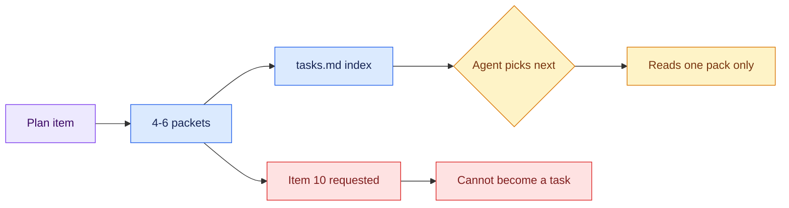

# 04 — Item 7 Becomes a Graph

## Session

**Continue Session B as the architect** — judgment work, no Bash. The developer
role waits for checkpoint 06.

## Why this step

One pack took fifteen minutes by hand. A plan has ten items and a real backlog
has hundreds. Decomposition is what turns the pack from a craft object into a
system: many small packets, plus a lean index so an agent can choose its next
unit without reading every spec.

## Structure



Explain briefly:

- Two layers: a lean index of stubs, and one full pack per unit. The index is
  what keeps the choosing cheap.
- Wide and shallow beats narrow and deep — shallow graphs give the loop more
  ready packets at any moment.
- Splitting on "and" is the whole sizing rule.

## Do live

```text
Como arquiteto (sem executar nada), decomponha os itens 5 a 8 de
storage/specs/4-plan-transform.md em 4 a 6 packets atômicos, dentro do
contrato confirmado.

Cada packet: um único objetivo sem "e", os arquivos a inspecionar e alterar,
critérios verificáveis por máquina, e depends_on explícito. Máximo 200
palavras por packet.

Use storage/tasks/T-001.md como modelo — os sete campos, na mesma ordem.
Grave cada packet em storage/tasks/T-00N.md e um índice enxuto em
storage/tasks/tasks.md com id, título, status, caminho e depends_on.

Qualquer item que exija uma decisão semântica não resolvida não vira task:
registre-o no índice como BLOCKED com o dono. Resuma em no máximo 120
palavras e pare.
```

Then, deliberately, ask for the one that cannot exist:

```text
Agora crie o packet para o item 10 — o modelo `revenue`.
```

## Show the evidence

The index first — one screen, every packet a single line. Then one generated
pack, to show it carries the same seven fields as the one typed by hand. Then
the refusal for item 10, and its row in the index marked BLOCKED with Finance
named.

Ask the room:

> Did decomposition dissolve the boundary? It did not. The refusal survived
> becoming a graph.

## Gate

- `storage/tasks/tasks.md` exists and fits on one screen.
- 4–6 packets exist, each with one objective and no "and" in its title.
- Every packet names `depends_on` explicitly.
- Item 10 was requested and refused; the index shows it BLOCKED, owner Finance.
- Session B stops here.

## Recovery

If a packet comes back oversized or with "and" in the title, reject it in one
line and regenerate — the correction is itself a teaching beat. Do not edit the
packet by hand; the architect owns its own revision.

The giveaway slide follows this checkpoint: the Tasks Pack template is free,
and what it cannot do — size a packet, judge whether an eval is terminal, write
a scenario Finance would sign — is the Bootcamp.

Next: [`05-ready-set.md`](05-ready-set.md).
