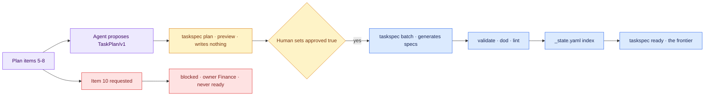

# 04 — Item 7 Becomes a Graph

## Session

**Continue Session B as the architect** — judgment work, no Bash and no file
writes. The architect proposes and reviews a plan; a human approves it, and the
facilitator runs `taskspec` to materialize the approved files. The developer
role waits for checkpoint 06.

## Why this step

One spec took fifteen minutes by hand. A plan has ten items and a real backlog
has hundreds. Decomposition is what turns the spec from a craft object into a
system: many small packets, plus a lean index so an agent can choose its next
unit without reading every spec.

Checkpoints 02 and 03 wrote a Task-Spec by hand so the room knows the shape. This
checkpoint uses the real tool for the same job — **the same tool that is given
away for free at 21:50**. The giveaway lands very differently once the room has
watched it work on their own repository.

The division of labour is the teaching point: the agent proposes a reviewable
**map**, a human approves it, and only then does the tool write files. Generation
materializes exactly the approved manifest — it never invents missing work.

## Structure



Explain briefly:

- Two layers: a lean index of stubs, and one full spec per unit. The index is
  what keeps the choosing cheap.
- Wide and shallow beats narrow and deep — shallow graphs give the loop more
  ready packets at any moment.
- Splitting on "and" is the whole sizing rule. Item 5 says "left join **and**
  keeps the 2,204 orders as explicit coverage" — that is two packets, and the
  room should catch it before the agent does.
- `approved: true` is not a convention. `batch` refuses to generate without it.

## Do live

### Move 0 — the tool, on screen

The facilitator, not Session B, runs:

```bash
taskspec version
taskspec init        # creates .taskspec/config; keeps the existing tasks/ content
```

Say the version number out loud: **3.7.0, MIT**. It is the thing being given away
in twenty minutes.

### Move 1 — the agent proposes a map, not files

```text
Como arquiteto (sem executar nada), decomponha os itens 5 a 8 de
storage/specs/4-plan-transform.md em 4 a 6 unidades atômicas, dentro do
contrato confirmado.

NÃO escreva arquivos. Proponha no chat um único manifesto TaskPlan/v1 com
approved: false, seguindo o schema de
~/GitHub/task-spec/docs/examples/task-plan.yaml. O facilitador salvará a versão
aprovada em tasks/.plans/transform-5-8.yaml.

Cada unidade: id T-20260812-<slug>, um único objetivo sem "e", effort,
depends_on explícito, touches_paths e creates_paths dentro de
dbt/models/staging/, e ao menos um behavior B-N com um eval que declare
verifies: [B-N].

Os itens 5 a 8 nomeiam modelos mart_ e int_; o contrato do Day 2 autoriza
apenas dbt/models/staging/, então use nomes stg_ e registre a redução de
escopo no context de cada unidade.

Qualquer item que exija uma decisão semântica não resolvida entra como
unidade com open_questions nomeando o dono — nunca com uma definição
escolhida por você. Resuma em no máximo 120 palavras e pare.
```

The architect reviews the response against the contract and returns a verdict.
After a human accepts that verdict, the facilitator saves the exact accepted
YAML as `tasks/.plans/transform-5-8.yaml`. Session B still writes nothing.

### Move 2 — preview the graph, changing nothing

The facilitator runs:

```bash
taskspec plan --manifest tasks/.plans/transform-5-8.yaml
```

This prints one row per unit with its kind, size and backend, plus a digest — and
**writes nothing**. Read the `depends_on` edges out loud. This is the architect's
whole job: reject a unit whose title needs "and", reject a dangling edge, reject a
write surface outside the contract.

### Move 3 — the human gate

Only after that review, flip one line in the manifest:

```yaml
approved: true
```

Then the facilitator generates. Try it once *before* flipping if you want the beat — `batch`
refuses with `TaskPlan must set approved: true before generation`.

```bash
taskspec batch --plan tasks/.plans/transform-5-8.yaml
```

### Move 4 — let the tool prove its own output

```bash
for spec_file in tasks/T-*.md; do
  taskspec validate "$spec_file"
  taskspec dod "$spec_file"
done
taskspec lint
taskspec rebuild-state
```

`dod` is the one to linger on. It prints the traceability matrix the room typed
by hand at checkpoint 03 — `[x] B-1 → eval_1` — and ends in `DOD=COMPLETE`. The
rule is now machine-checked, not asserted. `lint` reports the dependency graph
and warns on two packets writing the same file, which is a real design smell and
worth fixing live if it appears.

### Move 5 — then, deliberately, ask for the one that cannot exist

```text
Agora crie o packet para o item 10 — o modelo `revenue`.
```

The architect must refuse to give it a definition. After that refusal, the
facilitator records an empty blocked hole rather than an executable instruction.
`transition` requires an existing scaffold, so create it first and transition it
immediately — do not run the ready picker between those two commands:

```bash
taskspec new revenue-metric XS any
taskspec transition T-20260812-revenue-metric blocked \
  "Revenue is unresolved and owned by Finance (D1-D4, 2-ontology.md)"
taskspec rebuild-state
taskspec ready
```

## Show the evidence

Four things, in this order:

1. **`taskspec plan` output** — the whole graph on one screen, before any file
   existed. Point at the edges.
2. **The refusal to generate** without `approved: true`, if you staged that beat.
3. **`taskspec dod`** on one generated spec — the same B-N → eval matrix the room
   typed by hand, now produced by the tool.
4. **`taskspec ready`** — the frontier, with the revenue hole absent. Then the
   `blocked:` group in `tasks/_state.yaml` and the final line of
   `tasks/_metrics.jsonl`: together they show the hole, timestamped status
   change, reason, and owner.

Ask the room:

> Did decomposition dissolve the boundary? It did not. The refusal survived
> becoming a graph — and the tool will not hand a blocked unit to an executor.

## Gate

- `tasks/.plans/transform-5-8.yaml` exists and was previewed before approval.
- `taskspec plan` was shown writing nothing.
- 4–6 units exist, each with one objective and no "and" in its title.
- Every unit names `depends_on` explicitly; `taskspec lint` reports the DAG.
- `taskspec validate` passes on every generated spec.
- `taskspec dod` shows a complete behavior → eval matrix for at least one spec.
- `tasks/_state.yaml` exists and fits on one screen.
- Item 10 was requested and refused; only a definition-free blocked hole exists,
  `taskspec ready` excludes it, and `tasks/_metrics.jsonl` records the reason
  with Finance named.
- Session B stops here.

## Recovery

Two traps, both verified against v3.7.0 — do not discover them live:

1. **`status: blocked` in the manifest is silently ignored.** A unit declared
   blocked still generates as `status: ready` and will appear in
   `taskspec ready`. Create the definition-free scaffold only after the
   architect refuses item 10, then transition it immediately as move 5 shows.
2. **The manifest parser breaks on an unquoted colon inside a string.**
   `Owner: Finance` inside a list item fails with `invalid key`. Quote any string
   containing a colon.

If a unit comes back oversized or with "and" in the title, reject it in one line
and regenerate the manifest — the correction is itself a teaching beat. Do not
edit a generated spec by hand; fix the manifest and re-run `batch`.

If `taskspec` misbehaves on the night, fall back to the manual path: the human
facilitator materializes the architect's accepted manifest and five specs,
exactly as checkpoint 02 was written by hand. Do not ask the architect to write
files. Announce the fallback as **prepared** and say plainly that the tool is
what the room is being given, not what the lesson depends on.

Two deck slides follow this checkpoint, in order, at roughly 21:50 — about
three minutes total, then straight back to the graph:

1. **The giveaway** — Task-Spec is free, MIT, v3.7.0, installed from source. The
   room has now watched it plan, refuse, generate and prove. Say plainly what it
   cannot do: size a packet, judge whether an eval is genuinely terminal, write a
   behavior Finance would sign.
2. **The crank** — a **pre-recorded** clip of the loop consuming this same graph
   in two dependency-respecting waves. Say "pre-recorded" before anything else;
   describing it as live would cost the night its whole credibility argument.

The current deck has no ladder, pricing, or offer slide. Return directly to the
ready set.

Next: [`05-ready-set.md`](05-ready-set.md).
