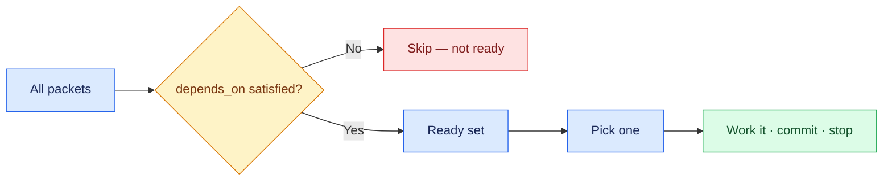

# 05 — The Ready Set

## Session

**Continue Session B.** Reading and ordering only — still no Bash.

## Why this step

A graph without an order is still not work. The ready set is the small idea that
replaces a project manager: the packets whose dependencies have all passed. The
agent picks from that set, and nobody has to decide what is next.

## Structure



Explain briefly:

- Ready = every dependency reports pass. Not "next in the list".
- Shallow graphs keep the ready set large; a chain of three is a smell that the
  split went too far or an intermediate packet does too little.
- The loop never asks a human what to do next — it asks the index.

## Do live

```text
A partir de tasks/_state.yaml, produza uma tabela com no máximo 8 linhas:
packet, depends_on, pronto agora (sim/não) e a justificativa em uma linha.

Ordene apenas pelo grafo — não use intuição, prioridade de negócio ou ordem
alfabética. Aponte qual packet o loop pegaria primeiro e por quê. Não execute
nada.
```

Then verify the claim against the file, in the terminal:

```bash
grep -n 'depends_on' tasks/_state.yaml
```

## Show the evidence

The table, and then the one line that matters: which packet is first, justified
only by `depends_on`. Point at a packet that is *not* ready and name what it is
waiting for.

Say:

> Nobody in this room decided that order. The graph did — and it will still be
> right tomorrow, when none of us remember writing it.

## Gate

- A table of at most 8 rows exists, on screen.
- Every "ready" verdict traces to `depends_on`, not to intuition.
- The first packet was named, with its justification.
- At least one not-ready packet was shown, with the dependency it waits on.
- No dependency chain is deeper than two.

## Recovery

If the agent orders by business priority or by list position, reject it in one
line — *"justifique apenas pelo grafo"* — and regenerate. If a chain of three
appears, say so out loud: it is evidence that checkpoint 04 split too
aggressively, and it is a better teaching moment than a clean graph.

Next: [`06-execute-one.md`](06-execute-one.md).
