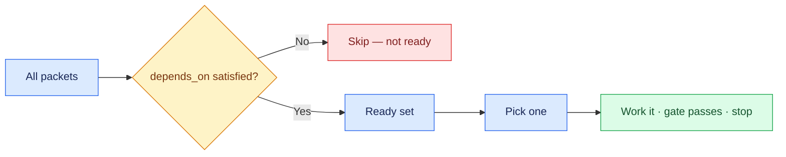

# 05 — The Ready Set

## Session

**Continue Session B.** Reading and ordering only — still no Bash. The
facilitator runs the CLI checks below; the architect predicts from files and
returns a verdict only.

## Why this step

A graph without an order is still not work. The ready set is the small idea that
replaces a project manager: the packets whose dependencies have all passed. The
agent picks from that set, and nobody has to decide what is next.

## Structure



Explain briefly:

- Ready = every dependency reports pass. Not "next in the list".
- Shallow graphs keep the ready set large; a chain of three is a smell that the
  split went too far or an intermediate packet does too little.
- The loop never asks a human what to do next — it asks the index.
- A `blocked` unit is never ready. That is how the item-10 refusal survives into
  dispatch: `taskspec ready` will not offer it, no matter who asks.

## Do live

Ask the agent to **predict**, before anyone runs anything:

```text
A partir de tasks/_state.yaml, produza uma tabela com no máximo 8 linhas:
packet, depends_on, pronto agora (sim/não) e a justificativa em uma linha.

Ordene apenas pelo grafo — não use intuição, prioridade de negócio ou ordem
alfabética. Aponte qual packet o loop pegaria primeiro e por quê. Não execute
nada.
```

Then let the tool compute the same answer, and compare the two on screen:

```bash
taskspec ready                                  # executable frontier only
taskspec lint                                   # DAG + write-disjoint groups
rg -n -A 3 '^blocked:' tasks/_state.yaml        # blocked hole IDs
tail -n 1 tasks/_metrics.jsonl                  # refusal reason and owner
```

`taskspec ready` prints one line per unit it would hand to an executor. `lint`
adds the concurrency partition: the groups that write to disjoint paths and are
therefore safe to dispatch together. Blocked holes are not emitted by either
`ready` form, so the generated state index plus the status-change metric are the
explicit proof that Revenue was recorded, withheld, and routed to Finance.

The comparison is the beat. If the agent's table matches the tool, the graph
decided and the agent merely read it. If it differs, the agent guessed — and the
tool is the arbiter, exactly as `dbt-check` was on Day 2.

## Show the evidence

The agent's table beside `taskspec ready`, and then the one line that matters:
which packet is first, justified only by `depends_on`. Point at a packet that is
*not* ready and name what it is waiting for. Then contrast the ready frontier
with the blocked index and final metric: the Revenue hole is withheld and still
owned by Finance.

Say:

> Nobody in this room decided that order. The graph did — and it will still be
> right tomorrow, when none of us remember writing it.

## Gate

- A table of at most 8 rows exists, on screen.
- `taskspec ready` ran, and its frontier was compared against the agent's table.
- Every "ready" verdict traces to `depends_on`, not to intuition.
- The first packet was named, with its justification.
- At least one not-ready packet was shown, with the dependency it waits on.
- The blocked Revenue hole appears under `blocked:` in `tasks/_state.yaml` and
  **not** in `taskspec ready`.
- No dependency chain is deeper than two.

## Recovery

If the agent orders by business priority or by list position, reject it in one
line — *"justifique apenas pelo grafo"* — and regenerate. If a chain of three
appears, say so out loud: it is evidence that checkpoint 04 split too
aggressively, and it is a better teaching moment than a clean graph.

If the agent's prediction and `taskspec ready` disagree, do not smooth it over —
that disagreement is the most valuable thing on screen tonight. Read both, then
say which one you would bet a migration on, and why.

Next: [`06-execute-one.md`](06-execute-one.md).
