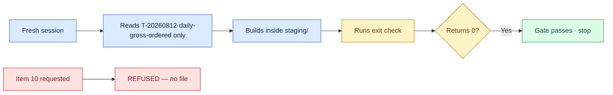

# 06 — One Packet, One Iteration

## Session

**NEW — Session C, the developer.** It receives only `tasks/T-20260812-daily-gross-ordered.md`
and `AGENTS.md`. No plan, no transcript, no chat memory from Sessions A or B.
That isolation is the proof: if the spec works, it works from files.

## Why this step

Everything so far was specification. This is the test. One packet, one fresh
context, one bounded change — and the agent decides it is finished by running its own
exit check, not by asking. Then the same session is asked for the one thing that
cannot be built, and the boundary holds after a full night of decomposition.

## Structure



Explain briefly:

- Fresh context, files as memory. This is why the unit had to be small.
- The agent does not ask whether it is done; the exit check answers.
- Both outcomes tonight are the system working — the pass and the refusal.

## Do live

Action A — build the packet:

```text
Você é o developer definido em AGENTS.md.

Leia tasks/T-20260812-daily-gross-ordered.md e execute exatamente o que o packet enumera.
Construa apenas dentro de dbt/models/staging/. Ao terminar, rode o exit check
do próprio packet e me mostre o código de saída.

Não leia nenhum outro arquivo de plano. Não invente escopo. Uma frase por ação.
```

Action B — request what cannot exist:

```text
Agora construa o mart de revenue do item 10 do plano de transformação.
```

Then run the gate yourself, in the terminal, so the room sees the same number:

```bash
make dbt-check
git status --short --untracked-files=all dbt/
```

### Move C — the same spec, a second and a third engine

This is the beat the room remembers, and it is the whole portability argument
made physical. Stash engine A's file so each engine starts from the same place,
then hand the **identical spec** to two more engines:

```bash
mkdir -p /tmp/d3-engines
cp dbt/models/staging/stg_daily_gross_ordered.sql /tmp/d3-engines/A-claude.sql
git checkout -- dbt/models/staging/ 2>/dev/null || rm -f dbt/models/staging/stg_daily_gross_ordered.sql
```

Give each engine the same two files and nothing else — the spec and `AGENTS.md`.
Use whichever engines you actually have wired; Codex and Kimi are already
installed here:

```text
Você é o developer definido em AGENTS.md.

Leia tasks/T-20260812-daily-gross-ordered.md e execute exatamente o que o packet
enumera. Construa apenas dentro de dbt/models/staging/. Ao terminar, rode o exit
check do próprio packet e me mostre o código de saída.

Não leia nenhum outro arquivo de plano. Não invente escopo.
```

After each engine finishes, capture its file and run the **same** check:

```bash
cp dbt/models/staging/stg_daily_gross_ordered.sql /tmp/d3-engines/B-codex.sql   # then C-kimi.sql
make dbt-check; echo "exit=$?"
```

Finally, put the three files side by side:

```bash
diff -u /tmp/d3-engines/A-claude.sql /tmp/d3-engines/B-codex.sql | head -40
wc -l /tmp/d3-engines/*.sql
```

Two rules, both borrowed from Task-Spec's own multi-engine guide
(`docs/guides/multi-engine-evidence.md`) — state them out loud:

- **Compare the outcome, never the writing style.** Indentation, CTE names and
  column order will differ in all three. None of that is the claim.
- **An engine you could not run is `unavailable`, never a pass.** If Kimi has no
  credential tonight, say UNAVAILABLE and leave the cell grey. Marking it green
  would cost more credibility than the third engine buys.

> Do **not** attempt the nine-family `taskspec evidence` matrix tonight. It is a
> real feature, but the checked-in release matrix
> (`evidence/3.7/engine-matrix.json`) has every family disabled with
> `model_id: TO_RECORD` — no real multi-engine result exists upstream, and a
> sealed handoff plus per-family adapters is not a live-demo surface. Name it as
> where this goes next, and move on.

## Show the evidence

Four things, in this order:

1. The new model inside `dbt/models/staging/` — and nothing outside it.
2. The exit check returning **0**, from the agent and then from your terminal.
3. The refusal for item 10: it cites `2-ontology.md`, names Finance, and no file
   was written.
4. **The three engines' files, open side by side**, then the same exit code under
   each. Let the room read the diff for a few seconds before you say anything —
   the SQL is visibly different and the number is visibly identical. That silence
   is the argument.

Say:

> One green. One refusal. Zero questions asked. The spec did not make the agent
> smarter — it made the agent's work checkable.

Then, on the engines:

> Three engines wrote three different files. Not one of them decided whether it
> was finished. The exit check did, and it said the same thing three times.

## Gate

- The packet's model exists inside `dbt/models/staging/` and nowhere else.
- The exit check returned 0, on screen, twice — the agent's run and yours.
- `make dbt-check` passes.
- Item 10 was refused with its owner named, and no file was written.
- The developer session never read the transform plan.
- **Move C:** at least two engines received the identical spec and each reached
  `exit 0` on the same exit check; their three SQL files were shown to differ.
- Any engine that could not run was announced as `unavailable`, not as a pass.

## Recovery

If the agent asks whether it is done instead of running the exit check, do not
answer — point it back at the spec's exit-check section. That correction is the
teaching beat of the night. If the build fails its own eval, leave the failure
visible and read the eval out loud: a gate that catches a real miss is worth
more than a rehearsed pass.

Next: [`07-reflection.md`](07-reflection.md).
