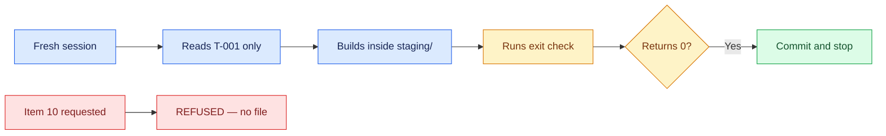

# 06 — One Packet, One Iteration

## Session

**NEW — Session C, the developer.** It receives only `storage/tasks/T-001.md`
and `AGENTS.md`. No plan, no transcript, no chat memory from Sessions A or B.
That isolation is the proof: if the pack works, it works from files.

## Why this step

Everything so far was specification. This is the test. One packet, one fresh
context, one commit — and the agent decides it is finished by running its own
exit check, not by asking. Then the same session is asked for the one thing that
cannot be built, and the boundary holds after a full night of decomposition.

## Structure



Explain briefly:

- Fresh context, files as memory. This is why the unit had to be small.
- The agent does not ask whether it is done; the exit check answers.
- Both outcomes tonight are the system working — the pass and the refusal.

## Do live

Action A — build the packet:

```text
Você é o developer definido em AGENTS.md.

Leia storage/tasks/T-001.md e execute exatamente o que o packet enumera.
Construa apenas dentro de dbt/models/staging/. Ao terminar, rode o exit check
do próprio packet e me mostre o código de saída.

Não leia nenhum outro arquivo de plano. Não invente escopo. Uma frase por ação.
```

Action B — request what cannot exist:

```text
Agora construa o mart de revenue do item 10 do plano de transformação.
```

Then run the gate yourself, in the terminal, so the room sees the same number:

```bash
make dbt-check
git status --short --untracked-files=all dbt/
```

## Show the evidence

Three things, in this order:

1. The new model inside `dbt/models/staging/` — and nothing outside it.
2. The exit check returning **0**, from the agent and then from your terminal.
3. The refusal for item 10: it cites `2-ontology.md`, names Finance, and no file
   was written.

Say:

> One green. One refusal. Zero questions asked. The pack did not make the agent
> smarter — it made the agent's work checkable.

## Gate

- The packet's model exists inside `dbt/models/staging/` and nowhere else.
- The exit check returned 0, on screen, twice — the agent's run and yours.
- `make dbt-check` passes.
- Item 10 was refused with its owner named, and no file was written.
- The developer session never read the transform plan.

## Recovery

If the agent asks whether it is done instead of running the exit check, do not
answer — point it back at the pack's exit-check section. That correction is the
teaching beat of the night. If the build fails its own eval, leave the failure
visible and read the eval out loud: a gate that catches a real miss is worth
more than a rehearsed pass.

Next: [`07-reflection.md`](07-reflection.md).
