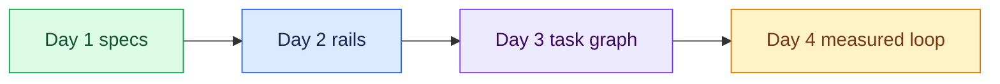

# 07 — Turn Three: Reflection and Handoff

## Session

**No agent.** Deck and the room only.

## Why this step

Reflection converts the run into behavior. Day 1 closed turn one of the
flywheel, Day 2 turned it again, and tonight the wheel turned a third time —
yesterday's plan was tonight's input, and tonight's task graph is tomorrow's
starting inventory.

## Structure



Walk the night's ledger once:

- **Built (4):** the Task-Spec written by hand, a scenario and its evals, the
  task graph with its index, and one packet executed from files alone.
- **Withheld (1):** Revenue — still `unresolved`, still owned by Finance. Item
  10 could not become a task, and the refusal at checkpoint 06 was a success.
- **Tomorrow:** the packets get run in a loop and measured. Day 4 is evaluation
  and execution loops — the unit of work becomes the unit of measurement.

## Do live

Ask the room to write three lines before leaving. Stop talking while they write;
do not collect answers unless offered.

```text
A definição de "pronto" que eu vou exigir por escrito é:
A decisão que eu não vou deixar o agente tomar é:
O primeiro item do meu backlog que vira packet é:
```

## Gate

- The three commitment lines were written by participants.
- The night's ledger (built / withheld / tomorrow) was stated once, plainly.
- The handoff names Day 4's module: packets → loop → measured evidence.

## Closing line

> The agent performs bounded work. Evidence supports claims. Humans keep the
> decisions the system cannot legitimately make. Tomorrow, 20:00 — the unit of
> work becomes the unit of measurement.
