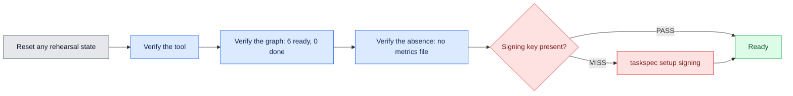

# 00 — Preflight: the graph that has never moved

## Session

**No agent.** Terminal only, projected. Every line here is a command and its real
output. Nothing is generated, nothing is explained by an assistant. This is the
last checkpoint of the week where the repository is still completely still.

## Why this step

Three nights produced artifacts. Tonight is the first night the repository changes
because a **loop** ran rather than because a human typed. Before that, the room has
to see the starting state with its own eyes, because Act 6 is a before/after on one
command and the "before" only lands if it was witnessed.

There is also one real gap to close. Day 3 taught the HMAC seal and never stamped
one, so this repository has never needed a signing key — and without a key,
`taskspec gate --stamp` degrades to **`TIER=2`, supervised dispatch only**. If you
want to show Tier 1 honestly at checkpoint 04, you provision the key here, live.

## Structure



## Do live

### Move A — idempotent reset

Run this every time, including the first. It archives anything a rehearsal left
behind instead of deleting it, so a mistake is recoverable and the archived copy is
tonight's **prepared** fallback.

```bash
mkdir -p tmp/prepared
for f in tasks/_metrics.jsonl tmp/d4; do
  [ -e "$f" ] && mv "$f" "tmp/prepared/$(basename "$f").$(date +%H%M%S)" && echo "archived $f"
done
mkdir -p tmp/d4/holdout tmp/d4/audit tmp/d4/receipts
git status --short
```

`tasks/_metrics.jsonl` must be **absent** when Move D runs. That absence is the
whole of Act 0's terminal slide.

### Move B — the tool is real and the same one you gave away

```bash
taskspec version
taskspec setup
```

Expected, verified 2026-08-13:

```text
3.8.0

Task-Spec readiness
PASS  workspace  /…/uc-transact-co/tasks
PASS  git        git version 2.50.1 (Apple Git-155)
PASS  shellcheck 0.11.0
MISS  signing    no repository key
NEXT: taskspec setup signing
SETUP=READY
```

Stop on the `MISS` line and read it out loud. Do not fix it yet — it is Move E.

### Move C — the graph exists and has never moved

```bash
taskspec ready
taskspec lint
grep -A7 '^stats:' tasks/_state.yaml
ls -1 dbt/models/staging/
```

Expected shape:

```text
T-20260812-daily-gross-ordered   S   any        Aggregate non-cancelled order totals by ordered_at
T-20260812-raw-payments-source   S   developer  "Declare the raw payments source"

(4 ready spec(s) hidden — blocked by an unmet depends_on; --all shows them)

concurrency partition (write-disjoint groups — safe to dispatch together):
  dbt/models  (5 task(s)): …
LINT=OK

stats:
  total: 6
  ready: 6
  in_progress: 0
  blocked: 0
  done: 0
  parked: 0

_raw_sources.yml
stg_orders.sql
```

Say the three numbers that matter: **six ready, zero done, one model on disk.**
Note that the write-disjoint group holds **five** tasks, not six —
`daily-grain-decision` writes nothing, because it is the `Revenue` hole and holes
do not have a write surface.

### Move D — the absence

```bash
taskspec metrics; echo "exit=$?"
```

```text
No metrics file found at tasks/_metrics.jsonl
exit=1
```

That is the slide. One command, one line, exit 1. The unit of work exists; the unit
of measurement does not. Do not explain it further here — Act 6 answers it.

### Move E — provision the signing key

```bash
taskspec setup signing
taskspec setup
taskspec doctor | grep -i signing
```

The readiness board must flip to `PASS signing`. Say plainly what you just bought:
without this key every stamp tonight would be `TIER=2` — structurally valid,
**supervised dispatch only**. With it, checkpoint 04 can show `TIER=1` and mean it.

> If provisioning fails for any reason, do **not** invent Tier 1 later. Run the
> chain at `TIER=2`, show the token on screen, and say the sentence: *this repo
> has no crypto trust, so a human reads every diff tonight.* That is a better
> lesson than a faked stamp.

### Move F — the parse still works

```bash
make dbt-check
```

Must end `All checks passed!` with exit 0. Two `WARNING` lines about unused
configuration paths (`models.transactco.intermediate`, `models.transactco.marts`)
are expected and pre-existing — name them so nobody thinks tonight broke something.

## Show the evidence

Exactly four things on the projector, in this order:

1. `MISS signing` → then `PASS signing`.
2. `stats:` block — `ready: 6`, `done: 0`.
3. `No metrics file found at tasks/_metrics.jsonl` and `exit=1`.
4. `All checks passed!`

Do not show the specs' contents. Do not show `taskspec dod`. The room already met
these files on Day 3; tonight they are a starting line, not a subject.

## Gate

- `taskspec version` prints `3.8.0`.
- `taskspec setup` ends `SETUP=READY` and `signing` reads `PASS`.
- `tasks/_state.yaml` shows `ready: 6` and `done: 0`.
- `taskspec metrics` printed the not-found line and exited 1.
- `dbt/models/staging/` holds exactly two files.
- `make dbt-check` passed.
- `git status --short` shows only the new signing key, nothing else.

## Recovery

If `taskspec` is missing from `PATH`, the whole night degrades — stop and fix it
before Act 1; the skill validator is not a substitute. If `make dbt-check` fails,
do not debug live: announce that the parse gate is red, run tonight's chain with
`--no-blast-radius` off and acceptance visible, and say the model work moves to a
follow-up. If the metrics file already exists and Move A did not catch it, archive
it by hand and say the word **prepared** on screen.

Next: [`01-green-that-proves-nothing.md`](01-green-that-proves-nothing.md).
