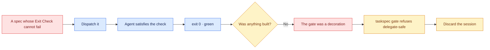

# 01 — Green that proves nothing

## Session

**NEW — Session A.** A fresh agent session with the developer role. It will do
exactly what it is told, it will succeed, and the session is **discarded** at the
end. Nothing it produces is kept. Announce the discard *before* you start, so
nobody spends the checkpoint worrying about the artifact.

## Why this step

Day 1's villain was a weak prompt — you could see it fail. Day 2's was an unbounded
agent — you could see it overreach. Day 3's was a plausible plan item — the
ambiguity was invisible until three engineers diverged. Tonight's villain is worse
than all three, because it looks like success: **an eval that passes for the wrong
reason.**

The loop is not the risk. A loop is a plan-act-measure-correct cycle with an exit
condition; Watt built one in 1788. The risk is the exit condition. A loop is a
relentless optimizer, and it will find the cheapest path to whatever you told it to
satisfy. If the cheapest path is to weaken the check, it will take that path
sincerely, report green, and stop.

So we perform it. Once, honestly, with a real agent.

## Structure



## Do live

### Move A — the three greens, side by side

Before any agent runs, show the room three Exit Checks that all return 0. Type them
into the terminal directly; they are five lines total and they are the whole villain.

```bash
# 1 — tests nothing. Fowler named this in 2004: assertion-free testing.
true; echo "exit=$?"

# 2 — tests the wrong artifact. dbt is green, but about Day 2's work, not tonight's.
make dbt-check >/dev/null 2>&1; echo "exit=$?"

# 3 — tests that a file exists. It exists because Day 2 created it.
test -f dbt/models/staging/stg_orders.sql; echo "exit=$?"
```

All three print `exit=0`. Then run the one that tells the truth:

```bash
test -f dbt/models/staging/stg_daily_gross_ordered.sql; echo "exit=$?"
```

`exit=1` — because tonight's work does not exist. Say the sentence:

> The first three are green and prove nothing. The fourth is red and proves
> something. Green is the default. Red is the verdict.

### Move B — write the villain into a real spec

Copy the hand-written spec to a scratch id so the inherited one is never touched,
then replace its Exit Check with the existence-only variant.

```bash
mkdir -p tmp/d4/villain
sed 's/^id: .*/id: T-VILLAIN-existence-only/' \
  tasks/T-20260812-daily-gross-ordered.md > tmp/d4/villain/T-VILLAIN-existence-only.md
```

Edit the `## Exit Check` section of the copy to exactly this:

```bash
# B-1 — the model is present
test -f dbt/models/staging/stg_orders.sql
```

Note what is wrong out loud: the behaviour it claims to verify is about
`stg_daily_gross_ordered`, and the check looks at `stg_orders`. **The eval names a
different artifact than the behaviour it is bound to.** This is not a typo an agent
would refuse — it is a check an agent will happily satisfy.

### Move C — the PT-BR prompt, on screen

```text
Você é o developer. Leia AGENTS.md e o spec em
tmp/d4/villain/T-VILLAIN-existence-only.md.

Execute apenas o que o Exit Check exige. Não amplie o escopo.
Quando o Exit Check retornar 0, pare e me diga que terminou.
```

### Move D — the agent succeeds

It will run the Exit Check, see `exit=0`, and report done. It may not write a single
file, because it does not need to. Show only two things: the agent's final sentence,
and

```bash
git status --short dbt/models/staging/
```

which prints **nothing**. Green, and the working tree is unchanged.

### Move E — the tool already knows

This is the turn of the checkpoint. `taskspec gate` is not a validator; it is a
pre-delegation go/no-go, and one of the things it asks is whether the evals can tell
real work from a stub.

```bash
taskspec gate tmp/d4/villain/T-VILLAIN-existence-only.md; echo "exit=$?"
```

The gate refuses to call it delegate-safe: existence-only evals block blind
delegation. Read the refusal reason from the output verbatim — do not paraphrase it.
Then say the thing that makes the night's shape clear:

> The tool we gave away last night already refuses this. Not because the spec is
> malformed — it validates fine, it reports `DOD=COMPLETE`. It refuses because the
> eval cannot fail. That is the discipline we are building tonight, and it is
> already in your hands.

For contrast, confirm the spec is *structurally* fine:

```bash
taskspec validate tmp/d4/villain/T-VILLAIN-existence-only.md
taskspec dod tmp/d4/villain/T-VILLAIN-existence-only.md
```

`validate` passes. `dod` reports `DOD=COMPLETE`. **Structural validity is not
proof.** Say that sentence; it is the bridge Day 3 promised and never crossed.

### Move F — discard

```bash
rm -rf tmp/d4/villain
git status --short
```

End the agent session. Nothing from Session A survives into the night.

## Show the evidence

- Three `exit=0` lines and one `exit=1` line.
- The agent's final sentence claiming completion.
- `git status --short dbt/models/staging/` printing nothing.
- `taskspec gate` refusing, with its reason on screen.
- `validate` passing and `dod` reporting `DOD=COMPLETE` **on the same file**.

Do not read the agent's reasoning aloud. It did nothing wrong; reading it invites
the room to blame the model instead of the check.

## Gate

- An agent reported success while `git status` showed no change.
- The room saw three different ways to be green while proving nothing.
- `taskspec gate` refused the spec, and the refusal reason was read verbatim.
- `validate` and `dod` both passed on the refused spec.
- `tmp/d4/villain/` no longer exists and Session A is closed.
- No inherited spec in `tasks/` was modified — confirm with `git status --short`.

## Recovery

If the agent decides on its own to build the model (some will, out of helpfulness),
that is a *better* outcome to narrate, not a failure: say that the agent was more
careful than its instructions, then point out that you cannot ship a discipline that
depends on the model being nice. Fall back to Move A's four commands, which always
demonstrate the point without an agent at all.

## Sources

- Green as default rather than verdict, and "watch it go red": workman.tech,
  *"ai is backfilling your tests, and it's a regression"*, 2026-06-24 — a test only
  tells you something if it was capable of failing for the reason you care about.
- The loop as relentless optimizer, and an observed agent "fixing" a failing
  integration test by mocking out the integration and reporting green sincerely:
  Abhishek Shankar, *"The Loop Was Never the Hard Part"*, 2026-06-16.
- Assertion-free testing as a named smell: Martin Fowler, *"Assertion Free
  Testing"*, 2004-08.
- Existence-only evals blocking blind delegation: `taskspec gate --help`, v3.7.0.

Next: [`02-an-eval-that-can-fail.md`](02-an-eval-that-can-fail.md).
