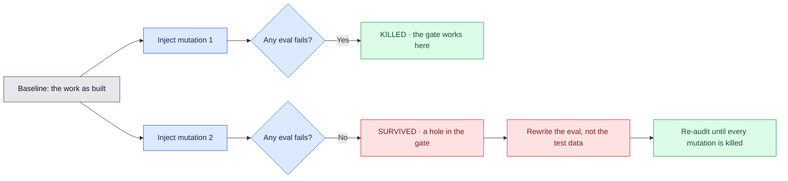

# 02 — An eval that can fail

## Session

**NEW — Session B.** It carries the proof discipline through checkpoint 03. Session
A is already closed and discarded. Session B is an **architect** for Moves A–C
(judgment, no hands) and the human types the Exit Check rewrite in Move D. The
mutation itself is done by hand, in the terminal, so nobody can suspect the agent
of arranging its own grade.

## Why this step

Checkpoint 01 showed three greens that proved nothing and one red that proved
something. This checkpoint turns that observation into a repeatable procedure with a
name that predates agents by forty years.

Software testing calls the deliberate breaking of code to see whether the tests
notice **mutation testing**. Jia and Harman defined it in their 2011 survey as a
fault-based technique that yields a *mutation adequacy score*: you inject a small
change, and if at least one test fails, the mutant is **killed**; if every test still
passes, the mutant **survives**. A survivor is not a passing grade. A survivor is a
hole in the gate, in a place you can point at.

`taskspec eval-audit` applies exactly that idea to an agent's evals.

## Structure



## Do live

### Move A — the five rules, one of which everyone skips

Put these on the deck, not the terminal. An eval worth trusting is:

1. **deterministic** — same input, same verdict
2. **idempotent** — running it twice changes nothing
3. **cheap before expensive** — the fast check gates the slow one
4. **explainable** — its failure message names what broke
5. **falsifiable** — *it fails when the thing it guards is broken*

Rules 1 to 4 get written. Rule 5 gets assumed. Say it plainly: **rule 5 is the only
one that makes the other four worth anything**, and it is the only one you cannot
verify by reading the eval. You have to run it against broken code.

### Move B — build the thing the eval will guard

We need real work before we can break it. Have the room watch you build the smallest
honest model for the hand-written spec:

The comment must not contain the word "revenue" in any case. The spec's `eval_3` is
`! grep -ril "revenue" dbt/models/`, which scans **file contents**, not just names —
a comment saying "NOT Revenue" fails the spec it is trying to honour. Verified: with
that comment the Exit Check returns 1; with the wording below it returns 0.

```bash
cat > dbt/models/staging/stg_daily_gross_ordered.sql <<'SQL'
{{ config(materialized='view') }}

-- Daily gross ordered amount, named by its physical basis.
-- Business meaning for this number is owned by Finance, not by this model.
select
    cast(ordered_at as date)  as ordered_date,
    count(*)                  as order_count,
    sum(total_amount)         as gross_ordered_amount
from {{ ref('stg_orders') }}
where order_status != 'cancelled'
group by 1
SQL

make dbt-check
cd dbt && uv run dbt build --profiles-dir . --select +stg_daily_gross_ordered; cd ..
cp dbt/models/staging/stg_daily_gross_ordered.sql tmp/d4/audit/original.sql
```

**Two details that will bite if you retype them from memory.** The upstream column is
`order_status`, not `status` — `stg_orders` renames it, so `where status != …` fails to
bind. And `dbt` is not on `PATH`: every build in this runbook goes through
`uv run dbt … --profiles-dir .`, and the first one needs `+` to materialise
`stg_orders` too. Verified 2026-08-13.

Name the label discipline once, then move on: the column is
`gross_ordered_amount`, not `revenue`. Tonight does not earn the right to rename it.

### Move C — write an Exit Check that is *almost* good

Ask the architect session for an Exit Check for `B-1` ("the model produces one row
per ordered date, excluding cancelled orders"). Most sessions will propose something
like this, and it is worth keeping deliberately:

```bash
# B-1 — the model builds
weak() { (cd dbt && uv run dbt build --profiles-dir . --select stg_daily_gross_ordered >/dev/null 2>&1); }
weak; echo "exit=$?"
```

It is deterministic, idempotent, cheap and explainable. It is also not falsifiable
against the behaviour it claims: it fails if the SQL is *invalid*, not if the SQL is
*wrong*. That distinction is what the audit is about to prove.

### Move D — break it on purpose

Delete the filter. Nothing else. The SQL stays valid, the build stays green, and the
numbers are now wrong:

```bash
sed -i '' "/where order_status != 'cancelled'/d" dbt/models/staging/stg_daily_gross_ordered.sql
weak; echo "exit=$?"
```

`exit=0`. **Green, with a real bug shipped.** Say the sentence and stop talking:

> This mutation is a real bug that ships. The eval was green for it. That is the hole,
> and it is not the model's fault — it is the check's.

Verified 2026-08-13: the build succeeds with the filter removed, so the Move C check
returns 0 on work that is wrong.

### Move E — close the hole by strengthening the eval

The only legitimate fix is to make the eval able to notice. A behaviour check compares
what the model produced against what the source says it should have produced — so
deleting a filter changes the number, and the number is what gets asserted:

```bash
strong() {
  (cd dbt && uv run dbt build --profiles-dir . --select stg_daily_gross_ordered >/dev/null 2>&1) || return 1
  uv run python -c "
import duckdb, sys
c = duckdb.connect('warehouse.duckdb', read_only=True)
model  = c.execute('select round(sum(gross_ordered_amount),2) from main.stg_daily_gross_ordered').fetchone()[0]
source = c.execute(\"select round(sum(total_amount),2) from main.stg_orders where order_status != 'cancelled'\").fetchone()[0]
sys.exit(0 if model == source else 1)
"
}
```

Now run it twice — still mutated, then restored. **This pair is the deliverable of the
checkpoint, not the green:**

```bash
strong; echo "mutated  exit=$?"      # 1  RED — the same bug, now caught

cp tmp/d4/audit/original.sql dbt/models/staging/stg_daily_gross_ordered.sql
strong; echo "restored exit=$?"      # 0  GREEN on correct work
```

Verified 2026-08-13: `weak` returns 0 in both states; `strong` returns 1 mutated and 0
restored. Two runs, two different colours, one command.

### Move F — optional · the same idea, automated

Everything above was done by hand because a room believes what it watches. If you want
to show that the tool does it too, `taskspec eval-audit` applies a matrix of mutations
in throwaway git worktrees and reports which evals noticed:

```bash
taskspec eval-audit --help
```

It needs the model committed and a `MutationMatrix/v1` file with one `.patch` per
mutation — worth naming on a slide, not worth building live. **Skip it if the room is
tired; the by-hand pair already proved the point.**

## Show the evidence

- The five rules, with rule 5 marked.
- The audit table: one `KILLED` row and one `SURVIVED` row.
- The same eval returning **1 on the mutated model** and **0 on the restored one**.
- `git diff` on the Exit Check — the eval got stronger; the model is byte-identical
  to what you built in Move B.

Never show the eval passing without also showing it failing. That pairing is the
entire lesson and the deck's `.src` line depends on it.

## Gate

- One mutation was killed and one survived, on screen, from a real `eval-audit` run.
- The survivor was closed by rewriting the **eval**, and `git diff` proves the model
  did not change to suit it.
- The rewritten eval was run twice: red on broken work, green on correct work.
- A re-audit kills every mutation.
- `make dbt-check` still passes and `stg_daily_gross_ordered.sql` matches Move B.
- The aggregate is still not called Revenue.

## Recovery

If `eval-audit` cannot create a worktree (dirty tree, detached HEAD), commit the
model first on a scratch branch and pass that ref as `--baseline`. If it still fails,
do the whole checkpoint by hand with Move D's `sed` and Move E's rewrite — the manual
version is *more* convincing, and the JSON was only ever a convenience. Label any
pre-generated report **prepared**.

## Sources

- Mutation testing as a fault-based technique with a mutation adequacy score, and
  the killed/survived vocabulary: Y. Jia and M. Harman, *"An Analysis and Survey of
  the Development of Mutation Testing"*, IEEE TSE, 2011.
- High mutation score as evidence of real fault-detection ability, and mutant
  reduction trade-offs: P. Zhang et al., *"Mutant Reduction Evaluation"*, ACM TOSEM,
  2022.
- "The only thing that turns green into a verdict is watching the test fail on the
  broken code": workman.tech, 2026-06-24.
- Deterministic graders for coding agents, and capability evals graduating into
  regression suites: Anthropic, *"Demystifying evals for AI agents"*, 2026.
- Verified usage: `taskspec eval-audit <spec> --baseline <git-ref>
  [--mutations <matrix>] [--report PATH] [--repeat N]`, v3.8.0 — `--mutations` takes a
  MutationMatrix/v1 file, not a count, and the report is `EvalAuditReceipt/v1` with a
  `cases[]` array. Token on malformed input: `EVAL_AUDIT=INVALID`.

Next: [`03-the-holdout.md`](03-the-holdout.md).
