# 04 — The authorization chain

## Session

**NEW — Session C.** The developer. It receives **only** its Task-Spec and
`AGENTS.md` — no transcript, no summary of the last three checkpoints, no holdout.
That isolation is what makes the exit code mean anything.

The facilitator drives the chain from a second terminal. The agent never runs `gate`
or `accept` on itself; that is the entire idea of the checkpoint.

## Why this step

Day 3 ended with a graph and a lesson it never got to demonstrate: authority in files
rather than in memory. Tonight the seal actually gets stamped, and the room sees that
"done" is not one decision but **four, held by different parties**:

| Command | Question it answers | Who owns the answer |
| --- | --- | --- |
| `gate --stamp` | *May this be delegated at all?* | a human, before any work |
| `handoff --backend --out` | *What exactly does the executor receive?* | the format |
| `run --ci` | *Did the declared evals pass in the workspace?* | the machine |
| `accept --handoff --stamp` | *Is the work real, independent of the executor's claim?* | a human, after |

`accept` is the one people mis-describe. It re-runs the evals itself rather than
trusting the report, and wraps that in **five gates**, only stamping `accepted` when
they all hold.

**3.8 changed two things in this chain.** `handoff` now emits `TaskHandoff/v3` with a
UUID attempt ID and an immutable base commit, and `accept` binds to that file. Run
`accept` without `--handoff` and preflight records `HANDOFF_MISSING_OR_LEGACY`, drops
the acceptance to Tier 2, and refuses to stamp unless a human also passes
`--allow-tier2 --supervised-by <id> --reason <text>`. So the handoff must be written
to disk at Move B and passed back in at Move E.

## Structure

```mermaid
flowchart LR
    A[gate --stamp] --> B[TIER=1 · signed_off written]
    B --> C[handoff --backend --out]
    C --> D[TaskHandoff/v3 · attempt-bound]
    D --> E[Session C executes]
    E --> F[run --ci]
    F --> G[exit 0]
    G --> H[accept --handoff --stamp]
    H --> I{Gates A-E}
    I -->|all hold| J[ACCEPTED=1]
    I -->|one fails| K[ACCEPTED=0 · exit 1]

    classDef human fill:#FEF3C7,stroke:#D97706,color:#78350F
    classDef fmt fill:#CFFAFE,stroke:#0891B2,color:#164E63
    classDef machine fill:#DBEAFE,stroke:#2563EB,color:#172554
    classDef good fill:#DCFCE7,stroke:#16A34A,color:#14532D
    classDef bad fill:#FEE2E2,stroke:#DC2626,color:#7F1D1D
    class A,B,H human
    class C,D fmt
    class E,F,G machine
    class I,J good
    class K bad
```



## Do live

### Move A — the pre-gate, and what a Tier means

Tonight's spec is `T-20260812-raw-payments-source`. Gate it **before** stamping, so
the room sees a verdict separately from a signature:

```bash
taskspec gate tasks/T-20260812-raw-payments-source.md; echo "exit=$?"
```

Read the verdict. Then explain the one line a dispatcher actually parses:

```text
TIER=1   HMAC verified            -> unsupervised dispatch is OK
TIER=2   structural only, no key  -> SUPERVISED dispatch ONLY
TIER=3   HMAC mismatch            -> never reached; a hard FAIL happens first
```

Name the thing checkpoint 00 bought: with no repository key this would read `TIER=2`,
and every diff tonight would need a human reader. Now stamp:

```bash
taskspec gate --stamp --require-tier1 tasks/T-20260812-raw-payments-source.md
echo "exit=$?"
git diff tasks/T-20260812-raw-payments-source.md
```

Show the frontmatter diff: `signed_off: false` → `signed_off: true`, plus
`signed_off_by` and `signed_off_at`. Then break it on purpose, once:

```bash
sed -i '' 's/^title: /title: x/' tasks/T-20260812-raw-payments-source.md
taskspec gate tasks/T-20260812-raw-payments-source.md; echo "exit=$?"   # seal breaks
sed -i '' 's/^title: x/title: /' tasks/T-20260812-raw-payments-source.md
taskspec gate tasks/T-20260812-raw-payments-source.md; echo "exit=$?"   # TIER=1 again
```

One character changed the body and the seal noticed. Day 3 promised that; this is the
first time the room has seen it.

### Move B — the handoff is what the executor gets, and nothing more

```bash
mkdir -p tmp/d4/receipts
taskspec handoff tasks/T-20260812-raw-payments-source.md \
  --backend claude --out tmp/d4/receipts/handoff-01.json
jq '.' tmp/d4/receipts/handoff-01.json
```

Use `--out`, not `--json` into a pipe: Move E needs this exact file on disk. The
command prints `HANDOFF=WRITTEN contract=TaskHandoff/v3 path=… attempt_id=…`, and
`--out` refuses to clobber an existing file, so a re-run needs a fresh name.

Read out what is **in** it — id, behaviours, evals, `touches_paths`,
`creates_paths`, the do-not-touch list, the authorization reference, and the two
fields 3.8 added: a UUID `attempt.id` and the `source.base_commit` this attempt is
pinned to — and then what is **not**: no repository history, no other spec, no
holdout, no chat. Say it:

> This is a read-only packet. If the executor needs something that is not in here,
> the spec is wrong, and that is a bug in *our* authoring, not in the agent.

If a spec is unsigned or malformed the tokens are `HANDOFF=REFUSED` /
`HANDOFF=INVALID`; a refused handoff is a correct outcome, not an outage.

### Move C — the PT-BR prompt, and the isolated run

```text
Você é o developer. Sua única fonte é AGENTS.md e este Task-Spec:
tasks/T-20260812-raw-payments-source.md

Faça exatamente o que o spec autoriza — nada além de creates_paths.
Ao terminar, rode o Exit Check e me diga apenas o código de saída.
Não resuma o que você fez.
```

Let it work. One sentence per action on screen, per the output budget.

### Move D — the machine's half of "done"

```bash
taskspec run --ci tasks/T-20260812-raw-payments-source.md; echo "exit=$?"
```

Exit 0. Then say the sentence that keeps the night honest:

> That zero is the machine's half. It is not the answer. Checkpoint 01 produced a
> zero too.

### Move E — the post-gate, all five gates named

```bash
taskspec accept --handoff tmp/d4/receipts/handoff-01.json \
  --stamp --gold-sanity tasks/T-20260812-raw-payments-source.md
echo "exit=$?"
```

Walk the gates as they print. Do not skip Gate D; it is the whole night compiled:

| Gate | What it checks | What it defends against |
| --- | --- | --- |
| **A** | evals pass, **re-run by us** | trusting the executor's claim |
| **B** | the handoff still matches the spec, the dependency closure holds, the base commit is the one dispatched, and changed files ⊆ `touches_paths`/`creates_paths`, ∩ do-not-touch = ∅ | satisfying the eval by editing something else |
| **C** | the sign-off HMAC still verifies — `TaskAuthorization/v3` | making evals pass by weakening them |
| **D** | **gold-sanity**: rebuild the baseline in an ephemeral worktree, hold the eval bodies constant, and require the evals to **FAIL** there | an eval that is green even on unbuilt work |
| **E** | sealed evidence policy — format-v4 receipts bound to **this** attempt | a claim with no receipt, or one borrowed from another run |

If someone has the 3.7 table in their notes, say it plainly: **3.8 removed the old
warn-only Gate D** (the isolation report), and the two gates after it moved up. Nothing
in `accept` warns any more — it passes, drops you to Tier 2, or rejects.

Expect **`ACCEPTED=1`** and the frontmatter gaining `accepted: true`, `accepted_by`,
`accepted_at`. Show the diff.

Gate D deserves one sentence spoken slowly: *the tool reconstructs last week's code,
drops tonight's evals into it, and refuses to accept the work unless those evals go
red there.* That is checkpoint 02's discipline, enforced by a command instead of by a
facilitator with a `sed` one-liner.

### Move F — one honest rejection

A chain nobody has watched refuse is a decoration. Break blast radius, deliberately:

```bash
echo "-- touched by nobody's authority" >> dbt/models/staging/stg_orders.sql
taskspec accept --handoff tmp/d4/receipts/handoff-01.json \
  --gold-sanity tasks/T-20260812-raw-payments-source.md; echo "exit=$?"
```

Expect **`ACCEPTED=0`**, exit 1, an `ACCEPTANCE_FAILURE=<code>` line naming the reason,
and **Gate B** naming `stg_orders.sql` as outside the spec's write surface. Point at
it: the evals still pass. The work is still real. It is rejected anyway, because it
touched something it was not authorized to touch.

```bash
git checkout dbt/models/staging/stg_orders.sql
taskspec accept --handoff tmp/d4/receipts/handoff-01.json \
  --stamp --gold-sanity tasks/T-20260812-raw-payments-source.md
```

Back to `ACCEPTED=1`.

### Move G — the state moves for the first time all week

```bash
taskspec transition T-20260812-raw-payments-source done "accepted at checkpoint 04"
taskspec rebuild-state
grep -A7 '^stats:' tasks/_state.yaml
taskspec ready
```

`done: 1`. The frontier has changed shape without anyone editing an order. Hold one
beat here — this is the moment the graph moves for the first time since Day 3 created
it.

### Moves H, I, J — the three deck slides, 21:50, five minutes

Deck only, no terminal.

1. **Giveaway.** Tonight's skill, `skills/prove-the-oracle/`, free and MIT, with a
   real install line. Say plainly what it cannot do: it does not tell you *what* to
   mutate, and a four-mutation audit is a discipline, not a certificate.
2. **The crank.** The loop consuming the graph in waves. **Say the difference from
   Day 3 out loud: last night's crank clip was pre-recorded; this one ran twenty
   minutes ago, in this repository, in front of you.**
3. **The Bootcamp handoff.** Switch to `presentation/bootcamp.html`. A door, not a
   pitch — no price, no second CTA, five minutes, then straight back to the graph at
   Act 5.

## Show the evidence

- `TIER=1`, then the seal breaking on a one-character edit, then `TIER=1` again.
- The `TaskHandoff/v3` JSON, with what is absent named out loud.
- `run --ci` → exit 0.
- `accept --handoff … --stamp --gold-sanity` → gates A–E → `ACCEPTED=1` and the
  frontmatter diff.
- One `ACCEPTED=0` with `ACCEPTANCE_FAILURE=<code>` and Gate B naming the
  unauthorized file.
- `stats:` showing `done: 1` and a recomputed `ready`.

## Gate

- `signed_off: true` was written by `gate --stamp`, and the seal broke on an edit.
- The executor received a handoff packet and nothing else, written with `--out` so
  Move E could bind to it.
- `run --ci` returned 0 in an isolated session.
- `accept` returned `ACCEPTED=1` with gold-sanity on, and the room heard what Gate D
  does.
- One acceptance was **rejected** and the failing gate was named on screen.
- `tasks/_state.yaml` shows `done: 1`.
- `tasks/_metrics.jsonl` now **exists** — do not open it; checkpoint 06 does.
- No file outside `dbt/models/staging/` and `tasks/` changed.

## Recovery

If `--require-tier1` fails because checkpoint 00's key did not take, drop the flag,
show `TIER=2`, and say the supervised-dispatch sentence — do not fake a tier. Note
that in 3.8 a Tier-2 run **cannot be accepted silently**: `accept` fails with
`ACCEPTANCE_FAILURE=TIER_TOO_LOW` until a human adds
`--allow-tier2 --supervised-by <id> --reason <text>`. Type those flags on screen if
you need them; that is the supervised path working, not a workaround.

**`--gold-sanity` no longer degrades to a warning.** In 3.8 it is Gate D and it
blocks: if the evals do not fail on the baseline, acceptance is rejected with
`ACCEPTANCE_FAILURE=EVAL_NONDISCRIMINATING`. If the worktree cannot be built at all,
drop `--gold-sanity` for the live run, say out loud that you are accepting on gates
A, B, C and E only, and keep checkpoint 02's manual mutation on screen as the
substitute proof. Do not describe a missing Gate D as a pass.

If Session C stalls, the facilitator finishes the file by hand and says so; the chain
is the subject, not the SQL.

## Sources

- The lifecycle precondition — *acceptance presupposes the gate; you cannot accept
  work that was never delegate-safe*. 3.8 shortened every per-command help to one
  usage line, so this is no longer a quote: it is enforced in
  `src/accept/accept-task.sh`, which fails a spec that is not `signed_off: true` with
  `POLICY_TAMPER` before Gate A runs.
- The five gates in printed order — A. Independent evaluation · B. Handoff, graph,
  base commit, and blast radius · C. Authorization integrity · D. Gold-sanity ·
  E. Sealed evidence policy: `src/accept/accept-task.sh`, v3.8.0. 3.7's warn-only
  Gate D (isolation report) was removed and old E/F became D/E.
- A missing or legacy handoff yields `HANDOFF_MISSING_OR_LEGACY` and forces Tier 2;
  Tier-2 acceptance requires `--allow-tier2 --supervised-by <id> --reason <text>`:
  `src/accept/preflight.py` and `src/accept/accept-task.sh`, v3.8.0.
- Tier semantics and the machine-readable `TIER=N` line, plus the `hmac-sha256-v3`
  seal that `gate --stamp` now writes: `src/gate/safe-to-delegate.sh`, v3.8.0.
- Tokens: `TIER=1|2`, `HANDOFF=WRITTEN|INVALID|REFUSED`, `ACCEPTED=1|0`,
  `ACCEPTANCE_FAILURE=<code>` — `taskspec agent-context`, format version 4.
- Exit codes 0 success · 1 contract/gate/eval failure · 2 usage · 3 runtime floor —
  `taskspec --help`, v3.8.0.
- Why an unattended task with undeclared egress is the exposed surface: RHB reports
  RL post-training raising exploit rates from 0.6% to 13.9% (Thaman, 2026); quoted
  only if the room asks, and always with the date.

Next: [`05-waves.md`](05-waves.md).
