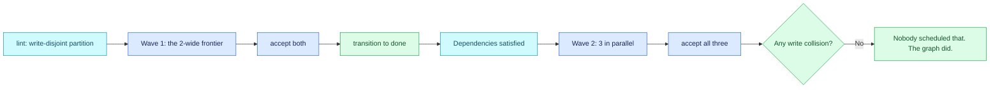

# 05 — Waves

## Session

**Continue Session C**, plus two more developer sessions started fresh for the wave.
Three sessions run at once. None of them was told about the others, and none of them
was given an order — that is the point to protect.

## Why this step

Checkpoint 04 ran one packet through the chain. The obvious next question from the
room is *"so do I write a scheduler?"* — and the answer is no, because the graph
already contains the schedule. Nobody has to decide what is safe to run together;
`taskspec lint` computes it from what each spec declares it will write.

Concurrency here is not a performance trick. It is a **safety property**: two specs
whose write surfaces do not overlap cannot corrupt each other's evidence, so their
exit codes stay independently meaningful. That is why the partition is computed from
`touches_paths`/`creates_paths` and not from wall-clock estimates.

## Structure



## Do live

### Move A — ask the graph, not a person

```bash
taskspec lint
```

Read the partition verbatim. The line that matters:

```text
concurrency partition (write-disjoint groups — safe to dispatch together):
  dbt/models  (5 task(s)): T-20260812-daily-gross-ordered T-20260812-raw-payments-source
                           T-20260812-stg-daily-captured-payments
                           T-20260812-stg-orders-payments-join
                           T-20260812-stg-returns-refunds-mirror
LINT=OK
```

Five tasks, not six. Say why: `T-20260812-daily-grain-decision` has **no write
surface at all**, because it is the `Revenue` hole. A decision is not a file. It
cannot be in a wave, it cannot be dispatched, and no amount of concurrency will make
it ready. Point at it now, because Act 6 comes back to it.

### Move B — the frontier, before anyone works

```bash
taskspec ready
taskspec ready --all
```

`ready` shows the frontier — the specs whose `depends_on` are all satisfied. `--all`
shows the ones still blocked, with the hidden count. After checkpoint 04's `done`
transition, `raw-payments-source` has left the frontier and its dependents have
joined it. Nobody edited an order for that to happen.

Have the room predict the next wave out loud before you print it. Then print it.

### Move C — wave 1

Two specs, two sessions, at the same time. Each gets the same three-step treatment
from checkpoint 04, and you narrate only the tokens:

```bash
# terminal 1
taskspec gate --stamp --require-tier1 tasks/T-20260812-stg-orders-payments-join.md
taskspec handoff tasks/T-20260812-stg-orders-payments-join.md --backend claude-code --json \
  > tmp/d4/receipts/handoff-join.json

# terminal 2
taskspec gate --stamp --require-tier1 tasks/T-20260812-stg-returns-refunds-mirror.md
taskspec handoff tasks/T-20260812-stg-returns-refunds-mirror.md --backend claude-code --json \
  > tmp/d4/receipts/handoff-mirror.json
```

Dispatch both PT-BR prompts, same shape as checkpoint 04 Move C, one per session.
While they work, put the wave table on the deck and leave it there.

### Move D — accept concurrently, then prove no collision

```bash
for id in stg-orders-payments-join stg-returns-refunds-mirror; do
  taskspec accept --stamp --gold-sanity tasks/T-20260812-$id.md
done

git status --short dbt/models/staging/
```

Two new files, each named by exactly one spec's `creates_paths`. Then the check that
makes the safety claim real rather than rhetorical:

```bash
jq -r '.creates_paths[]?' tmp/d4/receipts/handoff-join.json tmp/d4/receipts/handoff-mirror.json \
  | sort | uniq -d
```

Empty output. **No path appears in two handoffs.** That is the write-disjointness the
partition promised, verified after the fact rather than assumed.

### Move E — transition, and watch the frontier recompute itself

```bash
taskspec transition T-20260812-stg-orders-payments-join done "wave 1"
taskspec transition T-20260812-stg-returns-refunds-mirror done "wave 1"
taskspec rebuild-state
taskspec ready
grep -A7 '^stats:' tasks/_state.yaml
```

`done: 3`. The remaining specs move into the frontier because their dependencies are
now satisfied — including `stg-daily-captured-payments`, which was hidden at
checkpoint 00.

### Move F — wave 2, and the line

Run the remaining write-surface specs together. Then say it plainly and stop talking:

> Nobody scheduled that. The graph did.

Finish with the boundary, so the room does not over-generalise:

```bash
taskspec ready --all | grep -i grain || echo "daily-grain-decision: still not ready"
```

Still not ready. Still Finance's. Concurrency changed the throughput of the work and
changed nothing about who is allowed to define a word.

## Show the evidence

- The `lint` partition, read verbatim, with the five-not-six explanation.
- `ready` before and after the transitions — the same command, a different frontier.
- `git status --short dbt/models/staging/` gaining one file per spec.
- The `uniq -d` check printing **nothing**.
- `stats:` climbing `done: 1` → `3` → the wave-2 total.
- `daily-grain-decision` refusing to appear.

Do not show three agent transcripts side by side. Show three exit codes.

## Gate

- The partition came from `taskspec lint`, not from a slide.
- Two specs were accepted concurrently and no `creates_paths` was shared.
- The frontier recomputed with no manual reordering.
- `make dbt-check` still passes with every new model in place.
- `daily-grain-decision` is still blocked, still unready, still owned by Finance.
- `tasks/_metrics.jsonl` has grown — still unopened.

## Recovery

If a parallel session collides anyway, **stop and show it** — a real collision is a
better checkpoint than a clean one, and the diagnosis is always the same: a spec
declared a write surface it did not actually own. Fix the spec's `creates_paths`,
re-lint, and note that the partition is only as honest as the declarations feeding
it. If you cannot run three sessions at once for practical reasons, run them
sequentially and say so — the claim is that the graph *chose* the set, not that the
wall clock got shorter.

## Sources

- The concurrency partition and the `LINT=OK` token, computed from declared write
  surfaces: `taskspec lint`, v3.7.0, run 2026-08-13 against Day 3's graph.
- The 2-wide frontier and the hidden-count line: `taskspec ready`, verified
  2026-08-13.
- Blast-radius enforcement at acceptance time, which is what makes a disjoint
  partition safe rather than merely tidy: `taskspec accept --help`, Gate B, v3.7.0.
- The unit of work moving up a level — *specify a goal, a feedback signal and a
  stopping rule, and let the harness send the messages*: A. Shankar, *"The Loop Was
  Never the Hard Part"*, 2026-06-16. Cite only if the room asks why this is not just
  a job queue.

Next: [`06-the-unit-of-measurement.md`](06-the-unit-of-measurement.md).
