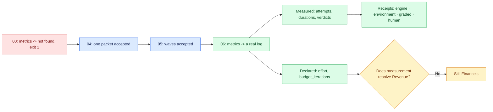

# 06 — The unit of measurement

## Session

**No agent.** Terminal only. Nothing is generated in this checkpoint; everything on
screen was written by the work the room already watched. That is the point — a
receipt you have to ask an agent to produce is not a receipt.

## Why this step

Checkpoint 00 ran one command and got one line:

```text
No metrics file found at tasks/_metrics.jsonl
```

Run the same command now. That before/after **is** this checkpoint. Do not build an
argument around it; build the argument *from* it.

The reason this matters beyond bookkeeping: self-reported productivity and measured
productivity disagree, and they disagree in a specific and humbling direction. In
METR's randomised trial with experienced open-source developers (2025-07-10),
developers predicted AI would speed them up about **24%**; afterwards they believed
they had been about **20% faster**; they were in fact **19% slower**. The belief and
the measurement pointed opposite ways. A year later METR's survey of 349 technical
workers reported a median **1.4–2× self-reported** change in the value of their work,
and METR itself noted reasons to be sceptical of that magnitude.

None of those numbers are about this repository. They are the reason the repository
keeps a log instead of an impression.

## Structure



## Do live

### Move A — the same command, twice in one night

```bash
taskspec metrics; echo "exit=$?"
```

Put checkpoint 00's screenshot beside it if you kept one. One line and exit 1, then a
populated log and exit 0. Say nothing clever here. Let the pair do the work.

### Move B — read the record, one row per thing that happened

```bash
jq -c '.' tasks/_metrics.jsonl | tail -8
```

Then the shape, as a table the room can actually read:

```bash
jq -r '[.ts, .task_id, .status, (.attempts // "-"), (.reason // "-")] | @tsv' \
  tasks/_metrics.jsonl | column -t
```

Walk **one** row, not eight. For that row name which fields are **measured** and
which are **declared**:

| Field | Kind | Who set it |
| --- | --- | --- |
| `ts`, `status` transitions | measured | the tool, at the moment it happened |
| `attempts`, durations | measured | the runner |
| acceptance verdict | measured | `accept`, from six gates |
| `effort` (`S`/`M`) | **declared** | a human, at authoring time |
| `budget_iterations` | **declared** | a human, as a stopping rule |
| `reason` on a park | **declared** | whoever stopped the work |

Say the distinction out loud, because it is the honest limit of the whole night:
**the log tells you what happened, not whether it was worth doing.** `effort: S` is an
estimate that was never checked against the clock. If you want that comparison, it is
tomorrow's work, and you now have the data to do it — which you did not have at 20:00.

### Move C — filters, because a log you cannot slice is a diary

```bash
taskspec metrics --since 2026-08-13
taskspec metrics --status done
```

Two filters, no commentary. The point is that this is queryable by a human at 2am
without an agent in the loop.

### Move D — receipts: four kinds, four different claims

Checkpoint 04 wrote a run receipt; checkpoint 03 wrote a holdout receipt. Show that
the format distinguishes *what kind of claim* a receipt is making:

```bash
taskspec receipt validate tmp/d4/receipts/*.json; echo "exit=$?"
```

Expect `RECEIPT=WRITTEN` / `RECEIPT=INVALID` tokens on creation and a clean validate
here. Then name the four creators and the one field that makes each honest:

| Receipt | Records | The honest field |
| --- | --- | --- |
| `receipt engine` | which provider, model and adapter ran a spec | `--outcome` accepts **`unavailable`** — an engine that could not run is never a pass |
| `receipt environment` | the environment digest the run happened in | `--environment-digest` |
| `receipt graded` | a rubric-based score against a threshold | `--rubric-digest`, so the rubric cannot change after the score |
| `receipt human` | a named person's accept/reject decision | `--accepted-by` and `--decision` |

Stop on `unavailable`. It is a small enum value carrying a large discipline: the
format refuses to let a missing engine be scored as a success. Note honestly that the
checked-in multi-engine matrix at `evidence/3.7/engine-matrix.json` ships with **every
family disabled and `model_id: TO_RECORD`** — there is no real cross-engine result
upstream, and tonight does not manufacture one.

### Move E — the boundary, stated last

```bash
taskspec ready --all | grep -i grain || echo "daily-grain-decision: still not ready"
taskspec dod tasks/T-20260812-daily-grain-decision.md
```

The decision spec is still there, still `DOD=COMPLETE` as a *document*, still unable
to become ready, still owned by Finance. Say the closing sentence of the act and do
not soften it:

> We measured the work. We did not earn the right to define the word. `Revenue` is
> still unresolved, and it will still be unresolved tomorrow unless a human at
> Finance decides it.

## Show the evidence

- `taskspec metrics` at 00 and at 06, side by side, with both exit codes.
- One metrics row, with measured versus declared fields marked.
- `receipt validate` passing over tonight's receipts.
- The `unavailable` outcome value, named.
- `daily-grain-decision` still refusing.

Do not put a productivity number about this repository on screen. Nobody measured a
baseline, so any speedup claim tonight would be exactly the kind of unmeasured
confidence this act is arguing against. If someone asks, that refusal is the answer.

## Gate

- The same command produced "not found, exit 1" at 00 and a real log at 06.
- At least one row was walked field by field, with measured and declared separated.
- `receipt validate` returned 0 over the night's receipts.
- The room heard that `unavailable` is not a pass.
- No productivity claim was made about TransactCo.
- `Revenue` is still unresolved and `daily-grain-decision` is still blocked.

## Recovery

If `jq` is unavailable, `taskspec metrics` falls back to coarse `grep` parsing by
design — say so and read fewer fields. If the metrics file is empty because
checkpoints 04 and 05 both fell back to manual work, do **not** hand-write a log:
show the empty file, say that nothing durable ran, and keep the before/after honest.
An empty log after a failed night is still a truthful measurement.

## Sources

- Predicted +24%, believed −20% faster, measured **19% slower**: METR, *"Measuring
  the Impact of Early-2025 AI on Experienced Open-Source Developer Productivity"*,
  2025-07-10.
- Median 1.4–2× **self-reported** change in value of work across 349 technical
  workers, with METR's own scepticism about the magnitude: METR, *"Measuring the
  Self-Reported Impact of Early-2026 AI on Technical Worker Productivity"*, 2026.
- METR revising its experiment design toward fixed tasks and task evals: Becker,
  Rush, Cunningham, Rein and Mahamud, 2026-02-24.
- Throughput up while bugs, incidents and rework rise faster — two years of telemetry
  across 22,000 developers and 4,000 teams: Faros AI, *"AI Engineering Report 2026:
  The Acceleration Whiplash"*, 2026.
- Receipt creators, the `unavailable` outcome, and the tokens `RECEIPT=WRITTEN` /
  `RECEIPT=INVALID`: `taskspec receipt {validate,engine,environment,graded,human}
  --help` and `taskspec agent-context`, v3.7.0.
- Metrics filters `--since` / `--author` / `--status`, and the `jq`-optional fallback:
  `taskspec metrics --help`, v3.7.0.

Next: [`07-reflection.md`](07-reflection.md).
