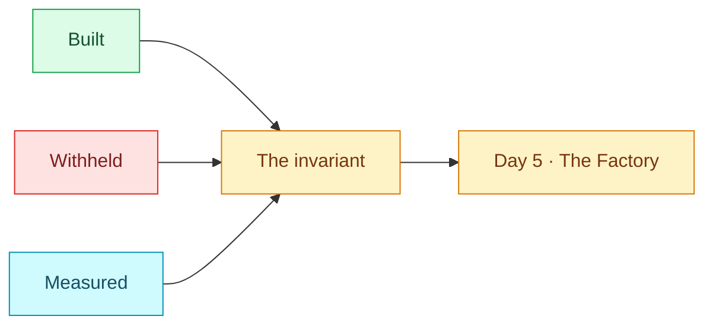

# 07 — Turn four closes

## Session

**No agent.** Deck and one terminal. The room writes; the facilitator does not
summarise. Three lines get filled in by participants, out loud or in the chat, before
anyone leaves.

## Why this step

Turn four is the turn where the map completes. Days 1 to 3 each lit one ring and left
two dim with the same note: *waits for Day 4*. Tonight lit both — **Loop** and
**Eval + human gate** — and the six-ring figure is whole for the first time all week.

The temptation at this point is to celebrate autonomy. Resist it. What tonight
actually bought is narrower and more durable: a signal from outside the loop that a
human can check tomorrow morning.

## Structure



## Do live

### Move A — the ledger, from the terminal not from memory

Three columns, and every number read from a command rather than recalled:

```bash
grep -A7 '^stats:' tasks/_state.yaml
git status --short dbt/models/staging/
taskspec metrics --since 2026-08-13 | tail -3
taskspec ready --all | grep -ci grain
```

**Built tonight**

- A falsifiable Exit Check, proven by a mutation that was killed and one that survived.
- A sealed holdout the executor never read, which caught a rename every visible eval
  missed.
- One spec through the full chain: `TIER=1` → handoff → exit 0 → `ACCEPTED=1`.
- A write-disjoint wave the graph chose.
- `tasks/_metrics.jsonl`, which did not exist at 20:00.

**Withheld on purpose**

- `Revenue`. Still unresolved, still Finance's, after a night of measuring work.
- `daily-grain-decision`. Still not ready, and correctly so.
- A cross-engine claim. `evidence/3.7/engine-matrix.json` ships every family disabled
  with `model_id: TO_RECORD`; we did not manufacture a comparison.
- A productivity number for TransactCo. No baseline was measured, so no speedup was
  claimed.

**Measured, not asserted** — read the metrics tail out loud, then stop.

### Move B — the three commitment lines

The room fills these in, not the facilitator. Give them the sentence stems and wait
through the silence:

1. *One eval in my codebase that has never been seen to fail is …*
2. *The evaluator I will seal so an agent cannot read it is …*
3. *The one word in my domain that an agent may not define is … and its owner is …*

Line 3 is the week's thread. If nobody can name an owner for their own unresolved
word, that is the most useful thing they will take home.

### Move C — six rings, lit

Put the recurring figure up complete, and say the shortest true version of the week:

```text
Day 1  Context · Graph        what is true, and who owns what is not
Day 2  Harness               what the agent may do, in files
Day 3  Prompt/Spec           the unit of work, small enough to finish and prove
Day 4  Loop · Eval + gate    the signal that closes it, and the receipt it leaves
```

Then the one line about the loop, once, and let it sit:

> The loop was never the hard part. James Watt shipped a loop in 1788. What was
> always scarce is a trustworthy signal from outside the loop, and that is the thing
> we built tonight.

### Move D — the invariant, word for word

Unchanged from Days 1 to 3. Read it exactly; do not improve it:

> The agent performs bounded work; evidence supports claims; humans keep the
> decisions the system cannot legitimately make.

Add the one sentence tonight earned, and no more:

> Tonight added the middle clause's teeth: evidence you have watched fail.

### Move E — Day 5 and the close

Name Day 5 — **The Factory** — and the one question it opens: *if one packet can be
proved and measured, what does it take to run a hundred of them and still be able to
answer for any single one?* One neutral Bootcamp line, the Day 5 time, and end.

Do not add a pitch here; the commercial beat already happened at 21:50 and repeating
it undoes it.

### Move F — optional coda · a glimpse of the near future

Six deck slides after the invariant, tagged **GLIMPSE**. Run them only if the room
still has about eight minutes. They are not a fifth night and they do not reopen
the Bootcamp. They ground Day 5 in what the field published in the last 30 days.

| Slide | One idea |
| --- | --- |
| A glimpse of the future | The door. Sit on it. No new claim. |
| The near future | July–August named what this week practiced |
| The bottleneck moved | Code got cheap; absorbing it did not |
| Harness, then loop, then factory | LoopsBench wrote the week down; the factory is many loops, one accountable person |
| The next engineer | Forward-deployed / AI-native — ontology, harness, oracle, transfer |
| Monday | Three actions already rehearsed; the invariant is not improved |

If time is short, skip this move. Never skip Move D.

## Show the evidence

- The `stats:` block, with tonight's `done` count.
- `git status --short dbt/models/staging/` — the models that exist now and did not at
  20:00.
- The metrics tail.
- `daily-grain-decision`, still refusing, one last time.
- The six-ring figure, complete.

## Gate

- Every number in the ledger was read from a command during this checkpoint.
- The withheld column was read out loud, including the absence of a productivity
  claim.
- All three commitment lines were filled by the room, not by the facilitator.
- The invariant was read verbatim.
- `Revenue` ends the night exactly as unresolved as it began.
- Day 5's name and time were stated.
- If Move F ran, every number on those five slides was labelled as paper,
  practitioner report, or market claim — and no TransactCo productivity figure
  was added.

## Recovery

If time is short, cut Move F first, then Move C, and keep Move B — the commitments
matter more than the figure, because they are the only part of the night the room
takes with them. Never cut Move D. If the night's chain failed and `done` is still 0,
the ledger is still runnable: read the real numbers, say which checkpoint fell over,
and let the withheld column carry the session. An honest ledger of a failed night is
on-message for this week; a padded one is not. The glimpse coda is never a recovery
for a failed chain.

## Sources

- The invariant: quoted verbatim from `live/d1/`, `live/d2/` and `live/d3/`. Unchanged
  by design.
- Six-ring model as presented on Days 1 to 3: `presentation/d1.html`, `d2.html`,
  `d3.html`.
- Watt's centrifugal governor, 1788, as a plan-act-measure-correct cycle with an exit
  condition that ran unattended; and *"a loop is only as honest as its oracle"*:
  A. Shankar, *"The Loop Was Never the Hard Part"*, 2026-06-16.
- Multi-engine matrix state (every family disabled, `model_id: TO_RECORD`):
  `evidence/3.7/engine-matrix.json`, Task-Spec v3.8.0.
- Tonight's counts: `tasks/_state.yaml`, `tasks/_metrics.jsonl` and
  `git status`, read live.
- Optional coda (Move F), last 30 days unless noted. Practitioner: Edith
  Harbaugh, LaunchDarkly, *"Entering the AI software factory era"*, 2026-07-27.
  Market: Rebecca Bellan, TechCrunch, *"Forward-deployed engineers are the AI
  industry's latest talent obsession"*, 2026-07-30. Papers: Ben Sghaier et al.,
  arXiv 2607.03691, 2026-07-04 (six days before the 30-day window); Li et al.,
  *LoopsBench*, arXiv 2608.00267, 2026-08-01. Practitioner: Aliseda-Canton,
  Duolingo, 2026-08-04; Vishal Anand, IBM Think, last 30 days; Anthropic
  Engineering, *"Harness design for long-running application development"*.
  None of those numbers is about TransactCo.

Sequence complete. The night's runbook index is [`README.md`](README.md).
