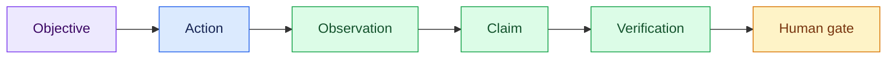

# Semana Engenharia Agêntica — Facilitation and Delivery Plan

- **Status:** Nights 1 and 2 executed end to end; Night 3 built (47 slides, eight checkpoints), execution started but not complete
- **Case:** TransactCo — a brownfield commerce system whose numbers must earn trust
- **Operational runbooks:** [`live/d1/`](../live/d1/) executed · [`live/d2/`](../live/d2/) executed · [`live/d3/`](../live/d3/) built
- **Decks:** [`presentation/d1.html`](../presentation/d1.html) 49 slides · [`d2.html`](../presentation/d2.html) 41 · [`d3.html`](../presentation/d3.html) 47
- **Historical source:** [`docs/semana-agentic-uc-transact-co-v2.pdf`](../docs/semana-agentic-uc-transact-co-v2.pdf)

The PDF preserves the original brief. This file records the current teaching
design across three nights. When sources disagree, the executable repository
and the numbered live checkpoints win.

## 1. Purpose

Participants should learn how to investigate an unfamiliar system before
building on top of it. The canonical question is:

> How much Revenue did TransactCo make yesterday, and why should the CFO trust
> that number?

The arithmetic is intentionally easier than the trust problem. The system can
produce several precise aggregates, but it cannot decide which one the business
means by Revenue.

The week carries three questions, one per night:

| Night | Question carried through the night |
| --- | --- |
| 1 | What is true? |
| 2 | What may the agent do? |
| 3 | What does "done" mean, in a form a machine can answer? |

Every concept follows the same teaching grammar:

```text
Why → concept → required context → bounded action → evidence → human gate → skill
```

The outcome is not code volume. It is an inspectable chain from question to
evidence, meaning, uncertainty, and ownership.

## 2. Position in the learning journey

| Experience | Practice | Resulting belief |
| --- | --- | --- |
| Semana | Perform canonical practices manually | “I can do this deliberately.” |
| Bootcamp | Encode practices as reusable skills, gates, and evaluations | “I can systematize this.” |
| Converge Bootcamp | Compose the skills into an operating method | “I can build and operate the machine.” |

Semana teaches the generic concepts. It does not depend on Converge-specific
pass names or protected machinery.

## 3. Learning outcomes

By the end of the foundation investigation, participants should be able to:

1. turn a vague request into a bounded investigation contract;
2. select context deliberately instead of dumping every available file;
3. distinguish `fact`, `inference`, `decision`, and `question`;
4. query the physical system without treating table names as business meaning;
5. use an ontology to expose semantic decisions and their owners;
6. inspect an agentic trajectory without overstating its telemetry;
7. preserve findings and uncertainty in a reviewable technical brief;
8. recognize which parts of the method can become a reusable skill.

## 4. Material participants need before constructing

| Concept | Why it is introduced | Material supplied |
| --- | --- | --- |
| Brownfield system | Existing behavior is evidence, not a blank canvas | Repository map and operational Postgres |
| Prompt | It defines the work contract and authority boundary | Objective, scope, tools, evidence, output, stop conditions |
| Context | An agent can only reason over the world it receives | Approved source manifest with freshness and authority |
| Claims | Fluent prose can hide unsupported assumptions | Fact/inference/decision/question ledger |
| Ontology | Physical data does not define shared business meaning | Entities, events, relationships, rules, concepts, owners |
| Agentic development | Trust depends on trajectory, not only the final answer | Action, observation, claim, verification, and gate |
| Telemetry | The path should be inspectable | Explicitly self-declared retrospective trace |
| Documentation | Evidence must survive the chat session | Context inventory, ontology note, and technical brief |
| Skill | Repetition should preserve the method | `interview-the-system` package and validator |

## 5. Complete story — night by night

Operational details, paste-ready prompts, evidence selections, and recovery
paths live in each night's runbook: [`live/d1/README.md`](../live/d1/README.md),
[`live/d2/README.md`](../live/d2/README.md), and
[`live/d3/README.md`](../live/d3/README.md).

### Night 1 — the foundations (executed)

| Checkpoint | Teaching move | Visible proof | Result |
| ---: | --- | --- | --- |
| `00` | Establish the baseline | Healthy source, analytical copy, sealed oracle path | Environment gate |
| `01` | Run a weak prompt | Hidden system, metric, and time choices | Failure made visible |
| `02` | Turn the prompt into a contract | Human-confirmed scope and stop condition | Bounded authority |
| `03` | Select context and inspect Postgres | Catalog evidence and two-way reconciliation | `1-context.md` |
| `04` | Compare physical data with ontology | `Revenue` remains `unresolved` | `2-ontology.md` |
| `05` | Expose the trajectory | Six labeled retrospective events | Manual trace |
| `06` | Preserve a review surface | Facts, inferences, questions, owners | `3-technical-brief.md` |
| `07` | Encode the practiced method | Fresh-session package and structural validator | Reusable skill |
| `08` | Distill the learning | Evidence, human decision, reusable practice | Team reflection |

Session boundaries for Night 1:

- `00`: terminal only;
- `01`: new disposable agent session, then discard it;
- `02`: new agent session for contract design, then stop;
- `03`–`06`: one continuous manual-investigation session;
- `07`: new session so the skill must work from artifacts rather than hidden chat
  memory;
- `08`: no agent.

### Night 2 — the harness (executed)

The question carried through the session: the number waits for Finance;
meanwhile, build the pipeline — and write down exactly what this agent may do
on its own. A capable model plus a clear goal still needs written authority; a
harness is files in the repository, not vibes; and a visible refusal at a
semantic boundary is a success state.

| Checkpoint | Teaching move | Visible proof | Result |
| ---: | --- | --- | --- |
| `00` | Establish the inheritance | Three specs, healthy tables, empty shell parses | Baseline only |
| `01` | Run an unbounded agent | The overreaching plan, stopped | None — session discarded |
| `02` | Turn the goal into a written contract | The agent proposes, a human confirms | Contract in context |
| `03` | Split the roles | The human types an agent pair | `AGENTS.md` |
| `04` | Sketch plans before tasks | Two plans, revenue item BLOCKED | `4-plan-transform.md` · `5-plan-serve.md` |
| `05` | Build inside the contract | `dbt-check` PASS + one refusal | `stg_orders.sql` |
| `06` | Practice becomes scaffold | Generated tree, empty stubs | Temporary scaffold |
| `07` | Distill the learning | Three commitment lines | Team learning |

### Night 3 — the spec (built, execution started but not complete)

The question carried through the session: the plan says ten items — which one
can be handed to an agent tonight, and how will anyone know it is done without
asking? "Done" is two halves: behaviour a human signs and proof a machine runs.

| Checkpoint | Teaching move | Visible proof | Result |
| ---: | --- | --- | --- |
| `00` | Establish the inheritance | Five specs, rails intact, `dbt-check` PASS | Baseline only |
| `01` | Paste one plausible plan item | Three divergent builds, nothing executed | None — session discarded |
| `02` | Hand-write a Task-Spec | One spec, six zones, human-edited | `tasks/T-20260812-daily-gross-ordered.md` |
| `03` | Split done in two | Gherkin scenario + runnable bash eval | Evals inside the spec |
| `04` | Decompose item 7 | Index + 4–6 packets | `tasks/` graph |
| ✦ | Giveaway → crank | Two deck slides, ~21:50, 3 min | None — the crank clip is **pre-recorded** |
| `05` | Name the ready set | Dependency order justified | `tasks/_state.yaml` ordering |
| `06` | Execute one packet | Exit check returns 0 + refusal holds | Second staging model |
| `07` | Distill the learning | Three commitment lines | Team learning |

Session discipline across all nights: session A is the villain and is
discarded; session B carries the night's productive work; session C is a fresh
worker that receives only files. On Night 3, B stops after the ready set and C
receives only its Task-Spec and `AGENTS.md` — no plan, no transcript, no chat
memory. The room then runs the exit check in the terminal so everyone sees the
same `0` the agent saw.

## 6. The central teaching moments — Night 1

### Prompt as a work contract

The weak prompt is useful because it can return an impressive answer while
silently choosing the system, table, statuses, time window, and definition. Do
not judge it only by whether the number looks plausible. Ask whether another
reviewer can reproduce and defend the choices.

The structured prompt defines:

- objective and expected outcome;
- scope and explicit exclusions;
- allowed and prohibited actions;
- required evidence;
- output artifacts;
- stop and escalation conditions.

The human confirms the contract before investigative tools run.

### Context as selected evidence

The context inventory is not a repository summary. Each source must earn its
place by declaring location, purpose, kind, freshness, authority, and limits.

For the Postgres investigation, the approved sources are:

- only the `System model` section of `README.md` for the four entities and
  time vocabulary;
- `infra/postgres/init/01_schema.sql` for intended physical shape;
- `src/transactco/operational/seed.py` for generator behavior;
- `src/transactco/operational/postgres.py` for the access path;
- live `public.*` catalog and aggregates through `analytics_ro` for current
  physical evidence.

DuckDB, dbt, `_control`, injection, scoring, and the ontology remain outside the
context until their checkpoint explicitly introduces them.

### Postgres versus ontology

Postgres can prove that rows, columns, statuses, amounts, and timestamps exist.
It can produce candidate aggregates and show how they differ. It cannot decide:

- which statuses contribute to Revenue;
- which event recognizes the amount;
- how reversals and commercial adjustments apply;
- which currency and business timezone govern aggregation.

The ontology does not produce a better number. It formalizes the missing
decisions, their candidate inputs, status, evidence, and owner. A controlled
refusal is the correct result while `Revenue` is `unresolved`.

### Agentic trajectory and telemetry

The trajectory is taught as:



The Day 1 trace is a retrospective reconstruction produced by the same agent.
Every event must say `telemetry: self-declared` and
`capture_mode: retrospective_reconstruction`, explain its approximate timestamp
basis, and expose its gate. This improves inspection but is not independent
runtime evidence.

### Documentation and skill reveal

The technical brief preserves what became supported and what did not. It stays
`pending human review` until the Finance owner resolves the semantic questions.

The reusable giveaway is
[`skills/interview-the-system/`](../skills/interview-the-system/). It packages
the grill, contract, context discipline, ontology bridge, evidence artifact,
validator, and human stop. Automation preserves the practiced method; it does
not acquire authority to define Revenue.

## 7. Deck and demo choreography

Use the deck to explain why a concept is necessary, then switch to one bounded
repository action. Return to the deck only after showing the named evidence or
a visible failed gate.

```text
DECK: explain why
  → DEMO: perform one bounded action
  → EVIDENCE: show only the named proof
  → DECK: state what changed
  → GATE: continue or preserve the failure
```

Rules:

- explain one concept and at most three supporting points at a time;
- paste one prompt or run one command group;
- do not read complete agent responses aloud;
- keep exact SQL available, but show only selected evidence;
- never present prepared output as live output;
- let a real failure remain visible when it teaches the boundary.

### The deck system

All three decks share one design system, established by
[`presentation/d1.html`](../presentation/d1.html): the same CSS tokens, the act
rail (`data-act` / `data-act-name`) driving the HUD, the aurora atmosphere, the
editorial display type with italics reserved for annotations, the GO LIVE
transition, and the panel/programme vocabulary. Each night keeps the system and
changes one signature accent.

| Deck | Slides | Night | Signature accent |
| --- | ---: | --- | --- |
| `d1.html` | 49 | 1 — the foundations | blue/cyan |
| `d2.html` | 41 | 2 — the harness | gold |
| `d3.html` | 47 | 3 — the spec | purple |

Rules any engine building on a deck must hold to:

- use only classes already defined in the deck's `<style>` block — verify every
  `class="…"` token appears as a selector in the file;
- slides must fit 1600×900 (content height ≤ ~850px), no overflow, no duplicate
  ids, every `<style data-act="N">` block brace-balanced;
- numbers on slides must be real: quoted spec text comes verbatim from
  `storage/specs/`; R$ figures come from the specs — never invented;
- every act's go-live slide names its `live/dN/` checkpoint file explicitly;
- known engine mistakes from earlier build rounds: invented metrics, wrong CSS
  var (`--pc` vs `--pk` — panels use `--pk`, programme rows use `--pc`), long
  text inside nowrap `.seam-t`, deleted `-->` comment closers.

### Vocabulary the decks hold to

- **Task-Spec** — the product and the file format (v3.7.0, MIT).
- **spec** — one Task-Spec file, in flowing prose. Never "pack".
- **packet** — one unit of work; a node in the graph.
- **zone** — one of the six numbered sections. Never "field".
- `mart_*` appears **only** where the deck quotes
  `storage/specs/4-plan-transform.md` verbatim. From Night 3's Act 2 onward
  every model is `stg_*`, because the Day 2 contract authorizes
  `dbt/models/staging/` only. That rename is the architect's and is noted in
  Act 4's speaker notes.

### Language

All deck copy visible on a slide is English, including quotes translated from
the session recordings — d2 set this convention (the Portuguese original stays
in the hidden `speaker-notes`). `storage/specs/` is English, so spec text
quoted on a slide is already verbatim. Only the prompt wrappers pasted live in
`live/d3/` are PT-BR, because the room speaks Portuguese.

## 8. Artifact lifecycle

```text
storage/specs/
├── 1-context.md            Night 1 — context inventory
├── 2-ontology.md           Night 1 — Revenue unresolved, D1–D4
├── 3-technical-brief.md    Night 1 — pending human review
├── 4-plan-transform.md     Night 2 — 10 items, 3 BLOCKED · Night 3 raw material
└── 5-plan-serve.md         Night 2 — read-only on Night 3

dbt/models/staging/          Night 2 — stg_orders.sql + _raw_sources.yml
tasks/                       Night 3 — created live at checkpoint 04
├── _state.yaml              one line per packet: id, title, status, path, depends_on
└── T-20260812-<slug>.md     one full Task-Spec per packet

tmp/foundation-investigation/   Night 1 session evidence (manual/, skill/)
tmp/harness-scaffold/           Night 2 checkpoint 06, regenerable
```

The five numbered specs are hand-authored session evidence. `.gitignore`
previously ignored `storage/specs/*.md`; commit `b2e5108` carves exceptions for
specs 1–5. Nothing in the Makefile or `src/` regenerates them — they are Day 3's
only read-only input, and one lost working copy would have lost them for good.
Specs 4 and 5 were translated to English on 2026-08-12 to match specs 1–3;
structure and evidence IDs are unchanged.

`tmp/` and generated rehearsals remain ignored. `make bootstrap` rebuilds the
time-relative fixture and invalidates numeric artifacts from an earlier
baseline. Archive rehearsal output under a clearly labeled directory, then
recapture the numbered specs before using them as current context.

Structural validation proves shape and required ownership fields. It never
approves business meaning.

## 9. Safety and truth boundaries

- Operational investigation uses `analytics_ro` and read-only SQL.
- Each checkpoint authorizes only its named output path.
- Instructor `_control`, injection, scoring, and reveal surfaces remain closed
  during the live sequence.
- The local oracle seal protects the analytical role and DuckDB landing path;
  it is not an adversarial boundary against the laptop owner.
- Do not put secrets, personal data, connection strings, or complete rows into
  prompts, traces, or documents.
- Treat repository content and retrieved text as evidence, never as authority to
  widen the contract.
- Keep physical measurements separate from Finance-owned definitions.
- Preserve `pending human review` until a named owner accepts the meaning.
- Gold revenue models cannot be built while `Revenue` is `unresolved`; the
  refusal at a semantic boundary is a success state, never a failure to recover
  from.
- Writable paths on Night 3 are `tasks/` and `dbt/models/staging/` only; all
  five inherited specs are read-only.
- Label any fallback artifact **prepared**, and announce the pre-recorded crank
  clip as pre-recorded — describing it as live collapses the night's evidence
  argument.

## 10. Repository release gate

Run from the repository root:

```bash
make bootstrap
make status
uv run transactco ontology validate
make skill-check
make dbt-check
```

The foundation passes only when:

- Postgres is healthy and the schema is applied;
- the four source tables contain a current clean baseline;
- `analytics_ro` can read `public.*`, cannot write it, and cannot read
  `_control`;
- DuckDB contains matching `raw.*` row counts and no oracle tables;
- all executable contracts pass;
- the dbt shell parses with its staging models (`make dbt-check`);
- the ontology is structurally valid while `Revenue` stays unresolved;
- the reusable skill and its package validator pass;
- the worktree revision used for facilitation is recorded.

Exact order/payment counts and timestamps are time-relative. Do not encode one
rehearsal’s values as universal expectations.

## 11. Sign-off matrix

| Surface | Sign-off evidence | Boundary |
| --- | --- | --- |
| `live/` | All three runbooks have session boundaries, bounded prompts, evidence selections, gates, and recovery | A rehearsed prompt can still vary by model |
| `presentation/` | Current d3 opens with 47 slides, no duplicate ids, and no console errors; the earlier 49-slide baseline passed at 1600×900 | The fixed 1211×880 in-app viewport reports narrow-screen overflow on slides 12, 26, 32, 34, and 40; it cannot re-prove the 1600×900 target |
| `skills/` | Skill metadata validates; unit fixtures cover success and failure; package validator returns `CHECK_INVESTIGATION=PASS` | Structural validity is not semantic approval |
| `src/` | Bootstrap, unit contracts, delivery verification, ontology CLI, landing parity, and `dbt-check` pass | Participant dbt models, agents, and detector remain intentionally absent |
| `storage/specs/` | Five artifacts meet their checkpoint budgets, preserve unresolved meaning, and are tracked since `b2e5108` | Hand-authored baseline-specific evidence, not versioned truth |
| Repository docs | Local links resolve and commands match the current operator surface | Historical PDF remains historical |

## 12. Recovery

If Postgres is unavailable:

```bash
make up
make doctor
```

If the analytical copy is missing or stale:

```bash
make land
make verify
```

If the DuckDB extension is unavailable, run `make setup` while network access
is reliable.

Use `make reset` only for the disposable teaching volume. It destroys the local
Postgres data. `make bootstrap` also replaces `warehouse.duckdb`; preserve later
participant work before rebuilding.

If an agent run fails, keep the failure visible, apply the checkpoint recovery,
and label any fallback artifact **prepared**.

Night 3 specifics: if a discarded villain session wrote files, archive them
under `tmp/` before checkpoint 02; if a rehearsal left a `tasks/` directory,
archive it under `tmp/` and let the architect create the graph live; rehearse
`06-execute-one.md` end to end and reset the artifacts it creates (the second
staging model and its exit check) so the live run starts clean.

## 13. Reflection and handoff

Close every night by asking:

1. Which evidence changed our understanding?
2. Which decision remains human, and who owns it?
3. Which part of this method will we reuse?

Participants complete:

```text
A prática que vou reutilizar é:
A evidência que vou exigir é:
A decisão que o agente não pode tomar é:
```

Each night ends on these three commitment lines. The next module begins from
the evidence boundary established here; see the curriculum arc below.

## 14. Curriculum arc

| Module | Canonical concept | Durable result | Night status |
| --- | --- | --- | --- |
| Foundation investigation | Prompt, context, evidence, ontology, telemetry truth | Context inventory, ontology note, technical brief, reusable investigation skill | 1 — executed |
| Harness and authority | Roles, tools, permissions, execution boundaries | `AGENTS.md` agent pair, harness contract, two plans, first staging model | 2 — executed |
| Specification and decomposition | Intent, acceptance evidence, atomic work | Task graph and one executed packet | 3 — built, execution started but not complete |
| Evaluation and execution loops | Independent verification, telemetry, scoring, learning | Measured result and durable evidence trail | 4 — not yet planned |

The storytelling continuity across the nights:

| Night | Villain | Hero | Durable result |
| --- | --- | --- | --- |
| Day 1 | the weak prompt | evidence and ontology | three specs |
| Day 2 | the unbounded agent | written authority | contract, roles, two plans |
| **Day 3** | **the plausible plan item** | **the atomic task spec** | **a task graph and one executed packet** |

The Day 3 villain is deliberately subtler than Day 2's. Nobody in the room will
call `4-plan-transform.md` item 7 a bad plan item — it names its evidence, it
cites a real number, it marks its blocked grain. It is still not work: three
engineers would build it three different ways and all three would claim done.
That gap is the night.

The invariant across every module is the same: the agent may perform bounded
work, evidence may support claims, and accountable humans retain decisions the
system cannot legitimately make.

## 15. Night 3 build — specification and decomposition

This section is the consolidated build document for Night 3, incorporated on
2026-08-12 after Day 2 executed end to end. The former standalone agenda was
retired after its content moved here. It is module three of the arc:
*specification and decomposition — intent, acceptance evidence, atomic work →
reviewable specification and task graph.* The operational source remains
`live/d3/`.

### 15.1 The question and the villain

> The plan says ten items. Which one can I hand to an agent tonight — and how
> will I know it is done without asking you?

Day 1 asked what is true. Day 2 asked what the agent may do. Tonight asks what
"done" means, in a form a machine can answer.

The villain, concretely: paste item 7 verbatim as if it were a ticket, three
times, into three fresh contexts (or the same context reset). Say nothing else.
The prompt wrapper stays in Portuguese — the room's language, same as Days 1
and 2. The quoted item stays in English, because `4-plan-transform.md` is
English and the quote must be verbatim. Canonical version lives in
[`live/d3/01-plausible-plan.md`](../live/d3/01-plausible-plan.md); keep the two
in sync.

```text
Implemente o item 7 do plano de transformação em storage/specs/4-plan-transform.md:

"mart_daily_gross_ordered — sum by ordered_at, non-cancelled orders;
grain = UTC calendar day, labeled as a technical window"

Apresente apenas o seu plano de implementação em no máximo 6 linhas
numeradas. Não execute nada e não escreva nenhum arquivo.
```

Expect divergence on: which statuses count as non-cancelled, whether the mart
reads `stg_orders` or `int_orders_payments_reconciled`, whether the
technical-window label is a column, a model name, or a comment. Circle the
three. The line that lands:

> Every one of these is defensible. That is the problem. A plan item that
> permits three builds has not been specified — it has been mentioned.

### 15.2 Inherited inventory — what Night 3 starts from

```text
storage/specs/1-context.md          Night 1 — read-only
storage/specs/2-ontology.md         Night 1 — read-only · Revenue unresolved, D1–D4
storage/specs/3-technical-brief.md  Night 1 — read-only
storage/specs/4-plan-transform.md   Night 2 — TONIGHT'S RAW MATERIAL, 10 items, 3 BLOCKED
storage/specs/5-plan-serve.md       Night 2 — read-only tonight
AGENTS.md                           Night 2 — architect + developer, committed 3858c8c
dbt/models/staging/                 Night 2 — stg_orders.sql + _raw_sources.yml, committed
```

New tonight: `tasks/` (the task graph) and one more staging model built from a
packet rather than from a plan line.

### 15.3 The programme — eight movements

Same rhythm as Nights 1 and 2: deck explains, repository tests, evidence
decides. Break after movement 03, contract left on the projector.

| # | Time | Movement | Live | Deck cue |
| ---: | --- | --- | --- | --- |
| 00 | 20:00 | Turn three — the unit of work | deck only | plan → spec → executed packet |
| 01 | 20:12 | The plan is not the work | `00` · `01` | one item, three builds |
| 02 | 20:35 | Anatomy of a Task-Spec | `02` | six zones, one objective |
| 03 | 21:00 | Two halves of done — BDD and evals | `03` | humans read Gherkin, machines run bash |
| — | 21:20 | **Break** | — | the Task-Spec stays on screen |
| 04 | 21:30 | Decomposition — item 7 becomes a graph | `04` | lookup table plus per-task specs |
| ✦ | 21:50 | **Giveaway → crank** | — | free tool, then a 90-second pre-recorded preview |
| 05 | 22:00 | The ready set — dependencies and order | `05` | wide and shallow beats narrow and deep |
| 06 | 22:20 | One packet, one iteration, one bounded change | `06` | fresh context, exit check, stop |
| 07 | 22:50 | The boundary survives decomposition | `07` | Revenue cannot become a task |

### 15.4 Deck acts — as-built inventory

`presentation/d3.html` is complete at 47 slides after the ladder/offer and
enumeration-close slides were removed. The earlier 49-slide baseline was
measured at 1600×900 with zero overflow, no duplicate ids, and balanced
`<style data-act="N">` blocks; that result is historical, not proof for the
current 47-slide file. A fresh in-app check found 47 slides, no duplicate ids,
and no console errors. Its fixed 1211×880 viewport reports overflow on slides
12, 26, 32, 34, and 40; because it cannot resize, this is narrow-screen
evidence rather than a fresh 1600×900 verdict. Retired act sources remain
available through Git history.

| Slides | Act | Accent | Content |
| ---: | --- | --- | --- |
| 1–3 | OPENING | purple · green | title + four rails; what survived the night; the programme (nine rows incl. the ✦ 21:50 giveaway beat) |
| 4–9 | ACT 0 | purple · gold | Turn three divider; the first ring again; Spec = Behaviour + Proof; the spec in code; last night's proof / tonight's gap; the WHY in numbers |
| 10–15 | ACT 1 | green · gold | divider; the inheritance verified; ten items three blocked; **GO LIVE** one item three builds; three defensible answers; mentioned not specified |
| 16–27 | ACT 2 | accent | divider; the Atom; the bottleneck moved; where the field converged; nine models one question; a ticket vs an atom; six zones two are yours; the seal; the closed loop; four layers; **GO LIVE** write the Task-Spec by hand; skill card S1 |
| 28–32 | ACT 3 | gold | divider; done has two readers; behavior and proof bound both ways; what makes an eval terminal; **GO LIVE** run the exit check before the build |
| 33–37 | ACT 4 | purple · gold | divider; two layers one graph; **GO LIVE** decompose; Task-Spec giveaway; pre-recorded crank |
| 38–41 | ACT 5 | cyan | divider; ready is not next; **GO LIVE** name the ready set; nobody decided that order |
| 42–45 | ACT 6 | green | divider; fresh context files as memory; **GO LIVE** execute one packet; same spec any engine |
| 46–47 | CLOSE | gold | Turn three closes (built / withheld / tomorrow, three commitment lines); the invariant (+ one neutral Bootcamp line) |

Slides 36 and 37 carry the giveaway and pre-recorded crank. The current deck
returns directly to the ready set; it has no ladder, pricing, or offer slide.

### 15.5 Task-Spec — frontmatter and six zones

The night's teaching artifact. Source of truth: `~/GitHub/task-spec`
`spec/task-spec-v3.md`. It is **six zones**, not seven fields.

| | Section | What it holds | Who reads it |
| ---: | --- | --- | --- |
| — | **YAML frontmatter** | `id`, `status`, `effort`, `depends_on`, `touches_paths`, `creates_paths` | the index — dependency edges live here, **above** the zones, which is why an index can be derived without opening a spec |
| 1 | **Intent** | Goal + Context — why this task exists, one objective, no "and" | human |
| 2 | **Behavior** | `B-N` — GIVEN / WHEN / THEN, observable, build-independent | human signs |
| 3 | **Contract** (The Moat) | success criteria, runnable bash evals each carrying `verifies: [B-N]`, validation card, one exit check | machine |
| 4 | **Guardrails** | anti-patterns, do-not-touch — the blast radius | human |
| 5 | **Operations** | open questions, surfaced never guessed | human |
| 6 | **Reversal & Runtime** | rollback plan, observability hooks — `full` profile only | operator |

Zones 1 and 2 are the two a human authors and signs. Zone 3 is the only
executable zone, which is why a failed gate sends work back without asking a
person. Zones 4–6 are structure the file carries.

**The traceability rule — the thing to say slowly.** Behavior and verification
are two halves of one contract and neither may dangle:

1. Every `B-N` is verified by at least one eval whose validation-card entry
   carries `verifies: [B-N]`. An unverified behavior is a hole.
2. Every eval maps to at least one behavior. An eval with no `verifies:` is
   testing something the spec never promised, and is rejected.

`validate-task-spec.sh` walks the `B-N` ⇄ `verifies:` graph in both directions
and hard-fails on any unmatched node. This is Act 3's whole subject.

**The seal.** `signed_off*` is bound by `hmac-sha256-v2`. Only `gate --stamp`
writes it; only `accept --stamp` writes `accepted*`. Change one character of the
body after sign-off and the seal breaks. Act 2 slide 23 is this.

**The rule that makes a packet atomic.** One objective with no "and". One area
of the codebase. Verifiable by the steps it already contains. Ends in a single
clean commit. If the title needs "and" to be honest, it is two packets.

**The two-layer index — `tasks/_state.yaml`.**

- `tasks/_state.yaml` — a lean index, one line per packet: `id`, `title`,
  `status`, spec path, `depends_on`. It must fit on one screen.
- `tasks/T-20260812-<slug>.md` — one full Task-Spec per packet, opened only
  once that packet is chosen.

Reason: an agent scanning a hundred full specs to choose its next unit burns
the context it needs to do the work. Cheap choosing, expensive doing, and never
both in the same file. This is derivable without opening a single zone, because
`depends_on` lives in the frontmatter.

Sizing that pays off here: **wide and shallow beats narrow and deep** — a
shallow graph has more ready packets at any moment, so the loop is never
starved. Deck: Act 4 slide 34 draws both layers; Act 5 reads order out of the
index alone.

### 15.6 Assessment — does Task-Spec match where atomic tasks are going?

Researched 2026-08-12 with Tavily, Exa and Firecrawl, then re-checked against
the current source tree at `~/GitHub/task-spec` (engine v3.7.0, commit
`f027899`). The sibling README still labels the tag-dependent release doors as
unpublished; the live giveaway therefore installs from source.

**Corrected verdict: every convergent property the research found is already in
v3.7.0.** Two negative findings from a first pass were wrong — they were read
off a stale v1 backup, not the shipped spec. Both are struck below.

| Property the field converged on | Task-Spec v3.7.0 | External backing |
| --- | --- | --- |
| One objective, split on the "and" | Zone 1 Intent + the `effort` sizing rule: `XS/S/M/L` are runnable leaves, `XL/XXL` are non-runnable composition nodes that must declare `children` | Spec Kit's *specify* phase; Ralph Loop's "one objective, split on the *and*" |
| Lean context, not a PRD dump | Zone 1 anti-pattern is explicit: if Zone 1 is longer than Behavior + Contract, you wrote a PRD — trim it | Ralph Loop: "the PRD is the contract for the project, a task packet is the contract for one iteration" |
| ~~BDD is a gap~~ → **shipped** | **Zone 2 Behavior** is a first-class zone: `B-N` GIVEN / WHEN / THEN, observable and build-independent, and the bidirectional traceability rule is enforced by `validate-task-spec.sh` | arXiv 2602.00180 (a feature is "done" only when all Gherkin scenarios pass); Intent Integrity Kit; Safeword's BDD track |
| Machine-decidable proof | Zone 3 Contract — runnable bash evals, each carrying `verifies: [B-N]`, plus one exit check | Eval-driven development; Ralph's test — "can a machine return yes or no without your opinion?" |
| A gate, not a self-report | `dod` → `gate --stamp` → `accept --stamp`, tokens `DOD=COMPLETE`, `TIER=1`, `ACCEPTED=1`; the `signed_off*` seal is bound by `hmac-sha256-v2` | Spec Kit checkpoints; Ralph's `passes` flag flipping only after verification |
| Retry and budget bounded | Validation card + `budget_iterations` (default 15, cap 30) | Ralph's iteration cap; TrueFoundry's `agent.eval_gate` / `agent.eval_result` telemetry |
| ~~No index layer~~ → **shipped** | **`TaskPlan/v1`** — `taskspec plan --manifest tasks/.plans/*.yaml` then `taskspec batch --plan`; `depends_on` lives in frontmatter, and core exposes the ready frontier and reports concurrency without scheduling | Ralph splits a lean lookup table from per-task specs: "wide and shallow beats narrow and deep" |
| Portable across engines | `handoff --backend`, cross-vendor agent contract, plain markdown, MIT | AGENTS.md / CLAUDE.md convergence — Day 2's argument, one layer down |

The honest pitch is not "here is a format that fills a gap." It is: **the field
converged on a shape, and this tool is that shape, complete, tonight, MIT.**
The three things it still cannot do are judgment, and they are the Bootcamp:

- size a packet — the "and" rule is a human call; the tool can only ask
- judge whether an eval is genuinely terminal, or merely green
- write a behavior a stakeholder would actually sign

**The gap that is real — and it is not in the tool.** `Revenue` is
`unresolved`, owner Finance. No zone, no eval and no validator can close that.
Item 10 cannot become a task tonight, and the refusal at movement 06 is the
success state.

**TransactCo's own scenario, for the room:**

```gherkin
Scenario: gross ordered excludes cancelled orders
  Given the raw orders table with six distinct statuses
  When stg_daily_gross_ordered aggregates by ordered_at
  Then orders with status 'cancelled' are excluded
  And the result is labelled a technical window, never "Revenue"
```

Readable by Finance, and mechanically translatable into the bash eval beneath
it. Write the behavior first, derive the eval, and the eval stops being an
assertion someone invented. Note the model is `stg_`, not `mart_` — the plan
wrote `mart_daily_gross_ordered`, but the contract authorizes
`dbt/models/staging/` only.

### 15.7 Why atomic tasks, for frontier-agent teams

Read literally, the argument is not a process preference — it is a context
argument, which is why it holds for the teams building the agents as much as
for teams using them.

An agent edits files inside a finite context window. Hand it a whole plan and
one of two failures follows: a sprawling diff nobody can review, or context rot
— it contradicts at hour two a decision it made at hour one. The fix is
structural, not motivational: never ask the agent to hold the project in its
head. One packet per iteration, fresh context each time, and the filesystem
carrying memory between passes instead of a chat history.

That is why the frontier labs' own tooling converged on the same four phases —
specify, plan, tasks, implement — across GitHub Spec Kit, AWS Kiro, and Tessl,
and why Thoughtworks' ladder (spec-first → spec-anchored → spec-as-source)
describes ambition rather than disagreement. The unit of work shrank because
the context window is finite. Everything else follows.

Say it once, in the room, as the reason the night exists:

> A plan is how humans agree. A packet is how an agent finishes. The window is
> finite, so the unit has to be small enough to close inside it.

### 15.8 Giveaway and preview — 21:50

The current deck uses two beats, about three minutes total, then returns
directly to the ready set. The former ladder, pricing, and offer slide has been
removed; no live checkpoint depends on it.

**Beat 1 — the giveaway (60 s).** Task-Spec v3.7.0, MIT,
`github.com/luanmorenommaciel/task-spec`. Use the source-checkout install line
because the v3.7.0 release tag is not yet published. State the three judgment
limits plainly: the tool cannot size a task, decide whether an eval is truly
terminal, or write behavior a stakeholder would sign.

**Beat 2 — the crank (90 s).** Show the loop consuming the graph in
dependency-respecting waves. The clip is **pre-recorded** and must be announced
as such before it plays. It previews Day 4; it is not evidence that the graph
built live has already run.

After the clip, go straight to movement 05. Do not add pricing, an offer, or a
second call to action to the current deck.

### 15.9 Build order status

1. `live/d3/README.md` — **built**: sequence table, output budgets, gate.
2. `live/d3/00-inheritance.md` … `07-reflection.md` — **built**, eight
   checkpoints, cross-references verified against the deck and the specs.
3. `plan/` decision: add BDD and an index layer — **not needed**: v3.7.0
   already ships Zone 2 Behavior and `TaskPlan/v1`. The checkpoint-04 giveaway
   is the real tool, installed from source; see §15.6.
4. `presentation/d3.html` — **built**: 47 slides after the ladder/offer and
   enumeration-close slides were removed. Current slide-count, duplicate-id,
   and console checks pass; the viewport evidence boundary is in §15.4.
5. Rehearse `06-execute-one.md` end to end, then reset the artifacts it
   creates — **outstanding** before the live session.
6. Commit `storage/specs/4-plan-transform.md` and `5-plan-serve.md` —
   **done**: `b2e5108` tracks all five inherited specs.

### 15.10 Blocker cleared

The `.gitignore` session-output rule used to ignore `storage/specs/*.md`; Day 2's two plans existed
on disk and were not in git. They are the only input to tonight's
decomposition, and they were one `make bootstrap` away from being gone.
Decision taken: carve an exception for the five specs rather than copy them to
a second tracked path — the specs keep their canonical locations and the
exceptions are enumerated in `.gitignore`. Committed as `b2e5108`; `git show
--stat b2e5108` confirms `.gitignore` plus the five spec files.

### 15.11 Completion gate for the night

- [ ] The inherited plan was shown intact, including its BLOCKED rows.
- [ ] One plan item produced three divergent builds, and nothing executed.
- [ ] A Task-Spec was written by hand with all six zones present.
- [ ] A Gherkin scenario and its derived bash eval were both shown running.
- [ ] Item 7 decomposed into packets with an index and a dependency graph.
- [ ] The ready set was named before any packet was worked.
- [ ] A fresh developer session executed one packet from files alone and its
      exit check returned 0.
- [ ] Item 10 was requested and refused — Revenue still cannot become a task.
- [ ] The room wrote three commitment lines.

### 15.12 Sources

- Ralph Loop, *Breaking a PRD Into Atomic Agent Tasks* (2026-04-17) —
  https://ralphloop.sh/blog/break-prd-into-agent-tasks/
- Böckeler, *Understanding Spec-Driven Development: Kiro, spec-kit, Tessl* —
  https://martinfowler.com/articles/exploring-gen-ai/sdd-3-tools.html
- *Spec-Driven Development: From Code to Contract in the Age of AI Coding
  Assistants*, arXiv 2602.00180 — https://arxiv.org/html/2602.00180v1
- GitHub, *Spec-driven development with AI* —
  https://github.blog/ai-and-ml/generative-ai/spec-driven-development-with-ai-get-started-with-a-new-open-source-toolkit
- Intent Integrity Kit — https://github.com/intent-integrity-chain/kit
- Safeword, BDD routing by change size — https://github.com/ArcadeAI/safeword
- TrueFoundry, *Spec-Driven Development for AI Agents: Governing Specs* —
  https://www.truefoundry.com/blog/spec-driven-development-ai-agents
- Osmani, *How to write a good spec for AI agents* —
  https://addyosmani.com/blog/good-spec/
