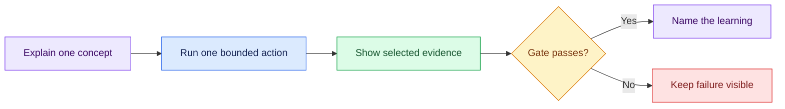

# Live Session Guides

This folder is the executable teaching surface for Semana. The deck introduces
one idea; the repository tests it; the evidence decides whether the sequence
can continue.

## Current module state

| Module | Runbook | Deck | State in this checkout |
| --- | --- | --- | --- |
| Day 1 · Foundation | [`d1/README.md`](d1/README.md) | [`../presentation/d1.html`](../presentation/d1.html) | Executed; specs 1–3 are tracked evidence |
| Day 2 · Harness | [`d2/README.md`](d2/README.md) | [`../presentation/d2.html`](../presentation/d2.html) | Executed; specs 4–5 and `stg_orders` are committed |
| Day 3 · The Task | [`d3/README.md`](d3/README.md) | [`../presentation/d3.html`](../presentation/d3.html) | Executed; six Task-Specs authored, all `DOD=COMPLETE` |
| Day 4 · The Loop | [`d4/README.md`](d4/README.md) | [`../presentation/d4.html`](../presentation/d4.html) | Executed; five specs crank-accepted at Tier 1 (`done: 5`), signing key and metrics on disk |
| Day 5 · The Factory | [`d5/README.md`](d5/README.md) | [`../presentation/d5.html`](../presentation/d5.html) | Built; one read-only checkpoint, scheduled 17 Aug 2026 |

Days 1 to 4 preserve the exact sequence that produced the inherited artifacts;
their preflight states are historical, not the current `main` preflight. Start
with Day 5 as the current live module. Use an isolated rehearsal copy, not this
checkout, to replay an executed night from its original starting state.

Day 4 was the first night that changed the repository because a **loop** ran
rather than because a human typed: its checkpoint `00` provisioned the
repository signing key that Days 1 to 3 never needed. Day 5 builds nothing
live — everything its checkpoint shows was finished and committed in advance,
and the only thing that happens on stage is the CFO question.

## Teaching loop

## Presentation rule

- Explain the diagram and at most three points.
- Paste one prompt or run one command group.
- Show only the evidence named by the checkpoint.
- Do not read complete agent responses aloud.
- Advance only after the gate is visible.

## Safety boundary

- Operational investigation is read-only.
- Durable writes go only to the path explicitly authorized by the active
  checkpoint.
- The five tracked files under `storage/specs/` are inherited evidence and are
  read-only in the current checkout.
- Temporary telemetry, scaffolds, and rehearsal artifacts stay under `tmp/`.
- Do not inspect instructor-control surfaces or run injection, reveal, scoring,
  reset, or source mutations during the live sequence.
- Never put secrets, connection strings, personal data, or complete rows in
  prompts or artifacts.
- Label fallbacks **prepared**.

The planning source is [`../plan/semana.md`](../plan/semana.md); each day's
README and numbered checkpoints are the operational source for what happens on
screen.
