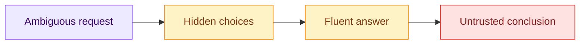

# 01 — Experience the Weak Prompt

## Session

**NEW — Session A, disposable.** Close it after the critique.

## Why this step

A weak prompt can produce polished analysis while silently choosing the system,
scope, metric, and authority. The failure is not verbosity; it is uncontrolled
decision-making.

## Structure



Explain briefly:

- The model must fill every gap the prompt leaves open.
- Confidence and detail do not repair missing authority.
- We keep the failure visible so the contract has a reason to exist.

## Boundary

Disable writes or deny every write request. Session A may reveal information
prematurely, so none of its conversation carries forward.

## Paste exactly

```text
Analise este banco de dados e explique a receita. Responda em português do
Brasil usando no máximo 6 bullets e 180 palavras.
```

Do not rescue the agent while it answers.

## Show the failure

Ask the room to fill only this table:

| Check | Question |
| --- | --- |
| System | Which database did the agent choose, and who approved it? |
| Meaning | Who defined Revenue? |
| Evidence | Can we reproduce the central claim? |
| Stop | Where did the agent refuse or escalate? |

Capture three defects. For TransactCo, watch for unapproved DuckDB use, an
invented currency, a chosen Revenue definition, or claims without exact SQL.

Say:

> Fluency is not evidence. The prompt gave the agent no structure to lean on.

## Gate

- Three concrete defects are visible.
- At least one defect concerns system choice.
- At least one concerns meaning or evidence.
- Session A is closed.

## Recovery

Use a short response labeled **prepared** and critique it with the same table.

Next: [`02-investigation-contract.md`](02-investigation-contract.md).
