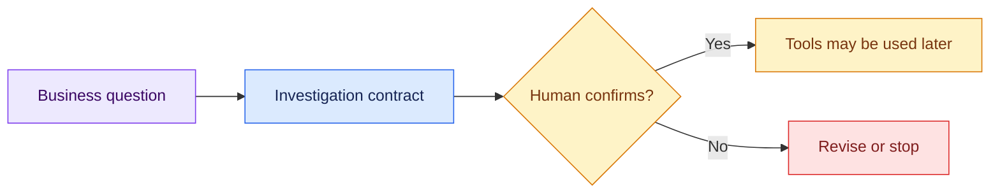

# 02 — Turn the Prompt into a Contract

## Session

**NEW — Session B, contract design.** Stop this session after confirmation.

## Why this step

The investigation contract turns an open-ended request into agreed work. It
defines outcome, authority, evidence, artifacts, and the point where a human
must decide.

## Structure



Explain briefly:

- Tools discover physical facts; humans authorize business meaning.
- Confirmation is a gate, not a polite summary.
- The same structure works whenever a team enters an unfamiliar system.

Ask the room:

1. What outcome is needed?
2. What may the agent inspect or change?
3. What evidence would make a claim defensible?
4. Which ambiguity requires an owner?

## Propose the contract

```text
Ainda não investigue. Para a pergunta “Qual foi a Receita da TransactCo ontem e
por que o CFO deveria confiar nesse número?”, proponha um contrato compacto.

Use uma única tabela com no máximo 8 linhas: objetivo, resultado, escopo,
exclusões, autoridade de ferramentas, evidência, artefatos e condição de parada.
Considere Postgres `public.*` como fonte primária, somente leitura; exclua
DuckDB, dbt, analytics, ontologia, `_control`, injection, scoring e superfícies
do instrutor. Nenhuma escrita ou ferramenta antes da confirmação.

Use no máximo 300 palavras, responda em português do Brasil e aguarde.
```

Review one row at a time. Then confirm:

```text
Contrato confirmado com quatro esclarecimentos:

1. “Ontem” é inicialmente o último dia-calendário UTC completo, apenas como
   janela técnica; o dia de negócio permanece uma questão.
2. Na primeira bifurcação sobre Receita, registre candidatos físicos, não
   escolha nenhum e escale ao responsável financeiro.
3. Cada checkpoint autorizará explicitamente seus próprios artefatos.
4. Nenhuma ampliação de escopo é permitida sem confirmação humana.

Responda com um checklist de no máximo 6 linhas confirmando o entendimento.
Não use ferramentas, não escreva arquivos e pare.
```

## Show the evidence

Point to four contract rows only: scope, authority, evidence, and stop. Ask:

> What failure from checkpoint 01 does each row prevent?

## Gate

- The agent used no tool and wrote no file.
- The human explicitly confirmed the contract.
- Postgres is physical authority; Finance remains semantic authority.
- Session B is stopped.

Next: [`03-context-inventory.md`](03-context-inventory.md).
