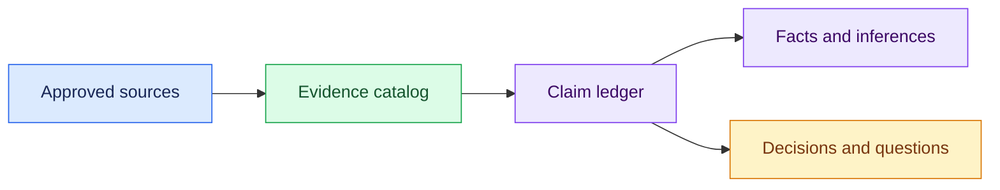

# 03 — Select Context and Build Evidence

## Session

**NEW — Session C, manual investigation.** Continue this session through
checkpoint 06.

## Why this step

The prompt defines the work; context supplies the world. We select a small set
of authoritative sources, preserve reproducible evidence, and separate what is
observed from what still needs a human decision.

## Structure



Explain briefly:

- More files do not automatically produce better context.
- Every fact needs a reproducible source.
- Arithmetic can reconcile rows without defining business meaning.

## Capture contract

This table is control context, not business evidence.

| Element | Contract |
| --- | --- |
| Evidence sources | Only the `System model` section of `README.md`; `01_schema.sql`; `seed.py`; `postgres.py`; read-only Postgres `public.*` |
| Excluded | Domain ontology, DuckDB, dbt, analytics, instructor and control surfaces |
| Window | Last complete UTC calendar day, recorded as technical only |
| Minimum proof | Live catalog for constraints and explicit currency metadata, status totals, two physical candidates, two-way order/payment reconciliation |
| Claim discipline | Maximum 16 rows: `fact`, `inference` with falsifier, `decision` with reversal impact, `question` with owner |
| Durable output | Only `storage/specs/1-context.md` |
| Size | One-screen summary; at most 8 evidence IDs, 16 ledger rows, and 1,500 prose words |
| Stop | First semantic fork; candidates are illustrative, never Revenue |

Use a terminal/repository agent without a browser or Playwright MCP. Browser
runtimes may create logs or screenshots even when the prompt forbids writes.

## Before a recapture

Skip this on a first run. To preserve an earlier rehearsal, move it to a unique
name under `tmp/foundation-investigation/rehearsal/` before opening Session C.

## Paste

```text
Leia `sessions/d1/03-context-inventory.md` e execute somente a seção “Capture
contract”. Trate esse arquivo apenas como instrução, nunca como evidência.

Comece do zero e use somente as cinco fontes aprovadas. Calcule a janela
técnica a partir do relógio do Postgres. Preserve SQL exato em uma seção
`<details>`, mas mantenha a narrativa curta.

Em `README.md`, leia somente a seção `System model`, encerrando antes de
`Failure lab`; não abra nem use as demais seções. Esse recorte é parte do
contrato de contexto, não uma sugestão.

Use no máximo 8 IDs de evidência. Na evidência de schema, consulte
`pg_constraint` e `information_schema.columns` somente para `public.*`:
comprove FK/CHECK existentes e verifique se há metadado explícito de moeda ou
câmbio. Diversidade de países é apenas sinal de risco, não prova de múltiplas
moedas.

Na reconciliação, meça separadamente: pedidos sem pagamento; pedidos na janela
com captura fora dela; capturas na janela cujo pedido ficou fora; e divergência
entre `payments.amount` e `orders.total_amount`. Feche a equação, mas não
confunda reconciliação aritmética com causa operacional.

Escreva somente `storage/specs/1-context.md` com estas seções: One-screen
summary, Source inventory, Evidence and reconciliation, Claim ledger, Exact
SQL. Em Source inventory, use uma única tabela de cinco linhas. Limite o Claim
ledger a 16 linhas. Priorize exatamente três bloqueantes: inclusão de status,
âncora temporal e moeda/política de conversão. Se nenhum reembolso cair na
janela, registre-o como observação não bloqueante. Pare na primeira bifurcação
sem chamar nenhum candidato de Receita.

Responda em português do Brasil com no máximo 120 palavras: arquivo, fontes,
equação, questões bloqueantes e confirmação de escrita.
```

## Show the evidence

```bash
sed -n '/^## One-screen summary/,/^## Source inventory/p' \
  storage/specs/1-context.md
sed -n '/^## Source inventory/,/^## Evidence and reconciliation/p' \
  storage/specs/1-context.md
rg -n '^## |candidate|reconcil|bloque|question|owner|responsável|moeda|câmbio|curr' \
  storage/specs/1-context.md | sed -n '1,40p'
```

Show only:

1. the five-row source inventory;
2. the two physical candidates;
3. the reconciliation equation;
4. at most three blocking questions.

Say:

> We reduced a repository to the context required for one defensible question.

## Gate

- Only the approved sources were used.
- Exact SQL exists but does not dominate the visible narrative.
- The seam closes in both directions.
- FK/CHECK and explicit currency metadata are supported by catalog evidence.
- Facts, inferences, decisions, and questions remain distinct.
- The ledger contains at most 16 claim rows and exactly three blocking questions.
- `1-context.md` stays within its output budget.
- Revenue remains unresolved.

Next: [`04-ontology.md`](04-ontology.md).
