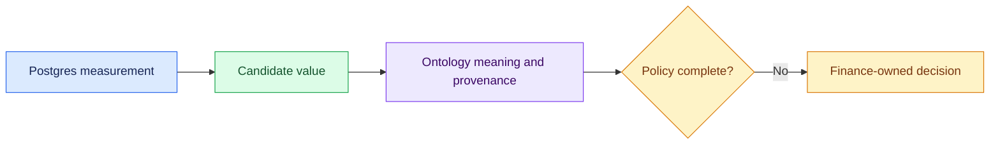

# 04 — Separate Data from Meaning

## Session

**CONTINUE — Session C.** Do not start a new session.

## Why this step

Postgres can calculate precise physical aggregates. Ontology records whether
the organization has authorized their meaning, which decisions are missing,
and who owns them.

## Structure



Explain briefly:

- The database answers what is stored.
- The ontology records what a concept means, its provenance, and its owner.
- A controlled refusal is safer than silently selecting a metric.

## Show the physical answer first

Open only the one-screen summary and reconciliation from `1-context.md`. Ask:

> Which additional business decision would let us call one candidate Revenue?

Do not run more exploratory SQL. Checkpoint 03 already preserved the physical
evidence.

## Reveal the ontology

```bash
uv run transactco ontology validate
uv run transactco ontology explain Revenue
```

Show only four lines from the explanation:

- status;
- answer;
- owner;
- required decisions.

## Paste

```text
Agora inspecione `src/transactco/domain/transactco.ontology.json` e a saída de
`transactco ontology explain Revenue`. Compare com
`storage/specs/1-context.md` sem executar novas consultas.

Escreva somente `storage/specs/2-ontology.md`, com no máximo 700 palavras e
quatro seções: Physical evidence, Ontology declaration, Missing decisions,
Human gate. Inclua uma tabela de no máximo 6 linhas separando: banco comprova,
ontologia declara, decisão ausente e responsável.

Mantenha Revenue como `unresolved` e o documento como `pending human review`.
Não invente políticas. Responda em português do Brasil com no máximo 100
palavras.
```

## Show the evidence

```bash
sed -n '/^## Physical evidence/,/^## Ontology declaration/p' \
  storage/specs/2-ontology.md | sed -n '1,40p'
rg -n '^## |unresolved|BLOCKED|Finance|pending human review|banco comprova|ontologia declara|decisão ausente|responsável' \
  storage/specs/2-ontology.md | sed -n '1,24p'
```

Ask only:

1. What did Postgres prove?
2. What did ontology add?
3. Who can unblock the concept?

Say:

> Postgres gave us a measurement. Ontology showed why it is not yet Revenue.

## Gate

- The physical candidate still points to reproducible evidence.
- Ontology is `unresolved` and names the Finance owner.
- No missing policy was invented.
- `2-ontology.md` stays within its output budget.

Next: [`05-agentic-investigation.md`](05-agentic-investigation.md).
