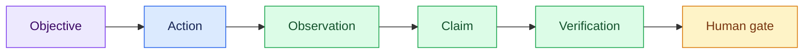

# 05 — Make the Agentic Trajectory Visible

## Session

**CONTINUE — Session C.** Use the work already completed; do not reinvestigate.

## Why this step

Agentic Development is not only a final answer. It is a controlled trajectory
through context, tools, observations, claims, verification, and human gates.

## Structure



Explain briefly:

- A tool call matters only when its observation supports or rejects a claim.
- Rejection and escalation are healthy outcomes.
- This trace is self-reported; it improves inspection but is not independent
  runtime proof.

## Paste

```text
Sem executar novas consultas ou ampliar a investigação, resuma a trajetória
desta Session C em exatamente 6 eventos JSONL em
`tmp/foundation-investigation/manual/trace.jsonl`.

Cada linha deve conter: timestamp, timestamp_basis, run_id, phase, action,
target, evidence_references, outcome, gate, telemetry e capture_mode. Use
`telemetry: "self-declared"` e
`capture_mode: "retrospective_reconstruction"` nos 6 eventos. Em
timestamp_basis, diga que o horário é aproximado, reconstruído pelo agente e
não capturado por runtime ou relógio independente.

Use referências resolvíveis no formato `arquivo#identificador-ou-seção`,
sempre apontando para `storage/specs/1-context.md` ou
`storage/specs/2-ontology.md`. Inclua: contexto carregado, evidência física
consultada, reconciliação verificada, uma afirmação rejeitada, a ontologia
consultada e uma questão escalada ao responsável.

Não registre dados pessoais, segredos ou linhas completas. Não apresente esta
reconstrução como telemetria capturada automaticamente nem como evidência
independente. Responda em português do Brasil com uma única frase.
```

## Show the evidence

```bash
wc -l tmp/foundation-investigation/manual/trace.jsonl
sed -n '1,6p' tmp/foundation-investigation/manual/trace.jsonl
```

Ask the room to locate one action, its evidence, its outcome, and its gate.

Say:

> The final answer is a snapshot. The trace exposes the path and its controls.

## Gate

- The trace has exactly six events.
- Every event declares `self-declared` telemetry, retrospective capture mode,
  and the approximate timestamp basis.
- Evidence references point to `1-context.md` or `2-ontology.md`.
- One claim was rejected and one question escalated.
- The room can explain why self-reporting is not independent telemetry.

## Recovery

Use a six-line trace labeled **prepared**, or keep malformed output visible and
identify the violated field or gate.

Next: [`06-technical-brief.md`](06-technical-brief.md).
