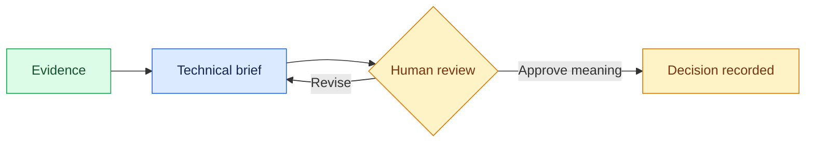

# 06 — Preserve a Reviewable Brief

## Session

**CONTINUE — Session C.** After this checkpoint, leave Session C unchanged.

## Why this step

Documentation lets another person review the evidence without replaying the
chat. It must preserve uncertainty instead of upgrading an inference into fact.

## Structure



Explain briefly:

- A brief is a review surface, not a declaration of truth.
- Every open question needs an owner and next action.
- `pending human review` is a meaningful engineering state.

## Paste

```text
Crie somente `storage/specs/3-technical-brief.md` a partir de
`storage/specs/1-context.md`, `storage/specs/2-ontology.md` e
`tmp/foundation-investigation/manual/trace.jsonl`. Não execute novas consultas
e não introduza afirmações novas.

Use no máximo 800 palavras e estas seções: Status, Question, Evidence,
Findings, Decisions and Questions, Human Gate. Limite Findings a 3 fatos e 2
inferências e rotule cada item como `fact` ou `inference`; limite as questões
abertas às 3 que mais mudam o resultado e rotule cada uma como `question`. Dê
responsável e próxima ação a cada uma.

Defina Status como `pending human review`. Responda em português do Brasil com
no máximo 5 bullets e 100 palavras.
```

## Show the evidence

```bash
rg -n '^#|^##|pending human review|fact|inference|question|responsável|próxima ação' \
  storage/specs/3-technical-brief.md | sed -n '1,48p'
```

Review only:

1. two facts back to evidence;
2. one inference against its falsifier;
3. one question, owner, and next action.

Say:

> Documentation preserves what became true—and what did not.

## Gate

- The brief stands without the chat.
- Revenue remains unresolved.
- No new claim appears during summarization.
- `3-technical-brief.md` stays within 800 words.

Next: [`07-skill-reveal.md`](07-skill-reveal.md).
