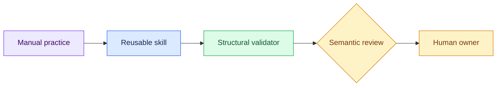

# 07 — Encode the Method as a Skill

## Session

**NEW — Session D, skill validation.** Do not reuse Session C.

## Why this step

The aha moment is not that a skill finds a magical answer. It packages the
questions, boundaries, evidence contract, validation, and human stop that the
room has already practiced.

## Structure



Explain briefly:

- Automation preserves a practiced method; it does not create authority.
- Structural validation checks completeness, not business correctness.
- A fresh session proves the workflow is carried by artifacts and skill
  instructions rather than hidden chat memory.

Show only the workflow headings:

```bash
rg -n '^## ' skills/interview-the-system/SKILL.md
```

## Start the skill

```text
Leia `skills/interview-the-system/SKILL.md` e aplique a skill para investigar
como a TransactCo pode responder qual foi sua Receita ontem e por que o CFO
deveria confiar na resposta.

Use `storage/specs/1-context.md`, `storage/specs/2-ontology.md` e
`storage/specs/3-technical-brief.md` como contexto aprovado. Apresente o grill
e o contrato proposto em uma única tabela de no máximo 8 linhas e 250 palavras.
Aguarde confirmação antes de usar ferramentas ou escrever arquivos. Responda
em português do Brasil.
```

After comparing the proposed contract with the manual method, confirm:

```text
Contrato confirmado. Execute somente as verificações de leitura necessárias
para confirmar atualidade e escreva o pacote em
`tmp/foundation-investigation/skill/`. Preserve Revenue como decisão humana
não resolvida. Se produzir `trace.jsonl`, todos os eventos devem declarar
`telemetry: "self-declared"`,
`capture_mode: "retrospective_reconstruction"`, a base aproximada do timestamp
e um gate explícito. Use papéis como `Facilitator` ou `Finance owner`, não nomes
pessoais. No chat, responda com no máximo 6 bullets e 150 palavras.
```

## Validate and show

```bash
python3 skills/interview-the-system/scripts/validate_investigation.py \
  tmp/foundation-investigation/skill/investigation.json \
  tmp/foundation-investigation/skill/technical-brief.md \
  tmp/foundation-investigation/skill/trace.jsonl

find tmp/foundation-investigation/skill -maxdepth 1 -type f -print | sort

rg -o '"(telemetry|capture_mode)"\s*:\s*"[^"]+"' \
  tmp/foundation-investigation/skill/trace.jsonl | sort -u
```

Show only `CHECK_INVESTIGATION=PASS`, the three package files, and one open
Finance-owned decision.

Say:

> The skill automates the discipline. A human still owns the meaning.

## Gate

- The skill waited for confirmation.
- Validation passes structurally.
- Facts have evidence and open decisions have owners.
- Every trace event exposes its self-declared, retrospective provenance.
- The fresh session reaches the same human stop.

Next: [`08-reflection.md`](08-reflection.md).
