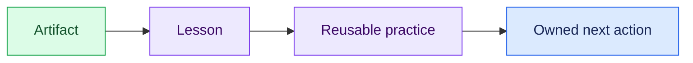

# 08 — Distill the Practice

## Session

**No agent.** Reflect from artifacts with the group.

## Why this step

Reflection turns evidence into a reusable behavior. The team should leave with
a practice it can apply to another brownfield system, not only a memory of the
TransactCo example.

## Structure



Explain briefly:

- Prompt establishes the contract.
- Context and tools produce evidence.
- Ontology and humans govern meaning.
- Telemetry, briefs, and skills preserve the method.

## Ask the room

1. What evidence changed our understanding?
2. What decision remains human, and who owns it?
3. Which part of this method will you reuse next?

Each participant completes only:

```text
A prática que vou reutilizar é:
A evidência que vou exigir é:
A decisão que o agente não pode tomar é:
```

## Gate

The group can name one evidence-backed lesson, one unresolved owner, and one
reusable practice.

Close with:

> We interviewed the system before changing it. Now we can build from evidence.
