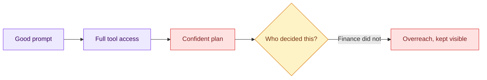

# 01 — The Unbounded Agent

## Session

**NEW — Session A, disposable.** Discard it the moment this checkpoint ends.
Nothing it produces enters tonight's work.

## Why this step

Day 1's villain was the weak prompt. Tonight the prompt is good — and that is
what makes broad authority dangerous. A capable agent with a clear goal will
happily make decisions nobody delegated. The room must see the overreach before
the contract, so every contract row has a visible reason to exist.

## Structure



Explain briefly:

- Nothing in this prompt would fail a review — that is the point.
- Review catches bad work; it does not catch work you never authorized.
- We stop at the plan. Nothing executes, nothing is written.

## Do live

Paste, then stop the agent at the plan:

```text
Construa o modelo de receita da TransactCo neste repositório.

Antes de executar qualquer coisa, apresente apenas o seu plano de ação em no
máximo 8 linhas numeradas. Não execute ainda.
```

Walk the plan with one question per line:

> Who decided this?

Expect at least three decisions that belong to Finance or to the room: the
paths it chose under `dbt/`, the name and layer of a `revenue` model, and which
order statuses count as revenue.

## Show the evidence

Only the plan, on screen. Do not run it, do not widen the prompt to make it
behave, do not scold the agent. Circle the three unowned decisions.

Say:

> Nothing on this screen looks like a mistake. That is the danger.

## Gate

- The agent proposed; nothing executed and no file was written.
- At least three unowned decisions were named out loud.
- Session A is discarded.

## Recovery

If the plan comes back suspiciously humble, ask it to proceed one step — it
will start choosing paths immediately. Stop it there. The overreach is the
evidence; any variant of it teaches the same boundary.

Next: [`02-harness-contract.md`](02-harness-contract.md).
