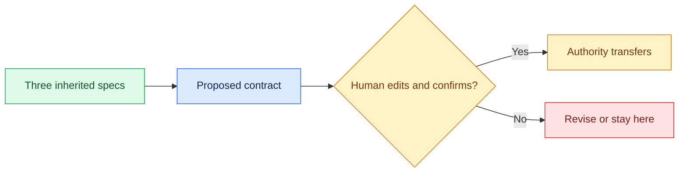

# 02 — The Harness Contract

## Session

**NEW — Session B.** This session carries the contract through checkpoints 03
and 04, then stops. Nothing is built in this checkpoint.

## Why this step

The contract is the construction mirror of Day 1's investigation contract: six
concerns that bound what the agent may do, written before any build tool runs,
for one night of work only. Confirmation is the moment authority transfers.

## Structure



Explain briefly:

- Every row exists because checkpoint 01 showed what happens without it.
- The six concerns are the four gates from Act 0, written down: outcome,
  tools, writable paths, prohibited surfaces, stop conditions, evidence.
- No build tool runs until a human confirms.

## Propose the contract

```text
Ainda não construa nada. Leia storage/specs/1-context.md, 2-ontology.md e
3-technical-brief.md como contexto aprovado — apenas leitura.

Proponha um contrato de harness para UMA noite de trabalho de construção neste
repositório, como UMA única tabela com no máximo 10 linhas cobrindo: objetivo e
resultado; ferramentas permitidas (analytics_ro, dbt, make dbt-check); caminhos
com permissão de escrita (dbt/models/staging/ e nada mais); superfícies
proibidas (src/transactco/control, oracle, qualquer sobrescrita de
storage/specs/); condições de parada (qualquer decisão semântica — o que conta
como Receita, quais status, qual timestamp — interrompe e escala para Finance);
evidência e artefatos exigidos.

Use no máximo 300 palavras, responda em português do Brasil e aguarde
confirmação humana. Não use ferramentas de escrita.
```

Read it on screen. **Edit at least one row live** — narrow a path, delete a
grant it gave itself, or add a stop condition it forgot. Then confirm:

```text
Contrato confirmado com os ajustes feitos acima. Cada checkpoint desta noite
autoriza explicitamente seus próprios artefatos; nenhuma ampliação de escopo
sem confirmação humana. Responda com um checklist de no máximo 6 linhas
confirmando o entendimento, não use ferramentas e aguarde.
```

## Show the evidence

The confirmed table, with the human edits visible. Ask the room:

> Point at one row and name the checkpoint-01 overreach it prevents.

## Gate

- The agent used no tool and wrote no file.
- A human explicitly confirmed the contract, after editing at least one row.
- The room can map rows to overreaches.
- Session B stays open — the contract is its context for 03 and 04.

Next: [`03-agent-pair.md`](03-agent-pair.md).
