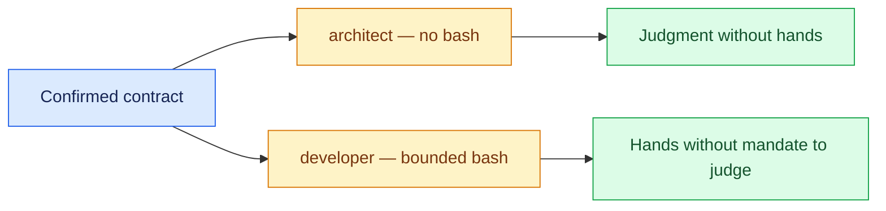

# 03 — Write the Agent Pair by Hand

## Session

**Continue Session B** for context, but **the human types** — terminal and
editor visible. No generator, no paste. The tedium is the lesson: Movement 06
prices it.

## Why this step

The contract says WHAT the agent may do. The harness is WHERE those rules live
so they survive the session, the engine swap, and the next model. Tonight that
means two entries in `AGENTS.md`: judgment and execution, deliberately split.

## Structure



Explain briefly:

- One context may think but never touch; the other touches only what the
  contract names. They never share a session.
- What is missing from each file is the point: the architect has no Bash, the
  developer has no mandate to judge.
- `AGENTS.md` and `CLAUDE.md` exist as shells; the entries are born now.

## Do live

Open `AGENTS.md` in the editor and type both entries under `## Agents`,
citing the contract clause each rule serves:

```markdown
### architect — judgment, no hands
- job: reviews every plan before it runs
- reads: the repo, the confirmed contract, storage/specs/*
- tools: read, grep, make psql-ro
- bash: denied — verdicts, not edits
- writes: nothing
- stops: any semantic decision — Revenue meaning is owned by Finance

### developer — execution, bounded hands
- job: builds what the approved plan enumerates
- reads: the contract, the plans, the diff
- tools: read, write, bash — inside the contract only
- writes: dbt/models/staging/ and nothing else
- done: make dbt-check passes, then claim it — never before
```

Then show the diff:

```bash
git diff AGENTS.md
```

This requires `AGENTS.md` to be committed (checkpoint 00 preflight checks it) —
`git diff` prints nothing for an untracked file. If it is still untracked at
showtime, use `git status --short AGENTS.md` and read the entries in the editor
instead.

## Show the evidence

The diff only: two entries, nothing else changed. Hold one beat and say:

> Remember how this felt. In Movement 06 a skill does it in seconds — and you
> will know exactly what it generated, because you typed it once.

## Gate

- Both entries exist in `AGENTS.md`, typed in front of the room.
- Each rule cites a contract concern (tools, paths, stop conditions).
- Nothing else in the repository changed.
- The room felt the manual cost.

## Recovery

If typing live stalls, keep going — slow typing teaches better than fast
pasting. Only if the session breaks entirely, restore from `git checkout
AGENTS.md` and retype the shorter developer entry first.

Next: [`04-sketch-plans.md`](04-sketch-plans.md). **BREAK comes after 03 in the
deck** — leave the contract on the projector.
