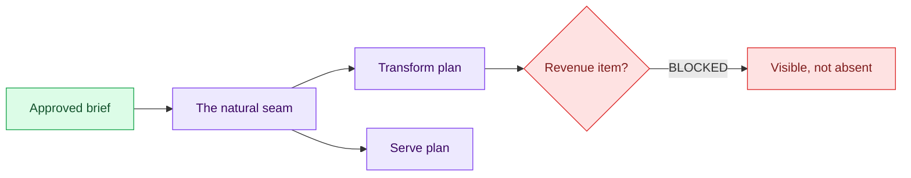

# 04 — Cut the Two Sketch Plans

## Session

**Continue Session B as the architect** — judgment work, no Bash. The
developer role waits for checkpoint 05.

## Why this step

With rails standing, the temptation is to start building. A plan lists the
work and its order, and stops there: what "done" means per unit is Day 3's
module. The revenue exclusion must sit inside the plan, where a builder will
meet it — not in a footnote.

## Structure



Explain briefly:

- Two lanes along the seam: transform shapes the data, serve exposes it.
- Blocked is a status, not an omission — the boundary survives the transition
  from ontology to construction input.
- Plans are tomorrow's raw material: Day 3 decomposes them into atomic tasks.

## Do live

```text
Como arquiteto (sem executar nada), corte dois sketch plans a partir de
storage/specs/3-technical-brief.md, dentro do contrato confirmado.

Plano 1 — transform: modelos medallion sobre raw.* dentro do shell dbt
(staging → intermediate → marts). Plano 2 — serve: API/MCP sobre o gold,
apenas enumerado (construção fica para o fim da semana).

Cada plano: no máximo 10 itens numerados e 300 palavras; cada item nomeia sua
evidência no brief; qualquer item que exija uma decisão semântica não resolvida
é marcado BLOCKED com o dono da decisão — visível dentro do plano.

Grave o plano 1 em storage/specs/4-plan-transform.md e o plano 2 em
storage/specs/5-plan-serve.md. Estes são os únicos arquivos autorizados neste
checkpoint. Resuma em no máximo 120 palavras e pare.
```

## Show the evidence

The two plans side by side. Go straight to the transform plan's revenue item:
BLOCKED, in the plan, with Finance named as owner. Ask the room:

> Did either plan invent meaning? If not, the gate passes.

## Gate

- `4-plan-transform.md` and `5-plan-serve.md` exist, within budget.
- Every item names its evidence; nothing unlisted, nothing undecided quietly
  decided.
- The revenue item is visibly BLOCKED inside the transform plan.
- Session B stops here.

## Recovery

If a plan exceeds budget or invents a definition, reject it in one line and
regenerate — the correction is itself a teaching beat. Do not edit the plan by
hand; the architect owns its own revision.

Next: [`05-bounded-build.md`](05-bounded-build.md).
