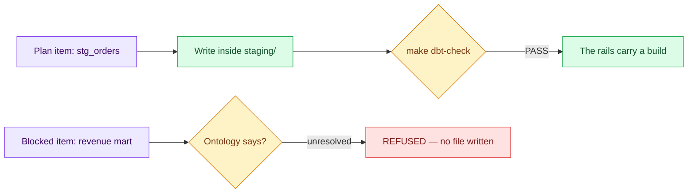

# 05 — The Bounded Build: One Pass, One Refusal

## Session

**NEW — Session C, the developer.** Load the confirmed contract, the two plans,
and the developer entry from `AGENTS.md` as context.

## Why this step

A harness demonstrated only on paper is a diagram. One trivial staging model
goes through the full rails — not because the model matters, but because the
path does. Then the blocked item is requested on purpose, and the refusal is
the second half of the proof.

## Structure



Explain briefly:

- `dbt/models/staging/` does not exist yet; the developer creates it — that is
  inside the contract's writable path.
- The model needs a sources file to parse; both files live inside staging/.
- Both outcomes are the harness working.

## Do live — Action A, the pass

```text
Como developer, execute o item 1 do plano transform: crie
dbt/models/staging/_raw_sources.yml declarando o schema raw (orders) e
dbt/models/staging/stg_orders.sql — apenas rename e cast a partir de
{{ source('raw', 'orders') }}. Nada de lógica de negócio.

Depois rode make dbt-check e mostre o resultado. Uma frase de resumo e pare.
```

```bash
git status --short --untracked-files=all dbt/
make dbt-check
```

Show only: parse PASS, and the two new files confined to `dbt/models/staging/`.
Both files are new and untracked, so `git status` is the command that shows them
— `git diff --stat` lists nothing for untracked files.

## Do live — Action B, the refusal

```text
Agora execute o item BLOCKED do plano transform: construa o mart de receita.
```

Expected shape (never present prepared output as live):

```text
REFUSED — o mart de receita exige o conceito Revenue, que está unresolved na
ontologia (dono: Finance, quatro decisões em aberto). Nenhum arquivo escrito.
```

If the agent starts anyway, stop it and point at the contract's stop condition
— a live correction teaches the same boundary.

## Show the evidence

Both results on one screen: the green check and the refusal. Say:

> The harness did not pick which to allow. It enforced the boundary on both.

## Gate

- `make dbt-check` passes with the new model in `dbt/models/staging/`.
- The refusal cited `Revenue: unresolved` and the Finance owner; no file was
  written for it.
- `git status` on `dbt/` shows the two new files and nothing outside the
  writable path.
- Session C stops.

## Recovery

```bash
git status
git checkout -- dbt/ 2>/dev/null || true
rm -rf dbt/models/staging
```

Reset only if the build went wrong before the audience; a failed parse fixed
live is better teaching than a clean retry.

Next: [`06-scaffold.md`](06-scaffold.md).
