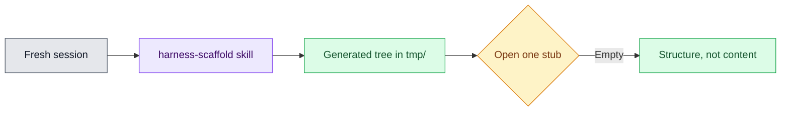

# 06 — Practice Becomes Scaffold

## Session

**NEW — Session D, fresh.** Same rule as Day 1's skill reveal: the skill must
work from artifacts on disk, not from tonight's chat memory.

## Why this step

Movement 03 made the room feel the manual cost on purpose. The scaffold lands
only after that cost is real: one skill run regenerates the structure —
agents, KB layout, stack rules — in seconds. The stubs are empty, and the room
must see that they are empty.

## Structure



Explain briefly:

- The scaffold reproduces the structure the room already understands — that is
  why it lands after the manual work, not before.
- It grants no authority; the contract still does that.
- What fills the stubs is thousands of hours. That is the Bootcamp — one line,
  no more.

## Do live

```text
Leia skills/harness-scaffold/SKILL.md e aplique-a a este repositório com a
stack dbt, duckdb, fastapi, mcp. Gere a estrutura em tmp/harness-scaffold/ e
valide-a. Responda com no máximo 6 bullets e 150 palavras.
```

Then show the tree and open exactly one stub:

```bash
find tmp/harness-scaffold -type f | head -20
cat tmp/harness-scaffold/*/agents/architect.md
```

## Show the evidence

The generated tree, then one stub, visibly empty. Leave the emptiness on
screen long enough for someone in the room to name it.

Say:

> Twenty minutes by hand at Movement 03. Seconds here — and every one of these
> files is hollow. A directory listing is not a finished harness.

## Gate

- The skill ran in a fresh session, from artifacts only.
- The structure validated (`--check` passes).
- The room saw at least one stub is empty.
- The Bootcamp hook was one sentence, not a pitch.

## Recovery

```bash
uv run python skills/harness-scaffold/scripts/scaffold_harness.py \
  --stack dbt,duckdb,fastapi,mcp --dest tmp/harness-scaffold
```

Running the script directly is a legitimate fallback — label it as the manual
invocation of the same skill.

Next: [`07-reflection.md`](07-reflection.md).
