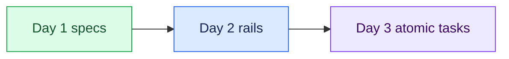

# 07 — Turn Two: Reflection and Handoff

## Session

**No agent.** Deck and the room only.

## Why this step

Reflection converts the run into behavior. Day 1 closed with turn one of the
flywheel; tonight the wheel turned again — yesterday's artifacts were tonight's
inputs, and tonight's rails are tomorrow's starting inventory.

## Structure



Walk the night's ledger once:

- **Built (4):** the confirmed contract, the agent pair in `AGENTS.md`, two
  sketch plans, the regenerable scaffold.
- **Withheld (1):** Revenue — still `unresolved`, still owned by Finance. The
  refusal at checkpoint 05 was a success, not a gap in the demo.
- **Tomorrow:** the plans become atomic, verifiable tasks. Day 3 is
  specification and decomposition — the unit of work is the spec.

## Do live

Ask the room to write three lines before leaving. Stop talking while they
write; do not collect answers unless offered.

```text
A autoridade que eu vou exigir por escrito é:
A decisão que o agente não pode tomar é:
O trilho que eu vou construir primeiro é:
```

## Gate

- The three commitment lines were written by participants.
- The night's ledger (built / withheld / tomorrow) was stated once, plainly.
- The handoff names Day 3's module: plans → atomic task specs → execution.

## Closing line

> The agent performs bounded work. Evidence supports claims. Humans keep the
> decisions the system cannot legitimately make. Tomorrow, 20:00 — the unit of
> work is the spec.
