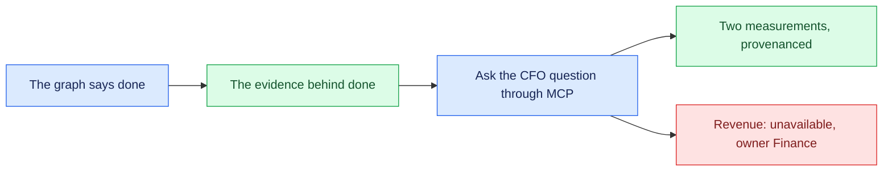

# 01 — Close the CFO question

## Session

One terminal, one Claude Code session started in this repository so `.mcp.json`
is picked up. No editing, no dispatching, no agent work on screen. Everything
below reads state that already exists.

Budget: eight minutes. The deck slide **The CFO question** is the only setup;
do not re-explain the week here.

## Why this step

Monday opened with a CFO asking for one number and a repository that could not
honestly produce it. Every night since then built the machinery to answer
carefully rather than quickly. This checkpoint spends its whole budget proving
one claim: **the machine finished the work it was allowed to finish, and stopped
at the word it was never given.**

The thing to protect is the order. Show that the work is done *before* asking
the question, otherwise the refusal reads as the system failing rather than the
system holding a line.

## Structure



## Do live

### Move A — the graph says the work is finished

```bash
grep -A7 '^stats:' tasks/_state.yaml
ls tasks/done/
taskspec ready
```

Expect `done: 5`, five files in `tasks/done/`, and a frontier holding exactly
one spec:

```text
done: 5
T-20260812-daily-grain-decision   S   architect   Halt on the business day grain decision
```

Say the sentence and move on:

> Five specs were built and accepted. The sixth is still sitting there, and it
> is going to stay there.

Do not explain *why* yet. The MCP server explains it in Move C, in its own
words, and that lands harder than yours.

### Move B — what "done" is standing on

```bash
git log --oneline --grep='^crank('
jq -r '.contract, .result, .subject.attempt_id' tmp/d4/receipts/holdout-final.json
jq -r '.evidence[] | .id + " " + (if .passed then "pass" else "FAIL" end)' \
  tmp/d4/receipts/holdout-final.json
```

Four commits, one per accepted spec, each message naming the gates it passed.
Filtering on `crank(` keeps deck and tooling commits out of the frame. Then the
sealed holdout receipt — `EvaluationReceipt/v2`, `pass`, bound by attempt id to
the run that produced the model:

```text
holdout_excludes_cancelled     pass
holdout_never_named_revenue    pass
```

Name what the second check is for in one line: it is a boundary, not a
correctness test, and it is sealed so that no executor could satisfy it by
renaming a column.

### Move C — ask the question, in the room's own words

The `.mcp.json` in this repository registers `transactco-cfo`, a read-only
server over the accepted models. Ask the session in plain language — do not type
a tool call:

```text
Connect to the transactco-cfo MCP server. The CFO wants to know our revenue
for the quarter. Answer using only what that server gives you.
```

Three things should come back, and they are the whole night:

1. **The refusal.** `revenue` returns `"answer": "unavailable"`, the reason, the
   owner (Finance), and the blocking decision (D2).
2. **What exists instead.** Two measurements, each with its physical basis, the
   clock it is measured on, what it is *not*, and the accepted spec plus the
   `accepted_by` and `accepted_at` that authorized it.
3. **The gap, explained rather than smoothed.** R$ 92,409,231.57 against
   R$ 86,933,043.44 — a R$ 5,476,188.13 difference that is two clocks, not an
   error.

Let the model narrate the answer. Do not correct its phrasing unless it invents
a number; every figure it can reach is bounded by the server.

### Move D — the one line to end on

No terminal. Say it and stop:

> It finished every task it was authorized to finish, and then it refused to
> guess. That refusal is not the system failing. It is the only reason you can
> trust the two numbers above it.

## Show the evidence

- `done: 5` and one spec left on the frontier.
- One commit per accepted spec, gates named in the message.
- The holdout receipt: `EvaluationReceipt/v2`, `pass`, bound to an attempt id.
- The MCP refusal, on screen, in the server's own words.
- The two measurements carrying `accepted_by` and `accepted_at`.

Do not put the model's reasoning on screen next to the JSON. Show the JSON.

## Gate

- The audience saw the work was finished before the question was asked.
- The refusal came from the server, not from the facilitator.
- Both measurements were shown with provenance, never as candidate values of
  one number.
- `T-20260812-daily-grain-decision` was still open at the end.

## Recovery

If the MCP server does not attach — a fresh session in this directory is what
loads `.mcp.json` — fall back to stdio and say plainly that you are calling the
same server directly:

```bash
printf '%s\n' \
 '{"jsonrpc":"2.0","id":1,"method":"tools/call","params":{"name":"revenue"}}' \
 '{"jsonrpc":"2.0","id":2,"method":"tools/call","params":{"name":"list_measurements"}}' \
 '{"jsonrpc":"2.0","id":3,"method":"tools/call","params":{"name":"reconciliation"}}' \
 | uv run python scripts/cfo_mcp.py | jq -r '.result.content[0].text'
```

That is the same code path the MCP client uses, so the evidence is unchanged —
only the narration is. Do not describe the fallback as the live version.

If the warehouse is missing, `make land` rebuilds `raw.*` and
`cd dbt && uv run dbt run --profiles-dir .` rebuilds the five views; the
accepted specs and receipts are unaffected either way.

## Sources

- Five accepted specs with per-spec commits: `git log`, `tasks/done/`,
  `.taskspec/acceptance/`.
- Acceptance gates A–E, re-run independently rather than trusted:
  `src/accept/accept-task.sh`, v3.8.0.
- Sealed holdout, HMAC-sealed descriptor bound to the accepted attempt:
  `tmp/d4/receipts/holdout-final.json`, contract `EvaluationReceipt/v2`.
- The CFO surface and its refusal: `scripts/cfo_mcp.py`, registered as
  `transactco-cfo` in `.mcp.json`.
- `Revenue` unresolved, owner Finance: `AGENTS.md` and
  `storage/specs/2-ontology.md`.
